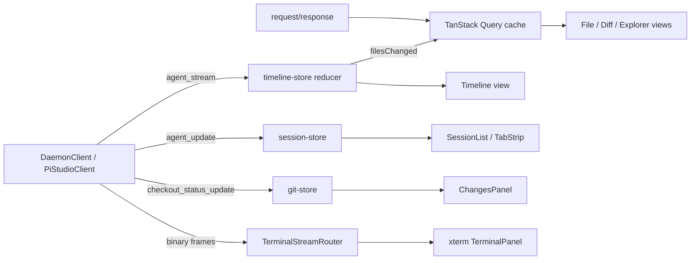

# POC → Production React App — UI Modularization Plan

> **Source of truth:** `poc/chat.html` — a ~1220-line single-file vanilla-JS/HTML/CSS proof of
> concept that drives the Pi-Studio daemon over one WebSocket. This document is the plan to
> re-implement it as a modular, production-grade, performant React application.
>
> **Guiding principle:** preserve the POC's exact wire behavior (RPC names, envelope shapes,
> streaming semantics) while replacing its monolithic DOM manipulation with a typed, componentized,
> testable React architecture. The daemon protocol does not change; only the client does.

---

## 1. What the POC actually is (baseline inventory)

`chat.html` is a functional but monolithic client. Every concern lives in one file with global
mutable arrays and direct `innerHTML`/`document.getElementById` manipulation. The subsystems:

| # | Subsystem | POC implementation | Key RPCs / events |
|---|-----------|---------------------|-------------------|
| 1 | **Connection** | `doConnect()`, raw `WebSocket`, `hello` handshake, bearer subprotocol | `hello`, `status(server_info)`, `ping`/`pong` |
| 2 | **RPC layer** | `rpc(type, params, timeout)` + `pending` Map keyed on `requestId` | `{type:"session", message:{requestId,...}}`, `rpc_error` |
| 3 | **Broadcasts** | `handleBroadcast()` fan-out | `agent_stream`, `agent_update`, `checkout_status_update` |
| 4 | **Tab system** | `tabs[]`, `activeTabId`, DOM-persisted panels | 4 kinds: `chat`/`file`/`diff`/`terminal` |
| 5 | **Chat sessions** | `sessions[]`, `initChatPanel`, streaming | `create_agent_request`, `send_agent_prompt`, `interrupt_agent` |
| 6 | **Streaming render** | `handleAgentStream` switch on `event.kind` | `turn_started/assistant_message/reasoning/tool_call/turn_completed/turn_failed/turn_canceled/error` |
| 7 | **Session restore** | `restoreSessions()` | `list_agents_request`, `fetch_agent_timeline_request` |
| 8 | **File / diff viewer** | `loadFileContent`, `loadDiffContent`, `renderDiffHtml` | `file_read_request`, `file_diff_request` |
| 9 | **Terminal** | `initTerminalPanel`, 800 ms poll | `create_terminal_request`, `capture_terminal_request`, `terminal_input` |
| 10 | **File explorer** | `loadFiles`, `resolveHome` | `file_explorer_request` |
| 11 | **Git changes** | `loadChanges`, `handleCheckoutStatusUpdate` | `checkout_status_subscribe`/`_unsubscribe`, `checkout_refresh_request` |
| 12 | **CWD picker** | `#cwd-overlay` modal | `file_explorer_request` |
| 13 | **Session context menu** | `#session-menu` | `update_agent`, `interrupt_agent` |
| 14 | **Attachments** | base64 via `FileReader`, paste + file picker | inline `images:[{mimeType,data}]` |
| 15 | **Markdown + highlight** | CDN `marked` + `highlight.js` | — |
| 16 | **Shortcuts / URL params** | `keydown` + `URLSearchParams` | Ctrl/Cmd+T, +W, Esc, `?host=&connect=1` |

### POC weaknesses to fix in the rewrite
- **No types.** Envelopes and RPC payloads are untyped `any`. Wire drift is invisible until runtime.
- **`innerHTML` everywhere.** XSS surface (`esc()` is hand-rolled and inconsistently applied), full
  subtree re-renders, lost DOM state.
- **Global mutable state.** `sessions`, `tabs`, `fileList`, module-level `_statusSubCwd` — no single
  source of truth, imperative `renderSessions()`/`renderTabs()` calls scattered through handlers.
- **Polling terminal.** 800 ms `setInterval` screen capture instead of incremental byte streaming.
- **CDN scripts.** `marked`/`highlight.js` from jsdelivr — no offline, no version pinning, no tree-shake.
- **No reconnection.** `ws.onclose` just flips a dot; in-flight RPCs and subscriptions are dropped.
- **No virtualization.** Long chats and large files append every node to the DOM.
- **One agent per session assumption**, `expectingAgent` race hack to bind streams to sessions.

---

## 2. Target stack (production, popular, justified)

All libraries are mainstream, actively maintained, and chosen to map 1:1 onto a POC concern. One
choice per concern — no competing conventions.

| Concern | Library | Why this one |
|---------|---------|--------------|
| Framework | **React 19** + **TypeScript 5** (ESM) | Matches repo language/module conventions. |
| Build / dev server | **Vite 6** (`@vitejs/plugin-react`) | Fast HMR, native ESM, `manualChunks` code-splitting, WS dev proxy. |
| Client-local state | **Zustand 5** (`subscribeWithSelector`) | Replaces global arrays; selector subscriptions avoid whole-tree re-renders. Tiny, no context boilerplate. |
| Server cache / async | **TanStack Query 5** | Replaces ad-hoc `rpc().then()` for file reads, diffs, explorer, agent lists — caching, dedupe, retry, invalidation, background refetch. |
| List/file virtualization | **TanStack Virtual 3** | Chat timelines and large file bodies render only visible rows. Fixes POC's unbounded DOM growth. |
| Overlays (modal/menu/tooltip/popover) | **Radix UI** primitives | Accessible, focus-trapped replacements for `#cwd-overlay`, `#session-menu`. |
| Floating positioning | **@floating-ui/react** | Context-menu / autocomplete anchoring (replaces manual `clientX/Y` math). |
| Drag & drop | **@dnd-kit** (core/sortable) | Tab reordering, split-pane drag (a production feature the POC lacks). |
| Animation | **Framer Motion** | Tab transitions, streaming cursor, panel mount/unmount. |
| Icons | **lucide-react** | Replaces emoji glyphs (💬 📄 ± ⌘) with crisp, sized SVG icons. |
| Markdown | **react-markdown** + **remark-gfm** | Component-based, sanitized-by-default rendering. Replaces CDN `marked` + `innerHTML`. |
| Syntax highlight | **Shiki** (or repo's `@av-pi-studio/highlight`) | Bundled, deterministic, VS-Code-grade. Replaces CDN `highlight.js`. Prefer the in-repo highlighter if it covers required grammars. |
| Terminal emulation | **@xterm/xterm** + `@xterm/addon-fit` | Real terminal rendering + input, replacing the plain-text 800 ms poll. |
| Routing | **react-router 7** | Deep-linkable workspace/session/tab state; supersedes `URLSearchParams` hack. |
| Class composition | **clsx** | Conditional class names in CSS Modules. |
| Styling | **CSS Modules** + design-token CSS variables | Preserve the POC's `:root` custom-property theme verbatim; scope styles per component. |
| Testing | **Vitest** + **@testing-library/react** | Matches repo test runner; component + reducer unit tests. |
| Networking | **`@av-pi-studio/client`** (existing SDK) | `DaemonClient`/`PiStudioClient` already implement handshake, RPC correlation, reconnection, terminal frame demux. **Never open raw WebSockets in components** (repo invariant). |

> **Networking note:** the POC hand-rolls the WS driver. The production app MUST consume the existing
> `@av-pi-studio/client` package (`DaemonClient` + `PiStudioClient`) and `@av-pi-studio/protocol`
> wire types instead. This deletes subsystems #1–#3 from the app layer and inherits reconnection,
> ping/pong, RPC timeout semantics, and binary terminal-frame routing for free.

---

## 3. Package & folder structure

A new `packages/web-client` workspace (`@av-pi-studio/web-client`), depending only on
`@av-pi-studio/client` and `@av-pi-studio/protocol` (never `server`/`cli`/`relay`).

```
packages/web-client/
  index.html                     Vite entry (mounts #root)
  vite.config.ts                 React plugin, manualChunks, /daemon-ws proxy, electron/web build targets
  package.json                   deps from §2
  tsconfig.json
  src/
    main.tsx                     createRoot + <AppProviders><App/></AppProviders>
    app.tsx                      Router + shell composition
    global.css                   :root design tokens (ported verbatim from POC), resets, scrollbars

    lib/                         # Non-React logic (pure, unit-testable)
      connection/
        connection-store.ts      Zustand: DaemonClient/PiStudioClient lifecycle, status, serverInfo
        use-connection.ts        Hooks: connect/disconnect, connection status selector
        query-client.ts          TanStack QueryClient config (staleTime, retry)
        rpc-keys.ts              Query-key factory for each RPC domain
      protocol/
        events.ts                Re-export/narrow AgentStreamEvent kinds from @av-pi-studio/protocol
    stores/                      # Zustand slices (replace POC globals)
      session-store.ts           sessions[] → normalized {byId, order}; agentId binding; status
      timeline-store.ts          per-agent streaming rows (reducer over agent_stream)
      tab-store.ts               tabs[], activeTabId, open/close/activate/reorder
      explorer-store.ts          file list, cwd, breadcrumb path
      git-store.ts               checkout projection (staged/unstaged/untracked)
      ui-store.ts                overlays, active session, cwd-picker path
    timeline/                    # Pure streaming/render model (heaviest logic, most tests)
      reducer.ts                 streamEvent → TimelineRow; merge deltas; finalize on turn_completed
      row-model.ts               TimelineRow discriminated union (assistant/reasoning/tool/user/error)
      tool-mapping.ts            tool.kind → detail/status/icon; dedupe by callId
      markdown.tsx               react-markdown config (gfm, code-block component → highlighter)
      highlight.ts               Shiki/repo-highlighter wrapper + lang-from-path map
    features/                    # Feature-scoped React components
      connection/
        Toolbar.tsx              brand, status dot, host/password inputs, provider/cwd, connect
        ConnectionStatus.tsx
      sessions/
        SessionList.tsx          left sidebar list (virtualized)
        SessionItem.tsx
        SessionContextMenu.tsx   Radix DropdownMenu (rename/stop/archive/delete)
      workspace/
        TabStrip.tsx             dnd-kit sortable tabs, middle-click close
        TabPanelHost.tsx         renders active panel via PanelRegistry; keeps mounted panels alive
        panel-registry.ts        kind → component map (chat/file/diff/terminal)
      chat/
        ChatPanel.tsx            timeline viewport + composer
        Timeline.tsx             TanStack Virtual list of TimelineRow
        rows/                    AssistantRow, ReasoningRow, ToolCard, UserRow, ErrorRow
        Composer.tsx             textarea autoresize, send/stop, Enter/Shift+Enter
        Attachments.tsx          paste + file-picker, base64, thumbnails, remove
      files/
        FileExplorer.tsx         right-sidebar Files tab (breadcrumb nav)
        FilePanel.tsx            file/diff view toggle in one panel
        DiffView.tsx             parsed unified-diff renderer (add/del/ctx + gutter)
        CodeView.tsx             highlighted body + virtualized line gutter
      git/
        ChangesPanel.tsx         right-sidebar Changes tab; A/M/D badges → open diff tab
      terminal/
        TerminalPanel.tsx        xterm.js mount, binary-frame stream via TerminalStreamRouter
      cwd/
        CwdPicker.tsx            Radix Dialog directory browser
    components/                  # Reusable primitives (design system)
      Button.tsx  Input.tsx  Select.tsx  StatusDot.tsx  Icon.tsx  ScrollArea.tsx
      Dialog.tsx  DropdownMenu.tsx  Tooltip.tsx  EmptyState.tsx  Spinner.tsx
    hooks/                       # Cross-cutting React hooks
      use-agent-stream.ts        subscribe PiStudioAgent.timeline → timeline-store
      use-file-read.ts           TanStack Query wrapper over file_read_request
      use-file-diff.ts           file_diff_request
      use-explorer.ts            file_explorer_request
      use-checkout-status.ts     subscribe + refresh
      use-shortcuts.ts           keymap registry (Ctrl/Cmd+T/W, Esc)
    routes/
      routes.tsx                 react-router config
      WorkspacePage.tsx          session-driven main view
    test/                        Vitest setup, testing-library render helper
```

**Split rule:** `lib/` + `stores/` + `timeline/` hold framework-free logic (fully unit-tested with
Vitest, no DOM). `features/` + `components/` hold thin React views that read stores/queries and
render. This is the core of "modularization": logic and view are separable and independently tested.

---

## 4. Subsystem-by-subsystem migration mapping

Each POC concern maps to a concrete module. This is the acceptance checklist for parity.

### 4.1 Connection, RPC, broadcasts (POC #1–#3, #7)
- **Delete** `doConnect`, `rpc`, `pending`, `handleBroadcast` from the app.
- `connection-store.ts` owns a `DaemonClient` + `PiStudioClient`. `connect({url,password,clientId})`
  → `daemon.connect()`; expose `status`, `serverInfo`, `features` as selectors.
- Password → bearer subprotocol handled by `createWebSocketTransport(url, password)`.
- RPC calls become typed `client.connection.request<T>(type, payload)` or facade methods
  (`client.createAgent`, `client.agent(id).send/interrupt/update`, `client.providers.*`).
- Broadcasts: `client.onAgentUpdate`, `agent(id).onUpdate`, `agent(id).timeline.subscribe`, and a
  raw `onSessionMessage` for `checkout_status_update`.
- **Reconnection** comes free via `ReconnectionManager` — a strict upgrade over the POC's dead socket.
- **URL params / bearer** (POC #16): `?host=&password=&provider=&cwd=&connect=1` → parsed in a boot
  hook that seeds the connection store and optionally auto-connects.

### 4.2 Tab system (POC #4)
- `tab-store.ts`: `{ tabs: Tab[], activeTabId }`, actions `open/close/activate/reorder/updateLabel`.
  `Tab = { id, kind: "chat"|"file"|"diff"|"terminal", label, data }`.
- `TabStrip.tsx`: dnd-kit `SortableContext` for reorder (POC couldn't reorder), Radix Tooltip on
  truncated labels, `lucide-react` icons per kind, middle-click + × close.
- `TabPanelHost.tsx`: mounts panels via `panel-registry.ts`; **keeps inactive panels mounted but
  hidden** (`display:none` via CSS, preserving POC's DOM-persistence behavior for terminal/scroll
  state) — but now with React reconciliation instead of `data-tab-panel` querying.

### 4.3 Chat sessions + streaming (POC #5, #6, #7)
- `session-store.ts`: normalized sessions `{ byId, order }`, each
  `{ id, agentId, title, status, cwd, messageCount }`. Kills the `expectingAgent` race by binding
  `agentId` from the `createAgent` response **before** any stream arrives, and routing streams by
  `agentId` (the SDK's `agent(id).timeline.subscribe` is already agent-scoped).
- `timeline/reducer.ts`: pure `(state, AgentStreamEvent) → TimelineState`. Handles every `kind`:
  - `turn_started` → open new turn, reset streaming refs.
  - `assistant_message` → append delta to current assistant row (streaming flag).
  - `reasoning` → separate reasoning row.
  - `tool_call` → upsert tool row keyed by `callId`; status transitions
    (`running → completed/error`); on `completed` for `write`/`edit`/`shell`, emit a
    `filesChanged` signal → invalidate TanStack Query keys for open file/diff tabs + explorer/git.
  - `turn_completed` → finalize assistant row (render markdown), auto-title session from first reply.
  - `turn_failed` / `turn_canceled` / `error` → terminal rows.
- `Timeline.tsx`: TanStack Virtual over `TimelineState.rows`. Auto-scroll pinned to bottom unless the
  user scrolled up (fixes POC's forced `scrollTop = scrollHeight`).
- Streaming deltas update only the tail row — no full-list re-render (POC re-touched the DOM per token).
- **Session restore** (#7): `list_agents_request` via TanStack Query on connect; per-agent
  `fetch_agent_timeline_request` hydrates `timeline-store` through the same reducer (source: `history`).

### 4.4 Composer + attachments (POC #5, #14)
- `Composer.tsx`: controlled textarea, autoresize hook (max 160px), Enter=send / Shift+Enter=newline.
  Send routes: no `agentId` → `client.createAgent({config:{provider,cwd}, initialPrompt, images})`;
  else `client.agent(id).send(prompt, {images})`. Stop → `agent(id).interrupt()`.
- `Attachments.tsx`: `FileReader` base64 (unchanged logic), paste handler, thumbnail strip with
  remove. Images sent as `[{mimeType, data}]` exactly as the POC.

### 4.5 File & diff viewer (POC #8)
- `use-file-read.ts` / `use-file-diff.ts`: TanStack Query wrappers (cache keyed by path+cwd+staged).
- `CodeView.tsx`: Shiki-highlighted body, virtualized gutter for large files (POC rendered every
  line). `DiffView.tsx`: port `renderDiffHtml` parser into a typed function emitting React rows
  (`add`/`del`/`ctx` + line numbers) — no `innerHTML`.
- File/diff view toggle preserved in `FilePanel.tsx` header.
- Auto-reload: the `filesChanged` signal from §4.3 invalidates the relevant query keys → tabs refetch
  automatically (replaces `reloadOpenFileTabs` + `setTimeout(400)`).

### 4.6 Terminal (POC #9) — upgrade
- `TerminalPanel.tsx`: mount **@xterm/xterm** with `FitAddon`. Create via `create_terminal_request`,
  then stream **binary terminal frames** through `TerminalStreamRouter` (from `@av-pi-studio/client`)
  instead of 800 ms `capture_terminal_request` polling. Input via `terminal_input` (or binary Input
  frame). Resize sends a Resize frame. This is a correctness + performance upgrade, not just a port.
  - *Fallback:* if binary streaming is unavailable for a given daemon feature flag, keep a
    poll-based capture path behind the same component API.

### 4.7 File explorer + git changes + CWD picker (POC #10, #11, #12, #13)
- `use-explorer.ts`: `file_explorer_request` via TanStack Query; `resolveHome()` logic preserved.
- `ChangesPanel.tsx`: `use-checkout-status.ts` subscribes (`checkout_status_subscribe`) and maps the
  `checkout_status_update` projection → A/M/D rows (logic ported verbatim from
  `handleCheckoutStatusUpdate`). Unsubscribe on cwd change / unmount (POC leaked subscriptions).
- `CwdPicker.tsx`: Radix `Dialog` + focus trap, replacing the hand-positioned `#cwd-overlay`.
- `SessionContextMenu.tsx`: Radix `DropdownMenu` anchored via floating-ui, replacing manual
  `clientX/clientY` clamping. Actions: rename (`update_agent` labels), stop (`interrupt_agent`),
  archive/delete (local).

### 4.8 Markdown, highlight, theme, shortcuts (POC #15, #16)
- `markdown.tsx`: `react-markdown` + `remark-gfm`, custom `code` component → highlighter. Sanitized
  by default — removes the POC's `innerHTML` XSS surface.
- `global.css`: port the POC `:root` token block **verbatim** (same colors, radius, font) so visual
  identity is preserved; then per-component CSS Modules.
- `use-shortcuts.ts`: registry-driven keymap (Ctrl/Cmd+T new terminal, Ctrl/Cmd+W close tab, Esc
  close overlays), plus a discoverable shortcuts help.

---

## 5. State & data architecture

Two clearly separated layers (the POC conflated them into global arrays + `rpc().then()`):

1. **Client-owned UI state → Zustand.** Sessions, tabs, timeline rows, explorer path, overlays.
   Ephemeral, high-frequency (streaming tokens), driven by broadcasts. `subscribeWithSelector` so a
   token delta re-renders only the tail timeline row, not the sidebar or tab strip.
2. **Server-owned cached state → TanStack Query.** File contents, diffs, directory listings, provider
   lists, agent lists. Read-through cache with `staleTime`, dedupe, and **invalidation on the
   `filesChanged` signal** emitted by completed write/edit/shell tool calls.



---

## 6. Performance strategy

- **Virtualize** timelines and file bodies (TanStack Virtual) — bounded DOM regardless of length.
- **Selector subscriptions** (Zustand) — streaming tokens touch one row component.
- **Code-split vendors** via Vite `manualChunks`: markdown, highlighter, xterm, overlays, query, dnd,
  motion, icons, react — keeps the initial bundle small and framework code cacheable.
- **Lazy-load heavy panels**: `React.lazy` the terminal (xterm) and diff/highlighter modules; they
  load only when a tab of that kind opens.
- **Memoize** row components and reducer outputs; keep `TimelineRow` immutable so `React.memo` on
  identity works.
- **No `innerHTML`** — eliminates reflow-heavy full-subtree replacement and the XSS surface.
- **Debounced invalidation** for the file-changed signal (coalesce bursts of tool completions).

---

## 7. Testing strategy (Vitest + Testing Library)

- **Pure logic (highest value):** `timeline/reducer.ts`, `tool-mapping.ts`, `DiffView` parser,
  `lang-from-path`, `resolveHome`, checkout-projection mapping. Table-driven tests over every
  `AgentStreamEvent.kind` and status transition; assert row upsert/dedupe by `callId`, streaming
  delta accumulation, and turn finalization.
- **Stores:** session binding (no `expectingAgent` race), tab open/close/activate/reorder, git
  projection updates.
- **Components:** Composer send/stop routing (create vs send), Attachments base64 + remove, Timeline
  virtualization smoke, CwdPicker navigation, context-menu actions dispatch correct RPCs (mock the
  `PiStudioClient`).
- **Connection:** inject a stub `Transport` (the SDK supports this) — no real sockets; assert
  handshake, RPC correlation, reconnection re-subscribes streams.
- Deterministic, isolated, full-suite-safe — matches repo Vitest conventions.

---

## 8. Phased delivery

Each phase is independently runnable and demoable against a live daemon. No phase ships stubs.

| Phase | Deliverable | Done when |
|-------|-------------|-----------|
| **P0 — Scaffold** | Vite + React + TS package, providers (QueryClient, connection store), `global.css` tokens ported, design-system primitives (Button/Input/Select/StatusDot/Dialog/DropdownMenu). | App boots, tokens render, primitives have tests. |
| **P1 — Connection** | `connection-store` over `DaemonClient`/`PiStudioClient`, `Toolbar`, status, URL-param boot, reconnection. | Connect/disconnect to a real daemon; status reflects socket; reconnect works. |
| **P2 — Chat core** | `session-store`, `timeline` reducer + `Timeline` (virtualized) + rows, `Composer`, streaming via `agent(id).timeline.subscribe`. | Create agent, send prompt, watch streamed assistant/reasoning/tool/turn events render; stop works. |
| **P3 — Tabs + sessions** | `tab-store`, `TabStrip` (dnd reorder), `TabPanelHost`, `SessionList`, `SessionContextMenu`, session restore. | Multiple chat tabs; rename/stop/archive/delete; restored on reconnect. |
| **P4 — Files & git** | `FileExplorer`, `FilePanel` (File/Diff toggle), `CodeView`, `DiffView`, `ChangesPanel`, `CwdPicker`, file-changed auto-invalidation. | Browse files, open file/diff tabs, see git changes, auto-refresh after edits. |
| **P5 — Terminal** | `TerminalPanel` with xterm.js + binary-frame streaming (poll fallback). | Interactive shell in a tab; input/output/resize work. |
| **P6 — Attachments + polish** | Image paste/upload, shortcuts, animations, empty/error states, lazy-loading, bundle-split verification. | Feature parity with POC + measured bundle budget met. |
| **P7 — Hardening** | Full test pass, accessibility (focus traps, ARIA on overlays), error boundaries, offline/disconnect UX. | `npm test` green; smoke test each subsystem against a daemon. |
| **P8 — Electron packaging** | `web-client` web build consumed by `@av-pi-studio/desktop` as the renderer; relative `base`, IPC-provided daemon URL, `electron-builder` config, code signing/auto-update hooks. | Desktop app launches, supervises the bundled daemon, renders `web-client`, connects over local WS. |

**Parity gate:** P0–P4 reach functional parity with `chat.html`; P5 exceeds it (real terminal); P6–P7
make it production-grade. The POC (`poc/chat.html`) stays as the reference oracle until P7 passes,
then is retired.

---
## 9. Electron packaging

The `web-client` must ship as a desktop Electron app in addition to running in a browser. The
integration point is the existing **`@av-pi-studio/desktop`** package (the only package permitted to
depend on both `@av-pi-studio/server` and the UI). Keep daemon supervision out of `web-client`; the
UI stays a pure renderer that talks to a daemon over WebSocket via `@av-pi-studio/client`.

### Division of responsibility

- **`web-client`** — renderer only. Produces two Vite builds from one source:
  - `build:web` → served over HTTP (dev proxy `/daemon-ws`), absolute `base: "/"`.
  - `build:electron` → loaded from `file://` inside a BrowserWindow, **relative `base: "./"`** so
    asset URLs resolve without a web server. Selected via `VITE_TARGET=electron`.
- **`@av-pi-studio/desktop`** — Electron main process. Spawns/embeds the daemon
  (`startDaemon` from `@av-pi-studio/server`) on `127.0.0.1:<port>`, manages its lifecycle
  (start on launch, graceful SIGTERM on quit, restart on crash, honor the PID lock), and loads the
  `web-client` electron build as the renderer.

```mermaid
flowchart TB
  subgraph Electron
    M[main process\n@av-pi-studio/desktop] -->|spawn/embed| D[daemon\n@av-pi-studio/server]
    M -->|loadURL file:// build| R[renderer\n@av-pi-studio/web-client]
    M -->|contextBridge: daemon URL, versions| R
  end
  R -->|ws://127.0.0.1:port via DaemonClient| D
```

### Daemon connection in Electron

- The main process picks the daemon port and exposes it to the renderer through a minimal
  `contextBridge` API (e.g. `window.piStudio.daemonUrl`) — **no Node APIs leak into the renderer**
  (Electron security: `contextIsolation: true`, `nodeIntegration: false`).
- `connection-store` reads that injected URL when present (Electron), otherwise falls back to the
  toolbar host input / URL params (browser). The connection logic itself is identical — same
  `DaemonClient`, same handshake — only the URL source differs.

### Build & packaging

- `web-client` provides `build:web` and `build:electron` scripts (both `tsc -b && vite build` with
  the target env var).
- `desktop` uses **electron-builder** (or electron-forge) with `asar`, bundling the `web-client`
  electron `dist/` and the `server` daemon. Auto-update and code-signing hooks live in `desktop`,
  not `web-client`.

### Constraints this places on `web-client` from day one

- **No absolute asset paths** assumed; keep everything relative-base compatible.
- **No Node-only APIs** in renderer code (already a repo invariant).
- **Connection URL is injectable**, not hard-coded — the store must accept an externally supplied
  daemon URL so Electron can provide it.

---
## 10. Explicit non-goals / preserved invariants

- **Protocol is append-only and unchanged.** Same RPC names, envelope shapes, `hello` handshake,
  bearer subprotocol. The app must ignore unknown session-message `type`s gracefully.
- **No raw WebSockets in components.** All networking through `@av-pi-studio/client`.
- **No Node-only APIs** in renderer/app code (browser + Electron renderer compatible).
- **`~` expansion, `clientId` stability, RPC-timeout ≠ socket death** — inherited from the SDK; do not
  re-implement.
- Visual identity (dark theme, tokens, layout proportions) preserved from the POC unless a deliberate
  design pass says otherwise.

---

## 11. Immediate first step

Scaffold **P0**: create the `packages/web-client` workspace, wire Vite (`manualChunks`, `/daemon-ws`
proxy), port `global.css` tokens from `poc/chat.html:9-29`, stand up `AppProviders`
(QueryClientProvider + connection store), and land the design-system primitives with tests. Everything
downstream builds on that shell.
