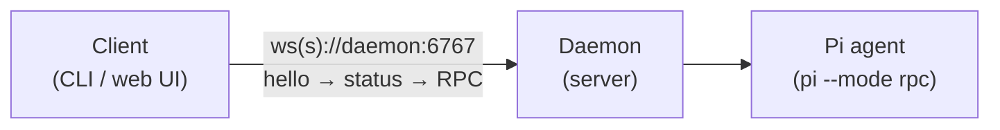
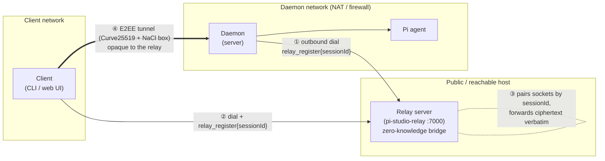

# Pi-Studio

Self-hosted, local-first system for running and controlling the **Pi** AI coding agent. A long-lived
**daemon** runs on your machine, manages agent processes, terminals, git worktrees, and projects, and
exposes a WebSocket API. Clients — a **CLI** and a **React/Vite web UI** today, native desktop/mobile
apps in later sprints — connect to the daemon to observe and drive agents. An optional **E2EE relay**
lets a client reach a daemon behind NAT/firewall without exposing it directly.

Your code never leaves your machine.

## Requirements

- **Node.js ≥ 20** (developed on Node 24)
- **npm** (workspaces)
- For the real `pi` provider: **pi credentials** only — the `pi` CLI itself is bundled as a dependency
  (`@earendil-works/pi-coding-agent`), so no global install is needed. Set an API key
  (`ANTHROPIC_API_KEY`, etc.) or configure `~/.pi/agent/auth.json`. A built-in `mock` provider works
  with no credentials at all.

## Install & build

```bash
npm install
npm run build          # builds all workspace packages in dependency order (protocol → … → cli)
```

You can also build just the daemon:

```bash
npm run build:server
```

## Start the daemon (server)

The daemon is the server. The simplest way to start it:

```bash
npm start              # builds the server, then starts the daemon in the foreground
```

`npm start` runs `build:server` first and then launches the daemon. If the server is already built,
start it directly without rebuilding:

```bash
npm run start:server   # node packages/server/dist/daemon/main.js
```

By default the production daemon:

- listens on **`0.0.0.0:6767`** (reachable over the LAN; override with `PI_STUDIO_LISTEN`)
- stores all state under **`$PI_STUDIO_HOME`** (default **`~/.pi-studio`**)
- writes rotating NDJSON logs to **`$PI_STUDIO_HOME/logs/`**
- writes a PID lock at **`$PI_STUDIO_HOME/pi-studio.pid`**
- generates a persistent Curve25519 keypair at **`$PI_STUDIO_HOME/daemon-keypair.json`** (used for
  relay pairing; see [Relay](#optional-e2ee-relay-reaching-a-daemon-behind-natfirewall))
- registers the **full** RPC surface (agents, terminals, git/worktrees, projects, chat, loops,
  schedules, files, providers) — this is the real daemon (`bootstrap.ts`), not a stub

It runs in the foreground; press **Ctrl-C** (SIGINT) or send SIGTERM to shut down cleanly (the PID
lock is released and the HTTP/WS servers close).

### Verify it's running

```bash
curl http://127.0.0.1:6767/api/health
# → {"status":"ok"}
```

`GET /api/health` is exempt from the Host-header allowlist and password auth.

### Configuration (environment variables)

All are optional; the daemon also reads `$PI_STUDIO_HOME/config.json`.

| Variable                   | Default                 | Purpose                                                   |
| -------------------------- | ----------------------- | --------------------------------------------------------- |
| `PI_STUDIO_HOME`           | `~/.pi-studio`          | State + config + logs directory                           |
| `PI_STUDIO_LISTEN`         | `0.0.0.0:6767`          | Daemon listen address (`host:port`)                       |
| `PI_STUDIO_PASSWORD`       | _(unset)_               | Require this password for connections (bcrypt-checked)    |
| `PI_STUDIO_HOSTNAMES`      | `localhost,*.localhost` | Allowed `Host` header values (literal IPs always allowed) |
| `PI_STUDIO_SERVER_ID`      | _(generated UUID)_      | Stable server identity                                    |
| `PI_STUDIO_LOG_LEVEL`      | `info`                  | pino log level                                            |
| `PI_STUDIO_RELAY_ENABLED`  | `false`                 | Opt in to dialing out to a relay (see below)              |
| `PI_STUDIO_RELAY_ENDPOINT` | _(unset)_               | Relay `host:port` to dial                                 |
| `PI_STUDIO_RELAY_USE_TLS`  | `false`                 | Use `wss://` to reach the relay                           |

Example — run on a different port with a password and an isolated home:

```bash
PI_STUDIO_HOME=/tmp/pi-studio-dev \
PI_STUDIO_LISTEN=127.0.0.1:6790 \
PI_STUDIO_PASSWORD=hunter2 \
npm run start:server
```

## Drive it from the CLI

The `@av-pi-studio/cli` package provides a `pi-studio` command. After `npm run build`, run it through
the workspace bin:

```bash
# log in to a model provider (the `pi` provider needs one — see "The `pi` provider" below)
node packages/cli/dist/cli.js auth login

# start a local daemon (if one isn't already running) and print a pairing QR code
node packages/cli/dist/cli.js daemon start

# report daemon health / stop it
node packages/cli/dist/cli.js daemon status
node packages/cli/dist/cli.js daemon stop

# set a daemon password (bcrypt-hashed into config.json; enforced on next start)
node packages/cli/dist/cli.js daemon set-password hunter2

# revoke every pairing link/QR ever issued (e.g. one leaked) — mints a fresh keypair and restarts
node packages/cli/dist/cli.js daemon rotate-key
```

> Tip: `npm link` inside `packages/cli` (or installing the package) exposes the `pi-studio` binary on
> your `PATH` so you can run `pi-studio daemon start` directly.

Once a daemon is running, drive agents:

```bash
node packages/cli/dist/cli.js run --provider pi/<model> "implement user authentication"
node packages/cli/dist/cli.js ls                 # list agents
node packages/cli/dist/cli.js attach <agentId>   # stream the live timeline
node packages/cli/dist/cli.js --host workstation.local:6767 ls   # target a remote daemon
```

Run `node packages/cli/dist/cli.js --help` for the full command tree (`agent`/`run`/`ls`/`attach`,
`auth`, `daemon`, `relay`, `chat`, `terminal`, `loop`, `schedule`, `permit`, `provider`,
`worktree`).

## Web UI (`packages/web-client`)

`@av-pi-studio/web-client` is the production React 19 + Vite 6 browser UI — a three-column workspace
(sessions sidebar, tabbed chat/terminal center, files/changes sidebar). It talks to the daemon only
through the `@av-pi-studio/client` SDK (never a raw WebSocket).

```bash
# run the dev daemon (all features + mock provider available) in one terminal
npm run dev:daemon

# run the Vite dev server in another
npm run dev -w packages/web-client        # http://localhost:5173
```

Enter the daemon URL and optional password in the toolbar and click **Connect**. The URL accepts a
bare `host:port`, a `ws://`/`wss://` URL, or `http://`/`https://` (mapped to `ws`/`wss` — the daemon
upgrades HTTP to WebSocket on the same port), e.g. `127.0.0.1:6767` or `https://box.local:6767`. The
password is sent as a `pi-studio.bearer.<pw>` WebSocket subprotocol. To build a
static bundle: `npm run build:web-client` (or `build:electron -w packages/web-client` for the
future Electron shell in `packages/desktop`).

> `npm run dev:daemon` runs `dev-main.js` → `dev-bootstrap.ts`, a **minimal** dev daemon (mock
> provider, a small handler subset) for iterating on the UI without credentials. It is **not** the
> production daemon — `npm start` / `main.ts` / `bootstrap.ts` is.

## Optional: E2EE relay (reaching a daemon behind NAT/firewall)

By default a client connects **directly** to the daemon's WebSocket. When the daemon can't accept
inbound connections (behind NAT, no port-forward), the `@av-pi-studio/relay` package provides an
end-to-end encrypted rendezvous: the daemon dials **outbound** to a relay, the client connects to the
same relay, and all application traffic is encrypted with Curve25519 ECDH + XSalsa20-Poly1305 (NaCl
`box`). The relay is **untrusted and zero-knowledge** — it forwards ciphertext frames verbatim, keyed
by session id, and never sees message contents, only metadata.

The relay is **fully opt-in**: with `daemon.relay.enabled` unset (default `false`), the daemon behaves
exactly as if the package weren't installed.

### Simple setup — direct connection (default, no relay)

The client reaches the daemon's WebSocket directly. Nothing extra to run.



### Scaled setup — client → relay → daemon (daemon behind NAT)

The daemon dials **outbound** to the relay (so no inbound port is needed on the daemon's network).
The client dials the relay too. Both register the same `sessionId`; the relay pairs the two sockets
and blindly forwards frames. The E2EE channel is established **end-to-end between client and daemon**,
so the relay never holds decryptable traffic.



Handshake order over the relay: both sides send `relay_register{sessionId}` → client sends
`e2ee_hello{ephemeralPublicKey}` → daemon replies `e2ee_ready` → all further traffic is
`e2ee_app{frame}` ciphertext. Only **after** the E2EE tunnel is up does the normal
`hello → status → RPC` protocol run inside it.

### Running a relay + pointing a daemon at it

```bash
# 1) start a relay on a reachable host (defaults to 0.0.0.0:7000)
npx @av-pi-studio/relay --listen 0.0.0.0:7000
# or via the CLI, managed as a local process:
pi-studio relay start --listen 0.0.0.0:7000

# 2) point the daemon at it (config.json)
#    { "daemon": { "relay": { "enabled": true, "endpoint": "relay-host:7000", "useTls": false } } }
#    or env: PI_STUDIO_RELAY_ENABLED=true PI_STUDIO_RELAY_ENDPOINT=relay-host:7000
```

The client then pairs via a pairing URL (carrying the daemon's public key + relay session id) and
swaps in the relay transport — every other `DaemonClient`/`PiStudioClient` API works unchanged. See
[`packages/relay/README.md`](packages/relay/README.md) for the full protocol and library API.

> **Treat a pairing link like a password.** On a relay connection its `offer=` key *is* the
> credential, and the relay session id is derived from that key — so a leaked link keeps working
> until the key is replaced. Run `pi-studio daemon rotate-key` to revoke it: the daemon mints a new
> keypair, restarts, and prints a fresh QR (all clients must re-pair; your password and relay
> settings are untouched).

## Run with Docker

Prebuilt Dockerfiles + compose for the daemon, relay, and web UI live in [`docker/`](docker/). The
daemon image ships `git` + a compiled `node-pty` + the bundled `pi` runtime; the relay image is a
tiny pure-JS stateless bridge; the web-client image is the static React/Vite SPA served by nginx.
All build from local monorepo source.

```bash
cd docker
docker compose up --build   # relay :7000 + daemon :6767 + web UI :8080, daemon dials the relay
```

Then open the UI at <http://localhost:8080> and enter the daemon URL (`http://localhost:6767`) in
the toolbar, or drive it from the CLI: `pi-studio --host http://localhost:6767 ls`. Mount your
projects at `/workspace` (`PI_STUDIO_PROJECTS=/abs/path`), persist state in the `/data` volume, and
supply pi credentials via `ANTHROPIC_API_KEY` or a mounted `auth.json`. See
[`docker/README.md`](docker/README.md) for the full env/volume/auth/security matrix.

## The `pi` provider

The `pi` CLI is **bundled** inside `@earendil-works/pi-coding-agent` — the daemon launches
`node <pkg>/dist/cli.js --mode rpc`, so **no global `pi` install is required**. You only need pi
_authenticated_. The supported way is `pi-studio auth login` (see below); alternatively set
`ANTHROPIC_API_KEY` (etc.) in the daemon's environment.

```bash
pi-studio auth login                          # interactive: pick a provider, enter a key
pi-studio auth login openai --api-key sk-...  # headless, for scripts/CI
pi-studio auth status                         # what's configured, and from where
```

This writes Pi's own credential store (`~/.pi/agent/auth.json` by default, or
`<dir>/agent/auth.json` under `--pi-home <dir>`) — the exact file the daemon's spawned agents
read, so a credential is picked up on the next agent spawn with no daemon restart. The command is
entirely local: it never connects to a daemon.

To use a _different_ pi than the bundled one, point the daemon at an absolute path in
`$PI_STUDIO_HOME/config.json`:

```json
{ "agents": { "providers": { "pi": { "command": ["/abs/path/to/pi", "--mode", "rpc"] } } } }
```

A missing/unresolvable pi surfaces as a clean `rpc_error` ("Pi provider unavailable…") instead of
crashing the daemon. The daemon speaks the real Pi RPC protocol (strict JSONL): a `create_agent` with
the `pi` provider runs an actual model turn and streams `assistant_message` deltas, tool calls, and
`turn_completed`. A literal `~` in the `cwd` field is expanded to your home directory. For a
dependency-free smoke test, use the `mock` provider instead.

## Development

```bash
npm test            # run the full test suite (Vitest)
npm run typecheck   # tsc -b across all packages
npm run lint        # oxlint
npm run fmt:check   # oxfmt --check
```

Per-package tests run with `npx vitest run packages/<pkg>` (this repo has no vitest
`--project` workspace config).

## Project layout

```
packages/
  protocol/    wire schemas + shared protocol types (zero workspace deps)
  client/      low-level daemon WS driver + PiStudioClient SDK facade
  server/      the daemon (agents, terminals, git, projects, orchestration, relay transport)
  cli/         pi-studio terminal client + local daemon/relay lifecycle control
  highlight/   server-side syntax-highlight helper
  relay/       E2EE relay (channels, self-hosted server, Cloudflare Workers adapter)
  web-client/  production React/Vite browser UI
  desktop/     Electron wrapper (later sprint — placeholder)
swe/   specifications + the sprint implementation plan
```

Compile-time dependency graph:

```
protocol  ─────────────────────────────► (no workspace deps)
highlight ─────────────────────────────► (no workspace deps)
relay     ─────────────────────────────► (no workspace deps)
client    ──────► protocol, relay
server    ──────► protocol, highlight, relay
cli       ──────► protocol, client, relay  (+ resolves server/web-client paths, no runtime import)
web-client──────► protocol, client
```

The detailed specifications live under [`swe/`](swe/) —
[`MAIN-SCOPE.md`](swe/MAIN-SCOPE.md) is the entry point. Each package also has its own
`README.md` and `AGENTS.md`.
