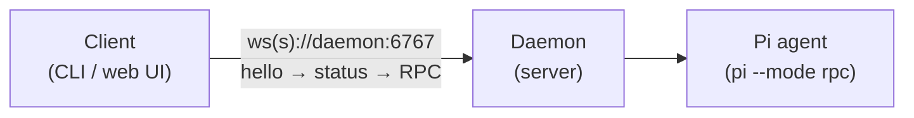
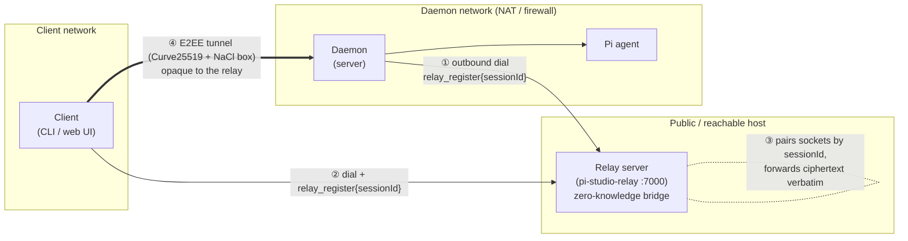

# Pi-Studio

Pi-Studio drives [**Pi**](https://pi.dev) — the terminal coding agent by Earendil — **locally or
remotely**. A long-lived daemon runs on your machine and manages agent processes, terminals, git
worktrees, and projects; two clients talk to it: a CLI and a full browser UI.

Your code never leaves your machine.

```bash
npm install -g @av-pi-studio/cli

pi-studio daemon start   # start (or find) a local daemon, print a pairing QR
pi-studio ui             # serve the browser UI, connected to that daemon
```

<p align="center">
  
</p>

---

## Quick start

```bash
# log in to a model provider (the `pi` provider needs one before it can run a turn)
pi-studio auth login

# start a local daemon (if one isn't already running) and print a pairing QR code
pi-studio daemon start

# open the full browser UI, pointed at that daemon
pi-studio ui

# ...or stay in the terminal: run an agent, list it, attach to stream live output
pi-studio agent run --provider pi/claude-3-5-sonnet "implement user authentication"
pi-studio agent ls
pi-studio agent attach <agentId>

# target a remote daemon instead of the local one
pi-studio --host workstation.local:6767 agent ls
```

Run `pi-studio --help` (or `<command> --help`) for the full command tree, and see
[`packages/cli/README.md`](packages/cli/README.md) for the complete CLI reference — every command
group, global option, and the library API.

## The web UI

`pi-studio ui` serves the production browser UI — a three-column workspace (sessions on the left,
chat/terminal/code in the middle, files and git changes on the right) — as a static site, with no
separate install or build step. Point it at any daemon, local or remote:

```bash
pi-studio ui                                    # serves on http://localhost:4173, connects to the local daemon
pi-studio ui --ui-port 8080 --daemon-host workstation.local:6767
```

Every tool call an agent makes (read/edit/write/shell) renders as its own card, with live diff
stats, right in the chat — that's the screenshot above. Review what it changed without leaving the
tab:

<p align="center">
  
</p>

Split the workspace into multiple panes — chat next to a live terminal (backed by `node-pty`), a
file, or another session — and the layout persists across reloads:

<p align="center">
  
</p>

Every file opens with full syntax highlighting:

<p align="center">
  
</p>

An optional **E2EE relay** lets a client reach a daemon behind NAT/firewall without exposing it
directly — see [below](#optional-e2ee-relay-reaching-a-daemon-behind-natfirewall).

---

## Daemon configuration

The daemon reads `$PI_STUDIO_HOME/config.json` and these environment variables — set them before
`pi-studio daemon start`, or pass them to `docker compose` (see [Docker](#run-with-docker) below).
All are optional.

| Variable                   | Default                 | Purpose                                                   |
| -------------------------- | ----------------------- | --------------------------------------------------------- |
| `PI_STUDIO_HOME`           | `~/.pi-studio`          | State + config + logs directory                           |
| `PI_STUDIO_LISTEN`         | `0.0.0.0:6767`          | Daemon listen address (`host:port`)                       |
| `PI_STUDIO_PASSWORD`       | _(unset)_               | Require this password for connections (bcrypt-checked)    |
| `PI_STUDIO_HOSTNAMES`      | `localhost,*.localhost` | Allowed `Host` header values (literal IPs always allowed) |
| `PI_STUDIO_SERVER_ID`      | _(generated UUID)_      | Stable server identity                                    |
| `PI_STUDIO_LOG_LEVEL`      | `info`                  | pino log level                                            |
| `PI_STUDIO_RELAY_ENABLED`  | `false`                 | Opt in to dialing out to a relay (see below)              |
| `PI_STUDIO_RELAY_ENDPOINT` | _(unset)_               | Relay `host:port` to dial                                 |
| `PI_STUDIO_RELAY_USE_TLS`  | `false`                 | Use `wss://` to reach the relay                           |

Example — run on a different port with a password and an isolated home:

```bash
PI_STUDIO_HOME=/tmp/pi-studio-dev \
PI_STUDIO_LISTEN=127.0.0.1:6790 \
PI_STUDIO_PASSWORD=hunter2 \
pi-studio daemon start
```

A password can also be set on an already-running daemon: `pi-studio daemon set-password hunter2`
(bcrypt-hashed into `config.json`, enforced on next start). To revoke every pairing link/QR ever
issued (e.g. one leaked), mint a fresh keypair: `pi-studio daemon rotate-key`.

## Optional: E2EE relay (reaching a daemon behind NAT/firewall)

By default a client connects **directly** to the daemon's WebSocket. When the daemon can't accept
inbound connections (behind NAT, no port-forward), the `@av-pi-studio/relay` package provides an
end-to-end encrypted rendezvous: the daemon dials **outbound** to a relay, the client connects to the
same relay, and all application traffic is encrypted with Curve25519 ECDH + XSalsa20-Poly1305 (NaCl
`box`). The relay is **untrusted and zero-knowledge** — it forwards ciphertext frames verbatim, keyed
by session id, and never sees message contents, only metadata.

The relay is **fully opt-in**: with `daemon.relay.enabled` unset (default `false`), the daemon behaves
exactly as if the package weren't installed.

### Simple setup — direct connection (default, no relay)

The client reaches the daemon's WebSocket directly. Nothing extra to run.



### Scaled setup — client → relay → daemon (daemon behind NAT)

The daemon dials **outbound** to the relay (so no inbound port is needed on the daemon's network).
The client dials the relay too. Both register the same `sessionId`; the relay pairs the two sockets
and blindly forwards frames. The E2EE channel is established **end-to-end between client and daemon**,
so the relay never holds decryptable traffic.



Handshake order over the relay: both sides send `relay_register{sessionId}` → client sends
`e2ee_hello{ephemeralPublicKey}` → daemon replies `e2ee_ready` → all further traffic is
`e2ee_app{frame}` ciphertext. Only **after** the E2EE tunnel is up does the normal
`hello → status → RPC` protocol run inside it.

### Running a relay + pointing a daemon at it

```bash
# 1) start a relay on a reachable host (defaults to 0.0.0.0:7000)
npx @av-pi-studio/relay --listen 0.0.0.0:7000
# or via the CLI, managed as a local process:
pi-studio relay start --listen 0.0.0.0:7000

# 2) point the daemon at it (config.json)
#    { "daemon": { "relay": { "enabled": true, "endpoint": "relay-host:7000", "useTls": false } } }
#    or env: PI_STUDIO_RELAY_ENABLED=true PI_STUDIO_RELAY_ENDPOINT=relay-host:7000
```

The client then pairs via a pairing URL (carrying the daemon's public key + relay session id) and
swaps in the relay transport — every other `DaemonClient`/`PiStudioClient` API works unchanged. See
[`packages/relay/README.md`](packages/relay/README.md) for the full protocol and library API.

> **Treat a pairing link like a password.** On a relay connection its `offer=` key *is* the
> credential, and the relay session id is derived from that key — so a leaked link keeps working
> until the key is replaced. Run `pi-studio daemon rotate-key` to revoke it: the daemon mints a new
> keypair, restarts, and prints a fresh QR (all clients must re-pair; your password and relay
> settings are untouched).

## Run with Docker

Prebuilt Dockerfiles + compose for the daemon, relay, and web UI live in [`docker/`](docker/). The
daemon image ships `git` + a compiled `node-pty` + the bundled `pi` runtime; the relay image is a
tiny pure-JS stateless bridge; the web-client image is the static React/Vite SPA served by nginx.
All build from local monorepo source.

```bash
cd docker
docker compose up --build   # relay :7000 + daemon :6767 + web UI :8080, daemon dials the relay
```

Then open the UI at <http://localhost:8080> and enter the daemon URL (`http://localhost:6767`) in
the toolbar, or drive it from the CLI: `pi-studio --host http://localhost:6767 ls`. Mount your
projects at `/workspace` (`PI_STUDIO_PROJECTS=/abs/path`), persist state in the `/data` volume, and
supply pi credentials via `ANTHROPIC_API_KEY` or a mounted `auth.json`. See
[`docker/README.md`](docker/README.md) for the full env/volume/auth/security matrix.

## The `pi` provider

The `pi` CLI is **bundled** inside `@earendil-works/pi-coding-agent` — the daemon launches
`node <pkg>/dist/cli.js --mode rpc`, so **no global `pi` install is required**. You only need pi
_authenticated_. The supported way is `pi-studio auth login` (see below); alternatively set
`ANTHROPIC_API_KEY` (etc.) in the daemon's environment.

```bash
pi-studio auth login                          # interactive: pick a provider, enter a key
pi-studio auth login openai --api-key sk-...  # headless, for scripts/CI
pi-studio auth status                         # what's configured, and from where
```

This writes Pi's own credential store (`~/.pi/agent/auth.json` by default, or
`<dir>/agent/auth.json` under `--pi-home <dir>`) — the exact file the daemon's spawned agents
read, so a credential is picked up on the next agent spawn with no daemon restart. The command is
entirely local: it never connects to a daemon.

To use a _different_ pi than the bundled one, point the daemon at an absolute path in
`$PI_STUDIO_HOME/config.json`:

```json
{ "agents": { "providers": { "pi": { "command": ["/abs/path/to/pi", "--mode", "rpc"] } } } }
```

A missing/unresolvable pi surfaces as a clean `rpc_error` ("Pi provider unavailable…") instead of
crashing the daemon. The daemon speaks the real Pi RPC protocol (strict JSONL): a `create_agent` with
the `pi` provider runs an actual model turn and streams `assistant_message` deltas, tool calls, and
`turn_completed`. A literal `~` in the `cwd` field is expanded to your home directory. For a
dependency-free smoke test, use the `mock` provider instead.

## More

- Full CLI command reference and library API: [`packages/cli/README.md`](packages/cli/README.md)
- Building from source, running tests, and the monorepo layout:
  [`CONTRIBUTING.md`](CONTRIBUTING.md)
- Architecture and feature specs: [`swe/`](swe/) — [`MAIN-SCOPE.md`](swe/MAIN-SCOPE.md) is the
  entry point. Each package also has its own `README.md` and `AGENTS.md`.
