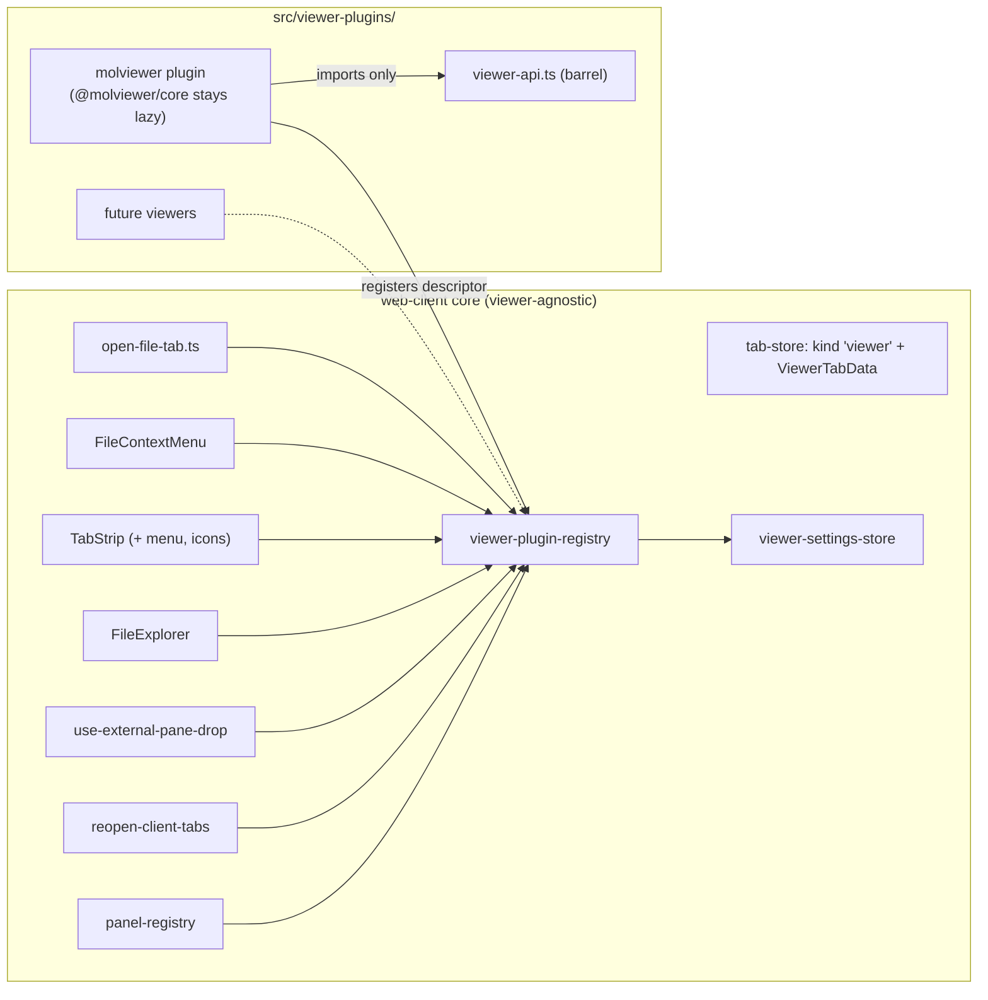

# Molviewer decoupling — viewer plugin system plan

Status: **plan, approved direction (Option 2: in-repo viewer plugin registry).** No code has been
written against this plan yet. This document is the implementation spec for decoupling the molecule
viewer (`@molviewer/core`) from `packages/web-client` core, turning it into the first registered
viewer plugin behind a small, general contract — and making it runtime-disableable via settings.

The integration this plan dismantles is documented in `docs/molviewer-integration-scope.md`
(sprint-044). That doc is the authoritative "before" record; this doc is the "after" spec.

---

## 1. Motivation

The molecule viewer is tightly coupled to web-client core in three ways:

1. **Type-level**: `"molecule"` is a first-class member of the `TabKind` union, with its own
   `MoleculeTabData`, `tabIds.molecule`, `openNewMolecule`, identity prefix, panel entry, icon
   entry, and special cases scattered across ~8 files.
2. **Knowledge-level**: molviewer-specific file-format tables (`MOLECULE_EXTENSIONS`,
   `MOLECULE_FILENAMES`, `isMoleculeFile`) live in the *generic* `viewer-registry.ts`, and
   file-open dispatch (`openFileTab`) hardcodes the molecule-vs-text fork.
3. **UI-level**: "Open in MolViewer" / "Open as Text" context-menu items and the "+" menu's
   "New molecule view" entry name the viewer directly.

Consequences today: adding a second custom viewer (e.g. a crystal-structure or plot viewer) would
require repeating the same surgery across all of these files; and there is no way to turn the
molecule viewer off without a code change.

Goals:

- **G1.** A small, general `ViewerPlugin` contract; web-client core talks only to a registry,
  never to a specific viewer.
- **G2.** Molviewer becomes plugin #1, living under `src/viewer-plugins/molviewer/`, importing
  only the plugin API barrel plus core hooks/services handed to it.
- **G3.** Runtime enable/disable per viewer via Settings (persisted), with graceful fallback
  semantics when a viewer is disabled.
- **G4.** No behavior change for users while molviewer is enabled: every tab, menu entry, reload,
  save, and polymer-build flow works exactly as today.

Non-goals (explicitly deferred — see §9):

- Dynamic/remote plugin loading (URL imports, separately versioned packages, plugin sandboxing).
- Build-time exclusion of molviewer from the bundle (white-label builds).
- A plugin marketplace, manifest discovery, or plugin API versioning beyond a single constant.

The contract in §4 is nonetheless designed as a strict subset of what a future remote-plugin
system needs: a descriptor object, a loader thunk, and host services passed *in* (never imported
by the plugin). Adopting that system later should not break this contract.

---

## 2. Current coupling inventory (grounded)

Every file web-client core touches for molviewer today. Paths are relative to
`packages/web-client/src/` unless noted.

| Coupling point | File | What's hardcoded |
|---|---|---|
| Hard dependency | `package.json` (`@molviewer/core`), `vite.config.ts` (`vendor-molviewer` manual chunk) | bundle-level; already isolated in its own lazy chunk |
| Tab kind union | `stores/tab-store.ts` | `"molecule"` in `TabKind`, `MoleculeTabData { path: string \| null }`, `tabIds.molecule`, `openNewMolecule`, `tabIdentity` → `molecule:<path>`, `closeByPathPrefix` filter |
| Identity persistence | `lib/pane-layout-persistence.ts`, `features/workspace/reopen-client-tabs.ts` | `tabIdentity`/`tabFromIdentity` round-trip `molecule:<path>`; `tabFromIdentity` is deliberately the *literal* inverse of `tabIdentity` |
| File-open dispatch | `features/files/viewer-registry.ts` (`isMoleculeFile`, `MOLECULE_EXTENSIONS`, `MOLECULE_FILENAMES`), `features/files/open-file-tab.ts` (`openFileTab` → `openMoleculeTab`/`openTextTab`) | molviewer's supported-format tables live in the generic registry |
| Panel mapping | `features/workspace/panel-registry.ts` | `molecule: MoleculeViewerPanel` (lazy) |
| Context menu | `features/files/FileContextMenu.tsx` | "Open in MolViewer" (files only), "Open as Text" (molecule files only) |
| Tab strip | `features/workspace/TabStrip.tsx` | `ICON_BY_KIND.molecule = Atom`, "+" menu "New molecule view", `MONO_LABEL_KINDS` |
| Explorer interactions | `features/files/FileExplorer.tsx` | active-row highlight includes molecule tabs; close-on-delete/rename checks both `file` and `molecule` ids |
| Pane drop | `features/workspace/use-external-pane-drop.ts` | dual-id lookup (a path can be open as either kind) |
| Viewer implementation | `features/files/MoleculeViewer.tsx`, `MoleculeViewerPanel.tsx`, `MoleculeViewer.module.css`, `molecule-source.ts`, `molecule-reload.ts`, `molecule-theme.ts`, `polymer-file.ts`, `MoleculeViewer.test.ts` | the implementation itself — already well isolated: pure helpers split out for testability, panel lazy-loaded |

Supporting facts that shape the plan:

- **No general settings store exists.** Only `theme/appearance-store.ts` (localStorage-persisted
  controller + `useSyncExternalStore`). A new viewer-settings store follows that exact pattern.
  `SettingsDialog` (`features/settings/SettingsDialog.tsx`) already has an extensible
  `SETTINGS_CATEGORIES` list with an `available(caps)` gate — a new category is one entry.
- **The existing `VIEWER_REGISTRY` is the wrong seam for this.** It maps `ViewerKind` →
  component with `{ path }` props inside `FilePanel`. Molviewer deliberately bypasses it (own tab
  kind, own panel) because it needs more than rendering: save (`file_write_request`), polymer
  build (`createEntry` + open-new-tab), live-reload gating on unsaved edits, an empty-state
  "new tab" affordance, its own icon and mono label. The plugin contract must cover all of these
  or it will be bypassed too.
- **`@molviewer/core` touches `document` at module scope** — which is why the pure helpers
  (`molecule-source.ts`, `molecule-reload.ts`, `polymer-file.ts`, `molecule-theme.ts`) exist as
  separate modules without the import. This constraint carries over: the plugin's *descriptor*
  registration must stay import-safe; only the panel component is a dynamic import.
- **Identities are load-bearing.** `tabFromIdentity` must stay the exact inverse of `tabIdentity`
  (its header comment explains why: dispatching through `openFileTab` at restore time would
  re-route kinds and orphan pane claims). Unknown identity prefixes are ignored by design —
  that's the forward-compat property the migration in §6 relies on.

---

## 3. Target architecture

```
packages/web-client/src/
  viewer-plugins/
    viewer-api.ts            ← the ONLY core surface plugins import (barrel)
    viewer-plugin.ts         ← ViewerPlugin interface + ViewerTabData
    viewer-plugin-registry.ts← register/lookup, enabled-filter, dispatch helpers
    viewer-settings-store.ts ← per-viewer enable/disable, localStorage-persisted
    molviewer/
      index.ts               ← registers the descriptor (module scope)
      MolViewerPanel.tsx     ← PanelProps adapter (lazy entry point)
      MoleculeViewer.tsx     ← the viewer (moved, logic unchanged)
      MoleculeViewer.module.css
      molecule-source.ts     ← pure helpers, moved unchanged
      molecule-reload.ts
      molecule-theme.ts
      polymer-file.ts
      MoleculeViewer.test.ts
    (future plugins land here)
```



Dependency rule: **core may import the registry; core may never import anything under
`viewer-plugins/<specific>/`.** Plugins import `viewer-api.ts` and nothing else from core.
Registration is enforced by one import in the app's composition root (see §5, phase 1).

---

## 4. The contract

Derived from what molviewer *actually* uses today — not a lowest-common-denominator
`{ path }` shape. Anything a future viewer needs that isn't here gets added to the contract
then, deliberately.

### 4.1 `ViewerPlugin` descriptor (`viewer-plugin.ts`)

```ts
import type { ComponentType, LazyExoticComponent } from "react";

/** Tab data for every viewer tab (replaces MoleculeTabData). */
export interface ViewerTabData {
  /** Which plugin owns this tab; matches ViewerPlugin.id. */
  viewerId: string;
  /** Absolute path backing the tab, or null for the plugin's empty-state tab. */
  path: string | null;
}

export interface ViewerPlugin {
  /** Stable id, kebab-case, unique. Persisted in tab identities — never rename casually. */
  id: string;                                  // "molviewer"
  /** Human-facing name for menus and settings. */
  label: string;                               // "Molecule Viewer"
  /** Tab-strip glyph / drop-chip icon. */
  icon: ComponentType<{ size?: number | string }>;
  /**
   * Does this viewer claim `path` for a *fresh* open? Pure, synchronous, no file reads.
   * Replaces isMoleculeFile. Returning false does not prevent force-open (§4.3).
   */
  match(path: string): boolean;
  /** The panel component, lazy. Receives PanelProps like every other panel. */
  panel: LazyExoticComponent<ComponentType<PanelProps>>;
  /**
   * Optional "+"-menu entry for a path-less tab (molviewer's drag-drop empty state).
   * Omitting it means no empty-tab affordance.
   */
  emptyTab?: {
    /** Menu item label, e.g. "New molecule view". */
    label: string;
    /** Tab id namespace for empty tabs, e.g. tabIds.molecule(`new-${n}`). */
    mintId(counter: number): string;
    /** Tab label for the empty tab, e.g. `Molecule ${n}`. */
    mintLabel(counter: number): string;
  };
  /** Render the tab label in the mono font (path-shaped tabs). */
  monoLabel?: boolean;
  /**
   * Context-menu force-open entry ("Open in MolViewer" for ANY file, including
   * extensions match() doesn't claim). Omit → no force-open menu item.
   */
  forceOpen?: { label: string };
  /** Registration order tie-break for overlapping match(); lower wins. Default 100. */
  priority?: number;
}
```

Design notes:

- **`match` is extension/filename tables only** — synchronous by contract, exactly like today's
  `isMoleculeFile` (LAMMPS `data` files stay excluded; content-sniffing would make it async and
  is out of scope).
- **`forceOpen` is a separate capability from `match`** because today's context menu offers
  "Open in MolViewer" for *every* file (a LAMMPS data file the reader can still parse), while
  extension dispatch only claims known formats. Collapsing them would lose that behavior.
- **`emptyTab.mintId/mintLabel` take a counter** because molviewer's empty tabs increment
  (`Molecule 1`, `Molecule 2`, ids `mol-new-<n>`). The counter stays owned by the registry's
  generic open helper, not the plugin.
- The union `TabKind` stays **closed**; plugins live *inside* the new `"viewer"` kind. No
  stringly-typed kinds leaking into exhaustive switches.

### 4.2 Host services (`viewer-api.ts`)

The barrel a plugin imports. Everything molviewer's `MoleculeViewer.tsx` reaches into core for,
re-exported from one place:

```ts
// Data plumbing
export { useFileDownload } from "@pi-studio-ui/hooks/use-file-download.js";
export { useFileWatch } from "@pi-studio-ui/hooks/use-file-watch.js";
export { writeFile, WriteFileError } from "@pi-studio-ui/features/files/write-file.js";
export { createEntry, CreateEntryError } from "@pi-studio-ui/features/files/create-entry.js";
export { deleteEntry } from "@pi-studio-ui/features/files/delete-entry.js";

// Tab/workspace interaction
export { tabIds, useTabStore, useIsTabVisible } from "@pi-studio-ui/stores/tab-store.js";
export { openViewerTab } from "@pi-studio-ui/viewer-plugins/viewer-plugin-registry.js";

// UI primitives a panel may compose
export { Panel } from "@pi-studio-ui/components/primitives/Panel.js";
export { Spinner } from "@pi-studio-ui/components/primitives/Spinner.js";
export { StatusBadge } from "@pi-studio-ui/components/primitives/StatusBadge.js";
export { useFileTransfer } from "@pi-studio-ui/hooks/use-file-transfer.js";

// Types
export type { PanelProps } from "@pi-studio-ui/features/workspace/panel-registry.js";
export type { ViewerPlugin, ViewerTabData } from "./viewer-plugin.js";
```

Enforcement is by convention + code review in this phase (a lint boundary rule is a nice-to-have
follow-up, not a gate). When a future plugin needs something new, it gets added here — the barrel
*doubles as the changelog of the plugin API*.

Note `write-file.ts`/`create-entry.ts`/`delete-entry.ts` currently sit in `features/files/` and
are shared with non-viewer code (FileExplorer's new-file row, the context menu's delete). They
stay where they are; the barrel re-exports them. Moving them would churn unrelated callers for no
gain.

### 4.3 Registry (`viewer-plugin-registry.ts`)

```ts
registerViewerPlugin(plugin: ViewerPlugin): void      // module-scope, idempotent per id, throws on dup id
registeredViewerPlugins(): readonly ViewerPlugin[]    // registration order
enabledViewerPlugins(): readonly ViewerPlugin[]       // filtered by settings store (reactive hook below)
viewerForPath(path: string): ViewerPlugin | undefined // first enabled plugin whose match() wins (priority order)
viewerById(id: string): ViewerPlugin | undefined      // regardless of enabled state (restore path)
useEnabledViewerPlugins(): ViewerPlugin[]              // hook, re-renders on settings change

openViewerTab(pluginId, path: string | null, workspaceCwd, targetPaneId?): void
openPathInViewer(path, workspaceCwd, targetPaneId?): boolean  // dispatch; false → caller falls back to text
```

Registration happens at module scope in each plugin's `index.ts`; the composition root
(`main.tsx` or the app bootstrap) imports `viewer-plugins/index.ts`, which imports every plugin's
`index.ts` **once, eagerly**. Only panel components stay lazy. This is what lets
`reopenClientTabs` resolve `viewer:<id>:` identities at boot before any connection exists —
synchronous registration, no async discovery.

---

## 5. Phased implementation

Each phase is independently shippable; the app works after every phase.

### Phase 0 — Runtime kill switch (no architecture change)

**Deliverable: molviewer disableable at runtime, before the registry exists.** This is the quick
win and its gate logic survives into phase 3 as the registry's enabled-filter.

1. New `src/viewer-plugins/viewer-settings-store.ts`: localStorage-persisted
   `{ [viewerId: string]: boolean }` (default: enabled), controller +
   `useSyncExternalStore` hook, same structure as `theme/appearance-store.ts`. Only one viewer id
   exists yet (`"molviewer"`), but the store is already keyed by id so phase 1 touches nothing.
2. Gate the five dispatch points on `isViewerEnabled("molviewer")`:
   - `openFileTab` (`open-file-tab.ts`): disabled → always `openTextTab`.
   - `FileContextMenu`: hide "Open in MolViewer" and "Open as Text" (the latter only makes sense
     while the viewer exists as an alternative).
   - `TabStrip` "+" menu: hide "New molecule view".
   - `tabFromIdentity` (`reopen-client-tabs.ts`): a persisted `molecule:<path>` reopens as a
     **text tab** (see §7 semantics) rather than a molecule tab.
   - `use-external-pane-drop.ts`: the dual-id existing-tab lookup keeps working (it's about tabs
     already open, not new dispatch) — no gate needed there; verify only.
3. Settings UI: new "Viewers" category in `SETTINGS_CATEGORIES` with one toggle row
   ("Molecule Viewer") — hardcoding the single row is fine; phase 4 makes it registry-driven.

**Verification:** manual smoke — toggle off, open `.cif` → text; "+" menu loses the entry;
reload with a persisted molecule tab → reopens as text; toggle on → all restored. Plus the unit
tests listed in §8.

### Phase 1 — Contract, registry, and the move

1. Create `viewer-plugin.ts`, `viewer-api.ts`, `viewer-plugin-registry.ts` per §4.
2. Move the eight molviewer files from `features/files/` to `viewer-plugins/molviewer/`,
   rewriting their core imports to go through `viewer-api.ts`. `MoleculeViewer.tsx` logic is
   unchanged; this is a move + import-rewrite phase.
3. `viewer-plugins/molviewer/index.ts` exports the descriptor:
   `id: "molviewer"`, `match` = relocated `isMoleculeFile` (tables move with it),
   `panel: lazy(MoleculeViewerPanel)`, `emptyTab` wired to the existing
   `tabIds.molecule`/`Molecule ${n}` conventions, `forceOpen: { label: "Open in MolViewer" }`,
   `icon: Atom`, `monoLabel: false`.
4. `viewer-plugins/index.ts` imports `./molviewer/index.js`; the app bootstrap imports it once.
5. `viewer-registry.ts` (generic file viewers) loses `isMoleculeFile`/`MOLECULE_EXTENSIONS`/
   `MOLECULE_FILENAMES` — deleted, not re-exported. `open-file-tab.ts` dispatches through
   `openPathInViewer`.

After this phase, core still names `"molecule"` in the tab model (that's phase 2), but all
*knowledge* of molecule formats lives inside the plugin.

### Phase 2 — Tab model generalization (the invasive step)

1. `tab-store.ts`:
   - `TabKind`: `"chat" | "file" | "diff" | "terminal" | "viewer"` — `"molecule"` removed.
   - `ViewerTabData` (from `viewer-plugin.ts`) replaces `MoleculeTabData` in `TabData`.
   - `tabIds.viewer(viewerId, path)` mints ids; the molviewer plugin keeps id shape
     `mol-<path>`/`mol-new-<n>` via its descriptor so persisted layouts and the
     external-pane-drop dual-id lookup keep functioning (the *identity* changes form, the *id*
     doesn't have to — see §6).
   - `openNewMolecule` becomes generic `openNewViewerTab(plugin)` driven by `emptyTab`;
     `TabStrip` iterates enabled plugins' `emptyTab` entries.
   - `tabIdentity`: `viewer:<viewerId>:<path>` (null path → still `null`, no identity).
   - `closeByPathPrefix` / `FileExplorer` close-on-delete/rename: match any tab whose data has a
     `path` — i.e. `file | diff | viewer` — without naming viewer ids. The explorer's
     active-row highlight reads `data.path` the same generic way.
2. `panel-registry.ts`: `viewer: ViewerPanelHost`, where `ViewerPanelHost` looks up
   `viewerById(tab.data.viewerId)` and renders its `panel` (unknown id → a small "viewer not
   available" fallback panel, never a crash — covers a disabled-but-registered edge and a
   future uninstalled-plugin edge alike).
3. `TabStrip`: `ICON_BY_KIND` gains a `viewer` entry that resolves through the registry
   (`viewerById(...)?.icon ?? File`); `MONO_LABEL_KINDS` consults the plugin's `monoLabel`.
4. `FileContextMenu`: iterate enabled plugins — one `forceOpen` item per plugin that declares
   one; "Open as Text" appears iff any enabled viewer's `match()` claims the path.
5. `use-external-pane-drop.ts`: the dual-id lookup becomes "find any open tab whose
   `data.path === payload.path`" — which is what it's actually checking today. The data-path
   formulation removes id-namespace knowledge entirely (no per-viewer id minting needed here).

### Phase 3 — Persistence migration

Covered in detail in §6 because it's the riskiest step and deserves its own rules. Lands with
phase 2 (same PR) — identity format and tab model change together; splitting them would create an
intermediate state where identities don't round-trip.

### Phase 4 — Settings UI, tests, docs

1. "Viewers" settings category becomes registry-driven: one row per registered plugin,
   toggle bound to the settings store, disabled state shows "disabled — files open as text".
2. Test updates per §8.
3. Docs: `packages/web-client/AGENTS.md` (tab-kind invariants, the molecule-viewer sections,
   source-layout tree), root `AGENTS.md` web-client line, `docs/molviewer-integration-scope.md`
   gets a status banner pointing here.

---

## 6. Persistence migration (identities)

Persisted pane layouts carry tab identities (`file:<path>`, `diff:<staged|worktree>:<path>`,
`molecule:<path>` today). Rules:

1. **New write format**: `viewer:<viewerId>:<path>` (molviewer: `viewer:molviewer:<path>`).
2. **Read alias, one-directional**: `pane-layout-persistence`'s validation/load and
   `tabFromIdentity` accept the legacy `molecule:<path>` and map it to a molviewer viewer tab
   *iff the molviewer plugin is registered and enabled*; if disabled, it reopens as a text tab
   (§7). Nothing ever *writes* the legacy form again.
3. **Forward-compat is already safe**: `tabFromIdentity` ignores unknown prefixes by design, so
   an old client reading a new layout drops `viewer:` identities (pane pruned, as today for
   unknown kinds) rather than crashing. Acceptable; note it in the migration's PR description.
4. **`tabFromIdentity` stays the literal inverse of `tabIdentity`** — it must keep constructing
   tabs directly, never dispatching through `openPathInViewer` (the existing header comment in
   `reopen-client-tabs.ts` explains the orphan-claim failure mode; that reasoning is unchanged).
5. **No data migration pass.** Layouts are rewritten naturally on next persist (every layout
   mutation persists). Old-format entries keep being read-aliased until then. The alias code is
   ~10 lines and can stay forever; removing it is an explicit future decision, not a TODO.

Test the round-trip both directions: new format writes/reads; legacy format reads to the right
tab; disabled-viewer legacy format reads to a text tab.

---

## 7. Disabled-viewer semantics (product decisions, fixed by this plan)

When a viewer is disabled in Settings:

| Surface | Behavior |
|---|---|
| File open dispatch | Falls through to text. Data is never unreachable. |
| Context menu | Force-open item hidden; "Open as Text" hidden (nothing to contrast with). |
| "+" menu | Empty-tab entry hidden. |
| Already-open viewer tabs | Stay mounted and functional until closed — disabling is about *new* opens, not ripping running UI out from under edits. (Simplest correct rule; matches the gate points in phase 0.) |
| Persisted viewer identities | Reopen as text tabs on next boot (phase 0 rule), so panes survive. Re-enabling doesn't auto-flip them back — next open dispatches normally. |
| Settings row | Visible and toggleable (that's the point). |

Rationale: "disabled" means "don't offer this viewer", never "destroy state" or "hide data".

---

## 8. Test plan

Existing tests that hardcode `"molecule"` and must be updated (not deleted) in phase 2/4:

- `stores/tab-store.test.ts` — `openNewMolecule` describe → generic `openNewViewerTab` with a
  fake registered plugin; id/label conventions preserved.
- `features/workspace/reopen-client-tabs.test.ts` — new-format round-trip + legacy alias +
  disabled-viewer alias.
- `lib/pane-layout-persistence.test.ts` — `tabIdentity` cases → `viewer:molviewer:<path>` form.
- `features/files/viewer-registry.test.ts` — `isMoleculeFile` suite moves to the molviewer
  plugin's own test file (the tables move with the plugin); the generic registry's tests keep
  only `detectViewerKind`/`LIVE_REFRESH_KINDS` coverage.
- `features/workspace/tab-attention.test.ts` — `NON_CHAT_KINDS` list updates to include
  `"viewer"` instead of `"molecule"`.
- `MoleculeViewer.test.ts` — moves with the plugin; imports unchanged (pure helpers).

New tests:

- Registry: duplicate-id registration throws; `viewerForPath` priority order; enabled-filter
  reacts to the settings store.
- Settings store: persistence round-trip, default-enabled, subscription notification (mirror
  `appearance-store.test.ts`).
- Disabled semantics: `openPathInViewer` returns false when the only matching viewer is
  disabled; context-menu contribution list shrinks.

No test may import `@molviewer/core` (module-scope `document` access; node test environment) —
this invariant already holds via the pure-helper split and must survive the move.

Final gate: `npm run typecheck`, `npm test`, `npm run lint`, plus a manual smoke of the full
viewer flow (open `.cif`, live-reload, save, polymer build, disable/re-enable, reload restore)
against a dev daemon.

---

## 9. Risks and deferred concerns

| Risk | Mitigation |
|---|---|
| Identity migration breaks persisted layouts | Read-alias (§6), both-direction round-trip tests, `tabFromIdentity` stays literal-inverse |
| Behavior drift during the move | Phase 1 is move + import-rewrite only; G4 is the acceptance bar; the eight moved files keep their existing unit tests green |
| Plugin contract too thin (next viewer needs more) | Contract was derived from molviewer's real usage, not invented; additions go through `viewer-api.ts` deliberately |
| `@molviewer/core` module-scope `document` access | Registration stays import-safe (descriptor only); panel remains a dynamic import; test invariant in §8 |
| Bundle: disabling doesn't remove download cost | Already acceptable — `vendor-molviewer` only loads when a molecule tab opens. Build-time exclusion (white-label) is a future `PI_STUDIO_VIEWERS` build knob filtering registration; trivial to add later since registration is a single import list |
| Scope creep toward remote plugins | Explicitly out (§1 non-goals); the contract is designed not to block it, not to build it |

## 10. Suggested sprint breakdown

- **Sprint A**: phase 0 (kill switch + hardcoded settings row) — small, immediately useful.
- **Sprint B**: phases 1–3 (contract, move, tab model, migration) — one coherent sprint; the
  tab model and identity format must land together.
- **Sprint C**: phase 4 (registry-driven settings, test sweep, docs sync) + the manual smoke.
