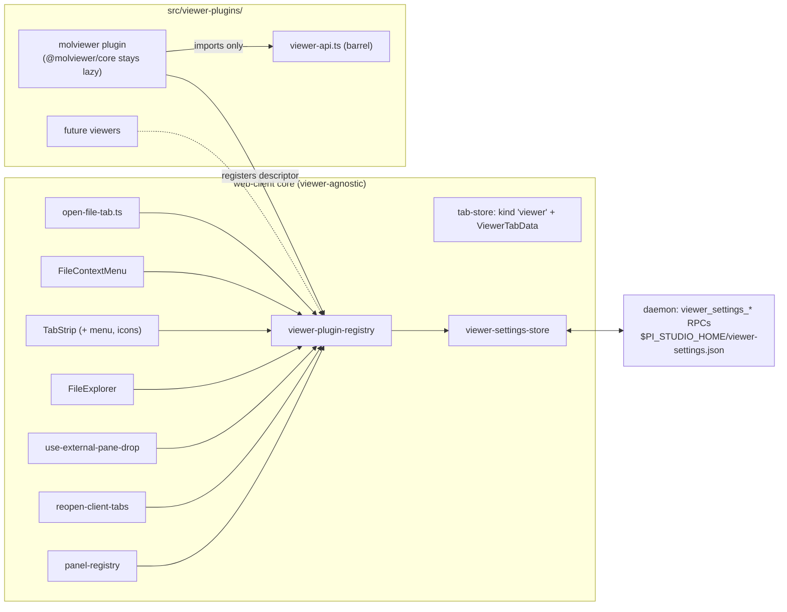

# Molviewer decoupling — viewer plugin system plan

Status: **plan, approved direction (Option 2: in-repo viewer plugin registry).** Chunk A (phase 0 —
the daemon-backed viewer settings + runtime kill switch) is **shipped**: sprint-073, PR #43, commit
`fc667b2` (2026-09-11); §11's chunk-A close entry records the implementation deviations and the
seven-step live E2E. Chunks B–D remain unimplemented plans. This document is the implementation
spec for decoupling the molecule viewer (`@molviewer/core`) from `packages/web-client` core, turning
it into the first registered
viewer plugin behind a small, general contract — and making it runtime-disableable via settings
that are persisted on the daemon (§4.4).

The integration this plan dismantles is documented in `docs/molviewer-integration-scope.md`
(sprint-044). That doc is the authoritative "before" record; this doc is the "after" spec.

---

## 1. Motivation

The molecule viewer is tightly coupled to web-client core in three ways:

1. **Type-level**: `"molecule"` is a first-class member of the `TabKind` union, with its own
   `MoleculeTabData`, `tabIds.molecule`, `openNewMolecule`, identity prefix, panel entry, icon
   entry, and special cases scattered across ~8 files.
2. **Knowledge-level**: molviewer-specific file-format tables (`MOLECULE_EXTENSIONS`,
   `MOLECULE_FILENAMES`, `isMoleculeFile`) live in the *generic* `viewer-registry.ts`, and
   file-open dispatch (`openFileTab`) hardcodes the molecule-vs-text fork.
3. **UI-level**: "Open in MolViewer" / "Open as Text" context-menu items and the "+" menu's
   "New molecule view" entry name the viewer directly.

Consequences today: adding a second custom viewer (e.g. a crystal-structure or plot viewer) would
require repeating the same surgery across all of these files; and there is no way to turn the
molecule viewer off without a code change.

Goals:

- **G1.** A small, general `ViewerPlugin` contract; web-client core talks only to a registry,
  never to a specific viewer.
- **G2.** Molviewer becomes plugin #1, living under `src/viewer-plugins/molviewer/`, importing
  only the plugin API barrel plus core hooks/services handed to it.
- **G3.** Runtime enable/disable (and, via an optional per-plugin panel, configure) per viewer
  via Settings, **persisted on the daemon** so every client of one daemon sees the same viewer
  state (§4.4), with graceful fallback semantics when a viewer is disabled.
- **G4.** No behavior change for users while molviewer is enabled: every tab, menu entry, reload,
  save, and polymer-build flow works exactly as today.
- **G5.** Level-2 readiness (§12): the four design choices that would otherwise force a rewrite
  before runtime install/uninstall — a mutable, reactive registry; a versioned plugin API;
  molviewer importing the host API through the same bare specifier an external bundle would; and
  a plugin-facing type surface (`ViewerPanelProps`, `viewer-plugin.ts`) with zero web-client
  internal imports, so a future types-only `@av-pi-studio/viewer-api` package is a move, not a
  redesign — are made now, inside phases 1–2.
- **G6.** A viewer is a first-class **file creator**, not only a file opener. A viewer tab opened
  without a file (the "+"-menu `emptyTab`, `path: null` — an *unbound* tab) can be turned into a
  file from inside the viewer: the host owns the "where to save" dialog and the tab rebind, the
  plugin owns serialisation. For molviewer that means building a molecule from nothing and
  saving it as a new `.mol2`/`.xyz`/… in the workspace, which is impossible today (an unbound tab
  draws no Save button at all). Contract: [`swe/features/viewer-unbound-tabs.md`](../swe/features/viewer-unbound-tabs.md).
  The lifecycle rule it relies on — `path` goes `null → string` at most once, never back, and a
  bound tab never changes path — is fixed in phase 1's contract so nothing has to be redesigned.

Non-goals (explicitly deferred — see §9 and §12.4):

- Runtime install/uninstall of plugin bundles ("level 2"): dynamic `import()` of separately built
  code, the import map that shares React/stores with it, the daemon-side bundle store and
  install RPCs, and the security sign-off that install-as-me requires.
- Build-time exclusion of molviewer from the bundle (white-label builds).
- A plugin marketplace, manifest discovery, or update prompts ("level 3").

The contract in §4 is designed as a strict subset of what level 2 needs: a descriptor object, a
loader thunk, host services reached through one versioned specifier, and a registry that can
change at runtime. Adopting level 2 later should add code, not change this contract.

---

## 2. Current coupling inventory (grounded)

Every file web-client core touches for molviewer today. Paths are relative to
`packages/web-client/src/` unless noted.

| Coupling point | File | What's hardcoded |
|---|---|---|
| Hard dependency | `package.json` (`@molviewer/core`), `vite.config.ts` (`vendor-molviewer` manual chunk) | bundle-level; already isolated in its own lazy chunk |
| Tab kind union | `stores/tab-store.ts` | `"molecule"` in `TabKind`, `MoleculeTabData { path: string \| null }`, `tabIds.molecule`, `openNewMolecule`, `tabIdentity` → `molecule:<path>`, `closeByPathPrefix` filter |
| Identity persistence | `lib/pane-layout-persistence.ts`, `features/workspace/reopen-client-tabs.ts` | `tabIdentity`/`tabFromIdentity` round-trip `molecule:<path>`; `tabFromIdentity` is deliberately the *literal* inverse of `tabIdentity` |
| File-open dispatch | `features/files/viewer-registry.ts` (`isMoleculeFile`, `MOLECULE_EXTENSIONS`, `MOLECULE_FILENAMES`), `features/files/open-file-tab.ts` (`openFileTab` → `openMoleculeTab`/`openTextTab`) | molviewer's supported-format tables live in the generic registry |
| Panel mapping | `features/workspace/panel-registry.ts` | `molecule: MoleculeViewerPanel` (lazy) |
| Context menu | `features/files/FileContextMenu.tsx` | "Open in MolViewer" (files only), "Open as Text" (molecule files only) |
| Tab strip | `features/workspace/TabStrip.tsx` | `ICON_BY_KIND.molecule = Atom`, "+" menu "New molecule view", `MONO_LABEL_KINDS` |
| Explorer interactions | `features/files/FileExplorer.tsx` | active-row highlight includes molecule tabs; close-on-delete/rename checks both `file` and `molecule` ids |
| Pane drop | `hooks/use-external-pane-drop.ts` | dual-id lookup (a path can be open as either kind) |
| Viewer implementation | `features/files/MoleculeViewer.tsx`, `MoleculeViewerPanel.tsx`, `MoleculeViewer.module.css`, `molecule-source.ts`, `molecule-reload.ts`, `molecule-theme.ts`, `polymer-file.ts`, `MoleculeViewer.test.ts` | the implementation itself — already well isolated: pure helpers split out for testability, panel lazy-loaded |

Supporting facts that shape the plan:

- **No general settings store exists, and no client-settings RPC exists.** Browser-local
  preferences use `theme/appearance-store.ts` (localStorage controller + `useSyncExternalStore`);
  daemon-backed client state uses Zustand stores under `stores/` hydrated on connect
  (`provider-auth-store.ts` is the closest precedent). Viewer settings are daemon-backed (§4.4),
  so the new store follows the Zustand-plus-RPC shape, not the appearance controller.
  `SettingsDialog` (`features/settings/SettingsDialog.tsx`) already has an extensible
  `SETTINGS_CATEGORIES` list with an `available(caps)` gate — a new category is one entry.
- **The existing `VIEWER_REGISTRY` is the wrong seam for this.** It maps `ViewerKind` →
  component with `{ path }` props inside `FilePanel`. Molviewer deliberately bypasses it (own tab
  kind, own panel) because it needs more than rendering: save (`file_write_request`), polymer
  build (`createEntry` + open-new-tab), live-reload gating on unsaved edits, an empty-state
  "new tab" affordance, its own icon and mono label. The plugin contract must cover all of these
  or it will be bypassed too.
- **`@molviewer/core` touches `document` at module scope** — which is why the pure helpers
  (`molecule-source.ts`, `molecule-reload.ts`, `polymer-file.ts`, `molecule-theme.ts`) exist as
  separate modules without the import. This constraint carries over: the plugin's *descriptor*
  registration must stay import-safe; only the panel component is a dynamic import.
- **Identities are load-bearing.** `tabFromIdentity` must stay the exact inverse of `tabIdentity`
  (its header comment explains why: dispatching through `openFileTab` at restore time would
  re-route kinds and orphan pane claims). Unknown identity prefixes are ignored by design —
  that's the forward-compat property the migration in §6 relies on.

---

## 3. Target architecture

```
packages/web-client/src/
  viewer-plugins/
    viewer-api.ts            ← the ONLY core surface plugins import (barrel)
    viewer-plugin.ts         ← ViewerPlugin interface + ViewerTabData
    viewer-plugin-registry.ts← register/lookup, enabled-filter, dispatch helpers
    viewer-settings-store.ts ← per-viewer enable/disable + config; daemon-backed (§4.4), Zustand
    molviewer/
      index.ts               ← registers the descriptor (module scope)
      MolViewerPanel.tsx     ← PanelProps adapter (lazy entry point)
      MoleculeViewer.tsx     ← the viewer (moved, logic unchanged)
      MoleculeViewer.module.css
      molecule-source.ts     ← pure helpers, moved unchanged
      molecule-reload.ts
      molecule-theme.ts
      polymer-file.ts
      MoleculeViewer.test.ts
    (future plugins land here)
```

The `viewer-plugins/` directory holds both the plugin **infrastructure** (contract, registry,
settings store) and the plugin **implementations** (molviewer, future viewers). The dependency
rule below keeps them distinct: the infrastructure files are core (imported by other core modules),
the `molviewer/` subdirectory is a plugin (imports only `viewer-api.ts`, and only through the bare
specifier `@pi-studio/viewer-api` — §12.3).

Daemon side (§4.4), following the `extensions/` subsystem layout:

```
packages/protocol/src/messages.ts            ← viewer_settings_{get,set}_{request,response}, viewer_settings_update
packages/protocol/src/client-capabilities.ts ← `viewerSettings` feature flag
packages/server/src/viewers/
  viewer-settings-state.ts                   ← schema + load/save over atomic-store ($PI_STUDIO_HOME/viewer-settings.json)
  viewer-settings-rpc.ts                     ← get/set handlers + broadcast, registered in bootstrap + dev-bootstrap
packages/client/src/…                        ← PiStudioClient facade methods + capability check
```


```mermaid
flowchart LR
  subgraph core["web-client core (viewer-agnostic)"]
    TS["tab-store: kind 'viewer' + ViewerTabData"]
    OF[open-file-tab.ts]
    CM[FileContextMenu]
    STRIP["TabStrip (+ menu, icons)"]
    EXPL[FileExplorer]
    DROP[use-external-pane-drop]
    REOPEN[reopen-client-tabs]
    REG[viewer-plugin-registry]
    SET[viewer-settings-store]
    PANEL[panel-registry]
  end
  subgraph plugins["src/viewer-plugins/"]
    API["viewer-api.ts (barrel)"]
    MOL["molviewer plugin<br/>(@molviewer/core stays lazy)"]
    FUT[future viewers]
  end
  OF --> REG
  CM --> REG
  STRIP --> REG
  EXPL --> REG
  DROP --> REG
  REOPEN --> REG
  PANEL --> REG
  REG --> SET
  SET <--> DAEMON["daemon: viewer_settings_* RPCs<br/>$PI_STUDIO_HOME/viewer-settings.json"]
  MOL -- "registers descriptor" --> REG
  MOL -- "imports only" --> API
  FUT -.-> REG
```

Dependency rule: **core may import the registry; core may never import anything under
`viewer-plugins/<specific>/`.** Plugins import `viewer-api.ts` and nothing else from core.
Registration is enforced by one import in the app's composition root (see §5, phase 1).

---

## 4. The contract

Derived from what molviewer *actually* uses today — not a lowest-common-denominator
`{ path }` shape. Anything a future viewer needs that isn't here gets added to the contract
then, deliberately.

### 4.1 `ViewerPlugin` descriptor (`viewer-plugin.ts`)

```ts
import type { ComponentType, LazyExoticComponent } from "react";

/** Tab data for every viewer tab (replaces MoleculeTabData). */
export interface ViewerTabData {
  /** Which plugin owns this tab; matches ViewerPlugin.id. */
  viewerId: string;
  /** Absolute path backing the tab, or null for the plugin's empty-state tab. */
  path: string | null;
}

/**
 * What a viewer's panel receives. Deliberately NOT the app's `PanelProps` (`{ tab: Tab }`): a
 * plugin must not compile against web-client's tab model. The host's `ViewerPanelHost` (phase 2
 * step 2) adapts from `PanelProps` to this. Everything molviewer's panel actually reads today.
 */
export interface ViewerPanelProps {
  /** Stable id of the tab this panel lives in — pass to openViewerTab's `fromTabId`. */
  tabId: string;
  /** Workspace the tab was minted in; the cwd for any file the viewer creates. */
  workspaceCwd: string;
  /** Absolute path backing the tab, or null for the plugin's empty-state tab. */
  path: string | null;
  /** Whether the tab is on screen (per-pane visibility) — the host resolves this, the plugin
   *  no longer calls useIsTabVisible itself. */
  isActive: boolean;
}

export interface ViewerPlugin {
  /** Stable id, kebab-case, unique. Persisted in tab identities AND as the key in the daemon's
   *  viewer-settings.json (§4.4) — never rename casually. */
  id: string;                                  // "molviewer"
  /** Must equal the host's VIEWER_API_VERSION (§12.2); registration refuses a mismatch. */
  apiVersion: number;
  /** Human-facing name for menus and settings. */
  label: string;                               // "Molecule Viewer"
  /** Tab-strip glyph / drop-chip icon. */
  icon: ComponentType<{ size?: number | string }>;
  /**
   * Does this viewer claim `path` for a *fresh* open? Pure, synchronous, no file reads.
   * Replaces isMoleculeFile. Returning false does not prevent force-open (§4.3).
   */
  match(path: string): boolean;
  /**
   * The panel component, lazy. Receives ViewerPanelProps (below) — a data-only projection the
   * host derives from its own tab model, never the app's PanelProps/Tab (§12.6).
   */
  panel: LazyExoticComponent<ComponentType<ViewerPanelProps>>;
  /**
   * Optional "+"-menu entry for a path-less tab (molviewer's drag-drop empty state).
   * Omitting it means no empty-tab affordance.
   */
  emptyTab?: {
    /** Menu item label, e.g. "New molecule view". */
    label: string;
    /** Tab id namespace for empty tabs, e.g. tabIds.molecule(`new-${n}`). */
    mintId(counter: number): string;
    /** Tab label for the empty tab, e.g. `Molecule ${n}`. */
    mintLabel(counter: number): string;
  };
  /** Render the tab label in the mono font (path-shaped tabs). */
  monoLabel?: boolean;
  /**
   * Context-menu force-open entry ("Open in MolViewer" for ANY file, including
   * extensions match() doesn't claim). Omit → no force-open menu item.
   */
  forceOpen?: { label: string };
  /** Registration order tie-break for overlapping match(); lower wins. Default 100. */
  priority?: number;
  /**
   * Optional per-viewer configuration UI, rendered under the plugin's row in Settings → Viewers
   * (phase 4). `config` is the opaque blob the daemon stores for this viewer id (§4.4); the
   * plugin owns its shape and its defaults. Omit → the row is just the enable toggle.
   */
  settings?: { component: ComponentType<ViewerSettingsProps> };
}

export interface ViewerSettingsProps {
  config: Record<string, unknown> | undefined;
  onChange(next: Record<string, unknown>): void;
}
```

Design notes:

- **`match` is extension/filename tables only** — synchronous by contract, exactly like today's
  `isMoleculeFile` (LAMMPS `data` files stay excluded; content-sniffing would make it async and
  is out of scope).
- **`forceOpen` is a separate capability from `match`** because today's context menu offers
  "Open in MolViewer" for *every* file (a LAMMPS data file the reader can still parse), while
  extension dispatch only claims known formats. Collapsing them would lose that behavior.
- **`emptyTab.mintId/mintLabel` take a counter** because molviewer's empty tabs increment
  (`Molecule 1`, `Molecule 2`, ids `mol-new-<n>`). The counter stays owned by the registry's
  generic open helper, not the plugin.
- The union `TabKind` stays **closed**; plugins live *inside* the new `"viewer"` kind. No
  stringly-typed kinds leaking into exhaustive switches.

### 4.2 Host services (`viewer-api.ts`)

The barrel a plugin imports. Everything molviewer's `MoleculeViewer.tsx` /
`MoleculeViewerPanel.tsx` reach into core for today (verified against their import lists),
re-exported from one place:

```ts
// Data plumbing
export { useFileDownload } from "@pi-studio-ui/hooks/use-file-download.js";
export { useFileWatch } from "@pi-studio-ui/hooks/use-file-watch.js";
export { useFileTransfer } from "@pi-studio-ui/hooks/use-file-transfer.js";
export { writeFile, WriteFileError } from "@pi-studio-ui/features/files/write-file.js";
export { createEntry, CreateEntryError } from "@pi-studio-ui/features/files/create-entry.js";
export { deleteEntry } from "@pi-studio-ui/features/files/delete-entry.js";
export { dirOf } from "@pi-studio-ui/lib/paths.js";

// Connection
export { useConnectionStore } from "@pi-studio-ui/lib/connection/connection-store.js";
export type { PiStudioClient } from "@av-pi-studio/client";

// Tab/workspace interaction
export { tabIds, useTabStore } from "@pi-studio-ui/stores/tab-store.js";
export { openViewerTab } from "@pi-studio-ui/viewer-plugins/viewer-plugin-registry.js";

// UI primitives a panel may compose
export { Panel } from "@pi-studio-ui/components/primitives/Panel.js";
export { EmptyState } from "@pi-studio-ui/components/primitives/EmptyState.js";
export { Spinner } from "@pi-studio-ui/components/primitives/Spinner.js";
export { StatusBadge } from "@pi-studio-ui/components/primitives/StatusBadge.js";

// Types — the plugin-facing contract only; never web-client's PanelProps/Tab (§12.6)
export type {
  ViewerPlugin,
  ViewerTabData,
  ViewerPanelProps,
  ViewerSettingsProps,
} from "./viewer-plugin.js";

// Versioning (§12.2) — bump on any breaking change to this barrel or to ViewerPlugin.
export const VIEWER_API_VERSION = 1;
```

One import is deliberately **not** re-exported: `useLayoutStore` (`stores/layout-store.ts`).
`MoleculeViewer.tsx` reaches into it for exactly one thing — `paneOfTab(workspaceCwd, tabId)`,
to open a freshly built polymer's tab in the *same pane* the viewer lives in. Exposing the whole
layout store to plugins for that would leak the pane tree. Instead `openViewerTab` gains an
optional `opts?: { fromTabId?: string }` and resolves the pane internally
(`paneOfTab(workspaceCwd, fromTabId)`), so the plugin says "open this next to me" without
knowing panes exist. This is the only place the contract changes molviewer's *call shape*
during the move; its behavior is identical.

Enforcement is by convention + code review in this phase (a lint boundary rule is a nice-to-have
follow-up, not a gate). The file MUST start with a prominent header comment stating the boundary
rule — "This is the ONLY core surface viewer plugins may import. Plugins MUST NOT import directly
from any other `@pi-studio-ui/` path." — so the rule is visible at every import site, not just in
this document. When a future plugin needs something new, it gets added here — the barrel
*doubles as the changelog of the plugin API*.

Note `write-file.ts`/`create-entry.ts`/`delete-entry.ts` currently sit in `features/files/` and
are shared with non-viewer code (FileExplorer's new-file row, the context menu's delete). They
stay where they are; the barrel re-exports them. Moving them would churn unrelated callers for no
gain.

### 4.3 Registry (`viewer-plugin-registry.ts`)

```ts
registerViewerPlugin(plugin: ViewerPlugin): void      // idempotent per id, throws on dup id or apiVersion mismatch (§12.2)
unregisterViewerPlugin(id: string): void              // §12.1 — no-op if absent; open tabs fall to the fallback panel
registeredViewerPlugins(): readonly ViewerPlugin[]    // registration order
enabledViewerPlugins(): readonly ViewerPlugin[]       // filtered by settings store
viewerForPath(path: string): ViewerPlugin | undefined // first enabled plugin whose match() wins (priority order)
viewerById(id: string): ViewerPlugin | undefined      // regardless of enabled state (restore path)
useRegisteredViewerPlugins(): ViewerPlugin[]           // hook, re-renders on register/unregister (§12.1)
useEnabledViewerPlugins(): ViewerPlugin[]              // hook, re-renders on register/unregister AND settings change

openViewerTab(pluginId, path: string | null, workspaceCwd, opts?: { targetPaneId?: string; fromTabId?: string }): void
  // targetPaneId: explicit pane (drop target / fresh split); fromTabId: "the pane this tab lives in"
  // (resolved via layout-store's paneOfTab — see §4.2); targetPaneId wins when both are given.
openPathInViewer(path, workspaceCwd, targetPaneId?): boolean  // dispatch; false → caller falls back to text
```

Registration happens at module scope in each plugin's `index.ts`; the composition root
(`main.tsx` or the app bootstrap) imports `viewer-plugins/index.ts`, which imports every plugin's
`index.ts` **once, eagerly**. Only panel components stay lazy. This is what lets
`reopenClientTabs` resolve `viewer:<id>:` identities at boot before any connection exists —
synchronous registration, no async discovery.

### 4.4 Daemon-side viewer settings (protocol + server + SDK)

**Decision (2026-09-10): viewer enable/disable/config state lives on the daemon, not in the
browser.** A pi-studio user reaches one daemon from several clients (desktop browser, a phone
over the relay, Electron); a `localStorage` setting would make those clients disagree about
which viewers exist. Storing it in `$PI_STUDIO_HOME` makes "which viewers are on" a property of
the daemon, exactly like which extension packs are selected. It is also the storage a level-2
installed-plugin list would need (§12.4), so building it now means that list later adds fields
to an existing file rather than a second settings surface.

There is no existing client-settings RPC to extend (verified: nothing matching
`preferences|client_settings|ui_settings` in `protocol`, `server`, or `web-client`), so this is a
new, small family. It follows the repo's conventions to the letter:

| Layer | Addition | Precedent |
|---|---|---|
| `packages/protocol` (`messages.ts`) | `viewer_settings_get_request` / `_response`, `viewer_settings_set_request` / `_response`, and the push `viewer_settings_update` — all real `sessionMessageSchema` union members (multi-client, durable state → real schemas, like `provider_auth_*`), `.passthrough()`, optional fields only | `provider_auth_*`, `agent_thinking_levels` |
| `packages/protocol` (`client-capabilities.ts`) | `viewerSettings` server feature flag, `COMPAT`-annotated | `thinkingLevels` |
| `packages/server` | New `src/viewers/` subsystem: `viewer-settings-state.ts` (`viewerSettingsSchema` — `{ version: 1, viewers: { [id]: { enabled: boolean; config?: Record<string, unknown> } } }` `.passthrough()`; `loadViewerSettings`/`saveViewerSettings` over `atomicWriteJson`/`loadStore`; file `$PI_STUDIO_HOME/viewer-settings.json`) and `viewer-settings-rpc.ts` (the two handlers, registered explicitly in `bootstrap.ts` **and** `dev-bootstrap.ts`). `set` persists, answers the effective document, then broadcasts `viewer_settings_update` to **every** active session (including the caller — one code path, the caller's own store is replaced like everyone else's) | `extensions/extensions-state.ts`, `extensions/extensions-rpc.ts`; broadcast shape of `terminals_update` / `agent_timeline_reset` |
| `packages/client` | `PiStudioClient.getViewerSettings()`, `setViewerSettings(patch)`, `onViewerSettingsUpdate(cb)`, `hasViewerSettingsCapability()` | the `provider_auth_*` / thinking-level facade methods |
| `packages/web-client` | `viewer-settings-store.ts` (phase 0 step 1) hydrates from `get` on connect, applies `update` pushes, sends `set` on toggle | `provider-auth-store.ts` |

Wire shapes (append-only from here; shown in TS for brevity, real definitions are Zod):

```ts
viewer_settings_get_request:  {}
viewer_settings_get_response: { settings: ViewerSettings }
viewer_settings_set_request:  { patch: { [viewerId: string]: { enabled?: boolean; config?: Record<string, unknown> } } }
viewer_settings_set_response: { settings: ViewerSettings }     // the effective document after merge
viewer_settings_update:       { settings: ViewerSettings }     // broadcast to all sessions on every successful set

ViewerSettings = { version: 1; viewers: { [viewerId: string]: { enabled: boolean; config?: Record<string, unknown> } } }
```

Rules:

- **The daemon knows nothing about plugins.** It stores rows keyed by whatever id a client sends
  and never validates the id against a list — plugin knowledge is a client-edge concern (§3's
  dependency rule, applied across the wire). An unknown id is a valid row.
- **Absent row = enabled.** Defaults are never written; the file only contains rows a user has
  touched. This is what makes a fresh daemon and an old daemon look identical to a client.
- **`config` is an opaque blob per viewer** — the daemon and the protocol never interpret it;
  only the owning plugin's `settings.component` (§4.1) reads/writes it. Same posture as
  `agent_ui_request`'s `payload`.
- **Last write wins; the broadcast converges.** No merge semantics beyond per-viewer patch.
- **Capability-gated, degrade to enabled.** A client that does not see
  `server_info.features.viewerSettings` treats every viewer as enabled and shows the Viewers
  category's rows read-only with a "requires a newer daemon" note (§7). Files are never
  unreachable because of a daemon version.
- **Replay ordering.** `reopenClientTabs`'s `isViewerEnabled` predicate reads this store, so the
  layout replay in `use-pane-layout.ts` waits for `loaded === true` in addition to
  `status === "open"` (§9 risk row). Pre-hydration UI (context menu, "+" menu) may briefly show
  a viewer that is about to be reported disabled; acceptable — the window is one RPC round-trip
  and it errs on the side of offering, never hiding, a viewer.

---

## 5. Phased implementation

Each phase is independently shippable; the app works after every phase.

### Phase 0 — Runtime kill switch (no architecture change on the client; new daemon settings family)

**Deliverable: molviewer disableable at runtime, before the registry exists.** This is the quick
win and its gate logic survives into phase 3 as the registry's enabled-filter.

> **Shipped as [`swe/sprints/sprint-073-viewer-settings/`](../swe/sprints/sprint-073-viewer-settings/)**
> — planned 2026-09-10, merged 2026-09-11 (`fc667b2`, PR #43), closed 2026-10-05 with the task-007
> seven-step live E2E. Seven tasks, one per layer, in dependency order. Three implementation
> decisions the sprint settled beyond this section are recorded in §11's chunk-A scheduling entry;
> the close entry below records the rest.

0. **Daemon side first** (§4.4): protocol schemas + `viewerSettings` flag → server
   `viewers/viewer-settings-state.ts` + `viewer-settings-rpc.ts`, registered in both bootstraps
   → `PiStudioClient` facade methods. Each step is its own commit in dependency order.
1. New `src/viewer-plugins/viewer-settings-store.ts`: a Zustand store (this repo's convention
   for daemon-backed client state, `stores/*.ts`) — NOT the `appearance-store.ts`
   localStorage controller, which is the right shape for browser-local preferences only.
   Shape: `{ loaded: boolean; viewers: Record<string, { enabled: boolean; config?: … }> }`,
   hydrated from `viewer_settings_get_request` once the connection reports `open`, replaced
   wholesale by every `viewer_settings_update` broadcast, and reset to `loaded: false` on
   disconnect. `setEnabled(id, bool)` is optimistic with rollback on RPC rejection.
   `isViewerEnabled(id)` = `viewers[id]?.enabled ?? true` (absent row = enabled; pre-hydration =
   enabled). Only one viewer id exists yet (`"molviewer"`), but the store is keyed by id so
   phase 1 touches nothing.
2. Gate the five dispatch points on `isViewerEnabled("molviewer")`:
   - `openFileTab` (`open-file-tab.ts`): disabled → always `openTextTab`.
   - `tabFromIdentity` (`reopen-client-tabs.ts`): a persisted `molecule:<path>` reopens as a
     **text tab** (see §7 semantics) rather than a molecule tab. `tabFromIdentity` must stay a
     pure synchronous function (unit-tested without stores, deliberately the exact inverse of
     `tabIdentity`) — so it gains a third parameter, `isViewerEnabled: (id: string) => boolean`,
     injected by `reopenClientTabs` from the settings store. Tests pass a stub. Do NOT have it
     read the settings store's `localStorage` key directly: a hidden global read is not purity,
     it is coupling to another module's storage format with no signature to show for it. The
     predicate survives unchanged into phase 3, where the registry's enabled-filter supplies it.
   - `FileContextMenu`: hide "Open in MolViewer" and "Open as Text" (the latter only makes sense
     while the viewer exists as an alternative).
   - `TabStrip` "+" menu: hide "New molecule view".
   - `use-external-pane-drop.ts`: the dual-id existing-tab lookup keeps working (it's about tabs
     already open, not new dispatch) — no gate needed there; verify only.
   - `use-pane-layout.ts`: the client-tab replay (`reopenClientTabs`) additionally waits for
     `useViewerSettingsStore.loaded` (§4.4 replay ordering) — otherwise a disabled viewer's
     persisted identity would race the settings fetch and reopen as a viewer tab. One extra
     condition on the existing `status === "open"` gate.
3. Settings UI: new "Viewers" category in `SETTINGS_CATEGORIES` with one toggle row
   ("Molecule Viewer") — hardcoding the single row is fine; phase 4 makes it registry-driven.
   The category's `available` is `() => true` (the first capability-independent category; the
   `SettingsCategory` shape `{ id, label, icon, component, available }` from sprint-065 already
   anticipates this).
4. **Make the settings gear reachable.** `ConnectionBar.tsx` renders the gear only when
   `providerAuthCapable` (sprint-065 gated it on the single category that existed). With a
   capability-free category, that gate is wrong: against a daemon without `providerAuth`, the
   Viewers toggle would exist but be unreachable. Change the gate to "any category is
   `available(caps)`" — derive it from `SETTINGS_CATEGORIES` rather than duplicating the
   per-category logic in the bar — which, given `() => true`, means the gear is always shown.

**Verification:** manual smoke — toggle off, open `.cif` → text; "+" menu loses the entry;
reload with a persisted molecule tab → reopens as text; toggle on → all restored. Plus the unit
tests listed in §8.

### Phase 1 — Contract, registry, and the move

> **Implementation spec: [`swe/architecture/viewer-plugin-system.md`](../swe/architecture/viewer-plugin-system.md)**
> (2026-09-10). It refines this phase's boundary — six decisions (D1–D6) that pull the
> descriptor-driven UI surfaces (context menu, "+" menu, tab icon/mono label, pane-drop lookup)
> and the `viewerId` tab-data field forward into phase 1, because the descriptor's
> `ViewerPanelProps` panel (§4.1/§12.6) forces a host adapter, which forces `viewerId`, which
> forces every tab-minting path through the registry. Phase 2 correspondingly shrinks to the
> `TabKind` rename plus the identity format and its migration — the only part that can break a
> persisted layout. `ViewerPlugin.emptyTab.mintId` is dropped there (ids become host-minted);
> §4.1/§4.2 below are otherwise unchanged.

1. Create `viewer-plugin.ts`, `viewer-api.ts`, `viewer-plugin-registry.ts` per §4 — including
   the §12 readiness items: `viewer-plugin.ts` imports only from `react` (§12.6, with its guard
   test); the registry is a subscribable store with
   `unregisterViewerPlugin` (§12.1); `viewer-api.ts` exports `VIEWER_API_VERSION = 1` and
   `registerViewerPlugin` rejects an `apiVersion` mismatch (§12.2); `vite.config.ts`
   `resolve.alias` + `tsconfig` `paths` map the bare specifier `@pi-studio/viewer-api` to the
   barrel (§12.3).
2. Move the eight molviewer files from `features/files/` to `viewer-plugins/molviewer/`,
   rewriting their core imports to `import { … } from "@pi-studio/viewer-api"` — the bare
   specifier, never the relative path (§12.3). `MoleculeViewer.tsx` logic is unchanged; this is
   a move + import-rewrite phase.
3. `viewer-plugins/molviewer/index.ts` exports the descriptor:
   `id: "molviewer"`, `apiVersion: VIEWER_API_VERSION`, `match` = relocated `isMoleculeFile`
   (tables move with it), `panel: lazy(MoleculeViewerPanel)`, `emptyTab` wired to the existing
   `tabIds.molecule`/`Molecule ${n}` conventions, `forceOpen: { label: "Open in MolViewer" }`,
   `icon: Atom`, `monoLabel: false`, no `settings`.
4. `viewer-plugins/index.ts` imports `./molviewer/index.js`; the app bootstrap imports it once.
5. `viewer-registry.ts` (generic file viewers) loses `isMoleculeFile`/`MOLECULE_EXTENSIONS`/
   `MOLECULE_FILENAMES` — deleted, not re-exported. `open-file-tab.ts` dispatches through
   `openPathInViewer`.

After this phase, core still names `"molecule"` in the tab model (that's phase 2), but all
*knowledge* of molecule formats lives inside the plugin.

### Phase 2 — Tab model generalization (the invasive step)

1. `tab-store.ts`:
   - `TabKind`: `"chat" | "file" | "diff" | "terminal" | "viewer"` — `"molecule"` removed.
   - `ViewerTabData` (from `viewer-plugin.ts`) replaces `MoleculeTabData` in `TabData`.
   - `tabIds.viewer(viewerId, path)` mints ids; the molviewer plugin keeps id shape
     `mol-<path>`/`mol-new-<n>` via its descriptor so persisted layouts and the
     external-pane-drop dual-id lookup keep functioning (the *identity* changes form, the *id*
     doesn't have to — see §6).
   - `openNewMolecule` becomes generic `openNewViewerTab(plugin)` driven by `emptyTab`;
     `TabStrip` iterates enabled plugins' `emptyTab` entries. The registry maintains a
     `Map<string, number>` of per-plugin empty-tab counters so `mintId`/`mintLabel` receive
     the correct increment per plugin.
   - `tabIdentity`: the `case "molecule"` branch becomes `case "viewer"`, emitting
     `viewer:<viewerId>:<path>` (null path → still `null`, no identity). The `viewerId` is
     read from `tab.data` cast to `ViewerTabData`.
   - `closeByPathPrefix` / `FileExplorer` close-on-delete/rename: match any tab whose data has a
     `path` — i.e. `file | diff | viewer` — without naming viewer ids. The explorer's
     active-row highlight reads `data.path` the same generic way. The `MoleculeTabData` import
     in `FileExplorer.tsx` (line 35) is removed — the generic `data.path` access on
     `ViewerTabData | FileTabData | DiffTabData` is sufficient.
2. `panel-registry.ts`: `viewer: ViewerPanelHost`, where `ViewerPanelHost` looks up
   `viewerById(tab.data.viewerId)` and renders its `panel` (unknown id → a small "viewer not
   available" fallback panel, never a crash — covers a disabled-but-registered edge and a
   future uninstalled-plugin edge alike). It is also the **`PanelProps` → `ViewerPanelProps`
   adapter** (§4.1, §12.6): it reads `tab.id`, `tab.workspaceCwd`, `tab.data.path`, resolves
   `isActive` via `useIsTabVisible(tab.id)`, and passes those four — never the `Tab` object.
   The molviewer plugin's `MolViewerPanel.tsx` becomes trivially thin (it no longer calls
   `useIsTabVisible` or casts `tab.data`); today's `MoleculeViewerPanel.tsx` already does
   exactly this adaptation locally, so this is a move of ~6 lines into the host.
3. `TabStrip`: `ICON_BY_KIND` gains a `viewer` entry that resolves through the registry
   (`viewerById(...)?.icon ?? File`); `MONO_LABEL_KINDS` consults the plugin's `monoLabel`.
   Delete the doc comment above `ICON_BY_KIND` that justifies `molecule: Atom` over "the spec's
   generic viewer (`Box`)" — its premise ("this app's kind is `molecule`, not a generic viewer")
   is exactly what this phase inverts; left in place it becomes a stale rationale.
4. `FileContextMenu`: iterate enabled plugins — one `forceOpen` item per plugin that declares
   one; "Open as Text" appears iff any enabled viewer's `match()` claims the path.
5. `use-external-pane-drop.ts`: the dual-id lookup becomes "find any open **`file` or `viewer`**
   tab whose `data.path === payload.path`". Kind-restricted on purpose: `diff` tabs also carry a
   `path`, and a path-only match would make dragging a file whose staged diff is open focus the
   diff instead of opening the file — a behavior change today's `file`/`molecule` id lookup
   never had. The kind filter removes id-namespace knowledge (no per-viewer id minting here)
   without widening what counts as "already open".

### Phase 3 — Persistence migration

Covered in detail in §6 because it's the riskiest step and deserves its own rules. Lands with
phase 2 (same PR) — identity format and tab model change together; splitting them would create an
intermediate state where identities don't round-trip.

### Phase 4 — Settings UI, tests, docs

1. "Viewers" settings category becomes registry-driven: one row per registered plugin,
   toggle bound to the settings store, disabled state shows "disabled — files open as text".
   A plugin that declares `settings.component` (§4.1) gets a disclosure under its row rendering
   that component with `{ config, onChange }`; `onChange` goes through
   `useViewerSettingsStore.setConfig(id, config)` → `viewer_settings_set_request`. Molviewer
   declares none in this plan (it has no user-facing options today); the slot exists so the
   first plugin that needs one adds a component, not a settings-dialog feature.
2. Test updates per §8.
3. Docs: `packages/web-client/AGENTS.md` (tab-kind invariants, the molecule-viewer sections,
   source-layout tree), root `AGENTS.md` (web-client line, § Protocol overview entry for
   `viewer_settings_*`, § Persistence layout gains `viewer-settings.json`),
   `packages/protocol/AGENTS.md` (schemas + flag), `packages/server/AGENTS.md` (new
   `viewers/` subsystem), `packages/client/AGENTS.md` (facade methods),
   `docs/molviewer-integration-scope.md` gets a status banner pointing here.

### Phase 5 — Unbound tabs become files (G6)

Spec: [`swe/features/viewer-unbound-tabs.md`](../swe/features/viewer-unbound-tabs.md). The first
phase with a **deliberate** user-visible change — an unbound molviewer tab gains a Save button.
Separate from phases 1–3 precisely so their G4 "zero behavior change" bar stays checkable.

1. Host: `SaveAsDialog` (absolute-path input pre-filled `<workspaceCwd>/<suggestedName>`,
   `~` allowed, exclusive-create semantics — an existing file is an inline error, never an
   overwrite), driven by a `pickSavePath()` promise API on `useUiStore` the way the cwd picker is.
2. Host: `bindViewerTab(tabId, path)` — `updateData({ path })` + `updateLabel(basename)`; the tab
   **keeps its birth id** and is not remounted. Its identity flips from `null` (never persisted)
   to the normal path identity, so a reload restores it as an ordinary file-backed tab.
3. Host: `writeNewFile()` — `writePolymer`'s claim-exclusive → binary-upload → rollback-on-failure
   mechanics hoisted out of the plugin into `features/files/` (they are not molecule-specific;
   `writePolymer` keeps only the free-name search around it). All three go into the barrel.
4. Molviewer: `onSave` is always wired. Unbound: `pickSavePath` → `writeNewFile` →
   `bindViewerTab` → `e.saved()`. Bound: unchanged. `onPolymerBuild` likewise always wired —
   unbound builds prompt for a path instead of falling back to a browser download.
5. Molviewer: a rebind is **not** a load command. The panel adopts the new `path` for
   watch/save only and must not refetch/reparse the structure the user just saved (formats are
   lossy; a reload would also unmount through the `Loading…` branch and drop undo/camera).

---

## 6. Persistence migration (identities)

Persisted pane layouts carry tab identities (`file:<path>`, `diff:<staged|worktree>:<path>`,
`molecule:<path>` today). Rules:

1. **New write format**: `viewer:<viewerId>:<path>` (molviewer: `viewer:molviewer:<path>`).
2. **Read alias, one-directional**: `pane-layout-persistence`'s validation/load and
   `tabFromIdentity` accept the legacy `molecule:<path>` and map it to a molviewer viewer tab
   *iff the molviewer plugin is registered and enabled* (the `isViewerEnabled` predicate, now
   sourced from the daemon-hydrated store — which is why replay waits for `loaded`, §4.4); if
   disabled, it reopens as a text tab (§7). Nothing ever *writes* the legacy form again.
3. **Forward-compat is already safe**: `tabFromIdentity` ignores unknown prefixes by design, so
   an old client reading a new layout drops `viewer:` identities (pane pruned, as today for
   unknown kinds) rather than crashing. Acceptable; note it in the migration's PR description.
4. **`tabFromIdentity` stays the literal inverse of `tabIdentity`** — it must keep constructing
   tabs directly, never dispatching through `openPathInViewer` (the existing header comment in
   `reopen-client-tabs.ts` explains the orphan-claim failure mode; that reasoning is unchanged).
5. **No data migration pass.** Layouts are rewritten naturally on next persist (every layout
   mutation persists). Old-format entries keep being read-aliased until then. The alias code is
   ~10 lines and can stay forever; removing it is an explicit future decision, not a TODO.

Test the round-trip both directions: new format writes/reads; legacy format reads to the right
tab; disabled-viewer legacy format reads to a text tab.

---

## 7. Disabled-viewer semantics (product decisions, fixed by this plan)

When a viewer is disabled in Settings:

| Surface | Behavior |
|---|---|
| File open dispatch | Falls through to text. Data is never unreachable. |
| Context menu | Force-open item hidden; "Open as Text" hidden (nothing to contrast with). |
| "+" menu | Empty-tab entry hidden. |
| Already-open viewer tabs | Stay mounted and functional until closed — disabling is about *new* opens, not ripping running UI out from under edits. (Simplest correct rule; matches the gate points in phase 0.) |
| Persisted viewer identities | Reopen as text tabs on next boot (phase 0 rule), so panes survive. Re-enabling doesn't auto-flip them back — next open dispatches normally. |
| Settings row | Visible and toggleable (that's the point). |
| Other clients of the same daemon | See the toggle flip live (`viewer_settings_update` broadcast, §4.4): a phone over the relay and a desktop browser never disagree about which viewers exist. |
| Client connected to an older daemon (no `viewerSettings` flag) | Every viewer enabled; Viewers rows shown read-only with a "requires a newer daemon" note. |

Rationale: "disabled" means "don't offer this viewer", never "destroy state" or "hide data".

---

## 8. Test plan

Existing tests that hardcode `"molecule"` and must be updated (not deleted) in phase 2/4:

- `stores/tab-store.test.ts` — `openNewMolecule` describe → generic `openNewViewerTab` with a
  fake registered plugin; id/label conventions preserved.
- `features/workspace/reopen-client-tabs.test.ts` — new-format round-trip + legacy alias +
  disabled-viewer alias, each exercised by passing an explicit `isViewerEnabled` stub (phase 0
  step 2) — never by stubbing `localStorage`.
- `hooks/use-external-pane-drop.test.ts` — add the case phase 2 step 5 guards: a path open only
  as a **diff** tab must NOT be reused; the drop opens a fresh file tab beside it.
- `lib/pane-layout-persistence.test.ts` — `tabIdentity` cases → `viewer:molviewer:<path>` form.
- `features/files/viewer-registry.test.ts` — `isMoleculeFile` suite moves to the molviewer
  plugin's own test file (the tables move with the plugin); the generic registry's tests keep
  only `detectViewerKind`/`LIVE_REFRESH_KINDS` coverage.
- `features/workspace/tab-attention.test.ts` — `NON_CHAT_KINDS` list updates to include
  `"viewer"` instead of `"molecule"`.
- `MoleculeViewer.test.ts` — moves with the plugin; imports unchanged (pure helpers).

New tests:

- Registry: duplicate-id registration throws; `apiVersion` mismatch throws naming both versions;
  `viewerForPath` priority order; enabled-filter reacts to the settings store;
  `unregisterViewerPlugin` notifies `useRegisteredViewerPlugins` subscribers.
- `viewer-plugin.test.ts`: source-level guard that `viewer-plugin.ts` imports nothing from
  `@pi-studio-ui/` (§12.6).
- `ViewerPanelHost`: unknown `viewerId` renders the fallback panel; a registered plugin's panel
  receives exactly `{ tabId, workspaceCwd, path, isActive }` derived from the tab.
- Disabled semantics: `openPathInViewer` returns false when the only matching viewer is
  disabled; context-menu contribution list shrinks.

No test may import `@molviewer/core` (module-scope `document` access; node test environment) —
this invariant already holds via the pure-helper split and must survive the move.

Daemon side (`packages/server`), mirroring `extensions-state.test.ts` / `extensions-rpc.test.ts`:

- `viewer-settings-state.test.ts` — load-from-missing yields defaults; round-trip; unknown
  fields survive (`.passthrough()`); a malformed file does not crash the daemon (falls back to
  defaults, logs).
- `viewer-settings-rpc.test.ts` — `get` returns the persisted document; `set` persists, answers
  the effective document, and broadcasts `viewer_settings_update` to every session (including
  the caller); a `set` with an unknown viewer id is accepted (the daemon has no plugin
  knowledge — the client decides what a row means).
- Protocol: `client-capabilities.test.ts`'s sorted flag list gains `viewerSettings`.

Client side additions: `viewer-settings-store.test.ts` — pre-hydration default is all-enabled
with `loaded: false`; `viewer_settings_update` from another session replaces local state;
`setEnabled` is optimistic and rolls back when the RPC rejects.

Final gate: `npm run typecheck`, `npm test`, `npm run lint`, plus a manual smoke of the full
viewer flow (open `.cif`, live-reload, save, polymer build, disable/re-enable, reload restore)
against a dev daemon.

---

## 9. Risks and deferred concerns

| Risk | Mitigation |
|---|---|
| Identity migration breaks persisted layouts | Read-alias (§6), both-direction round-trip tests, `tabFromIdentity` stays literal-inverse |
| Layout replay runs before viewer settings are hydrated | `reopenClientTabs` waits for `useViewerSettingsStore.loaded` in addition to `status === "open"` (§4.4, phase 0 step 2's `use-pane-layout.ts` bullet); the replay effect already runs from a connection-gated `useEffect` in `use-pane-layout.ts`, so this is one more condition on an existing gate, not a new mechanism. Test: replay with `loaded: false` opens nothing; flipping `loaded` triggers it once |
| Two clients toggle the same viewer concurrently | Last write wins at the daemon; `viewer_settings_update` broadcast converges both. No merge semantics — a boolean per viewer id has none worth building |
| Older daemon without `viewerSettings` | Client treats every viewer as enabled and shows the Viewers rows read-only with "requires a newer daemon" — same shape as the `providerAuth`-gated Model Providers category. Files stay openable either way (§7) |
| Behavior drift during the move | Phase 1 is move + import-rewrite only; G4 is the acceptance bar; the eight moved files keep their existing unit tests green |
| Plugin contract too thin (next viewer needs more) | Contract was derived from molviewer's real usage, not invented; additions go through `viewer-api.ts` deliberately, bumping `VIEWER_API_VERSION` when breaking |
| `@molviewer/core` module-scope `document` access | Registration stays import-safe (descriptor only); panel remains a dynamic import; test invariant in §8 |
| Bundle: disabling doesn't remove download cost | Already acceptable — `vendor-molviewer` only loads when a molecule tab opens. Build-time exclusion (white-label) is a future `PI_STUDIO_VIEWERS` build knob filtering registration; trivial to add later since registration is a single import list |
| Scope creep toward remote plugins | Level 2 explicitly out (§1 non-goals, §12.4, §12.5); the four §12 choices are the entire concession, and each is a few lines |

## 10. Suggested delivery split

Four independently shippable chunks; the app works after each. (Deliberately not pre-slotted into
`swe/sprints/PLAN.md` — this document is the spec; scheduling is a separate decision.)

- **Chunk A** (**shipped** — sprint-073, PR #43, `fc667b2` 2026-09-11): phase 0 (daemon settings
  family §4.4 + client store + kill switch + hardcoded settings row + always-reachable gear).
  Cross-package (protocol → server → client SDK → web-client), so it is executed in that dependency
  order, but it is still one small deliverable.
- **Chunk B**: phases 1–3 (contract, move, tab model, migration) — one coherent unit; the tab
  model and identity format must land together. It touches ~15 files including the tab model, so
  it should still be executed as ordered steps (phase 1 → phase 2 step by step → phase 3), each
  leaving `npm run typecheck` green — not as one big-bang commit.
- **Chunk C**: phase 4 (registry-driven settings + per-plugin config panels, test sweep, docs
  sync) + the manual smoke.
- **Chunk D**: phase 5 (Save As dialog, `bindViewerTab`, `writeNewFile`, molviewer wiring) — the
  first user-visible feature; depends on chunk B's barrel and stable-id rule, independent of
  chunk C.

---

## 11. Review log

- **2026-09-10** — re-verified §2's inventory line-by-line against the tree after sprints
  063–072 landed (settings dialog, extension UI, fork): every coupling point still exists exactly
  as listed, no code has landed against this plan. Folded in five corrections: the settings gear
  gate (phase 0 step 4), the diff-tab regression in phase 2 step 5, the incomplete §4.2 barrel,
  the `tabFromIdentity` predicate instead of a direct `localStorage` read (phase 0 step 2), and
  the `TabStrip` icon-rationale comment (phase 2 step 3).
- **2026-09-10 (later)** — decided the runtime-management question (install/uninstall/configure
  at runtime). Level 1 (enable/disable/configure, plugins compiled in) is this plan; level 2
  (install/uninstall prebuilt bundles) is deferred but no longer blocked: three design choices
  promoted into phases 1–2 (§12), and viewer settings moved from `localStorage` to the daemon
  (§4.4) so every client of one daemon sees one plugin state.
- **2026-09-10 (later still)** — answered "do we need a package for community plugin authors?":
  not now (§12.5 — nothing could load it at level 1), yes at level 2 as a types-only
  `@av-pi-studio/viewer-api`. Folded in the one change that makes that package a `git mv`
  rather than a redesign: plugins receive a data-only `ViewerPanelProps` instead of the app's
  `PanelProps`/`Tab` (§4.1, phase 2 step 2's host adapter), and `viewer-plugin.ts` may not
  import web-client internals (§12.6, guarded by a source-level test).
- **2026-09-10 (scope)** — wrote phase 1's implementation spec,
  [`swe/architecture/viewer-plugin-system.md`](../swe/architecture/viewer-plugin-system.md)
  (indexed in `swe/MAIN-SCOPE.md` § 8). Re-grounded every phase-1 touchpoint against the tree and
  found the phase-1/phase-2 line drawn one field too early: `ViewerPanelProps` (§12.6) forces a
  host adapter in phase 1, the adapter forces `viewerId` in tab data, and that forces every
  tab-minting path (context menu, "+" menu, `openFileTab`, `reopenClientTabs`) through the
  registry in phase 1 — otherwise core hardcodes the string `"molviewer"` in four places for one
  phase. Spec decisions D1–D6 move those surfaces (plan phase 2 steps 3/4/5 and part of step 1)
  into phase 1, drop `emptyTab.mintId` in favour of host-minted ids, and leave phase 2 as the
  rename + identity migration alone. Two open questions from §4.2 resolved against the source:
  `extOf` keeps a core caller (`detectViewerKind`) so the plugin carries its own copy, and
  `ICON_BY_KIND` must become `iconForTab(tab)` because `DropPreview.tsx`'s `DragChip` indexes it
  by kind and a per-plugin icon is not expressible as a `Record<TabKind, …>`.
- **2026-09-10 (unbound tabs)** — requirement raised: a viewer must be usable without a file and
  able to *create* one from an empty view. Opening without a file was already covered
  (`emptyTab`, `path: null`); creating a file from it was not, and cannot be expressed today —
  `MoleculeViewer.tsx:306-307` withholds `onSave`/`onPolymerBuild` when `path` is null, and its
  `hasLoadedRef` comment (`:155-158`) assumes a mounted viewer never sees a new path. Added G6,
  phase 5, chunk D, and [`swe/features/viewer-unbound-tabs.md`](../swe/features/viewer-unbound-tabs.md).
  Two contract consequences pulled into phase 1 so it does not paint phase 5 into a corner: the
  tab-lifecycle rule (`path` transitions `null → string` at most once; the id is a birth handle
  that never changes; the host passes the new path through `ViewerPanelProps.path` without
  remounting) and viewer-tab equality by `(viewerId, path)` in `openViewerTab` rather than by id
  — a bound-later tab keeps `viewer-molviewer-new-1`, so an id-only dedupe would open a second
  tab on the same file from the explorer. `SaveEvent` already carries what the plugin needs
  (`text()`, `formatId`, `fileName: null` for a built-from-scratch structure, `saved()`), so no
  `@molviewer/core` change is required.
- **2026-09-10 (chunk A scheduled)** — phase 0 is now a planned sprint:
  [`swe/sprints/sprint-073-viewer-settings/`](../swe/sprints/sprint-073-viewer-settings/), seven
  tasks in dependency order (protocol → daemon → SDK → store → gates → settings UI → live E2E and
  root docs), indexed in `swe/sprints/PLAN.md`. Grounding the tasks against the tree settled three
  things this section had left open. **(a)** The state loader takes the **soft-fallback** contract
  (`loadStore` → all-enabled defaults on a corrupt file), deliberately *not*
  `extensions-state.ts`'s `"unreadable"` sentinel: extensions must not silently re-offer packages
  after a bad read, whereas an unreadable viewer setting must degrade toward *offering* the
  viewer — the same direction as every other degrade path here. **(b)** `dev-bootstrap.ts` gets
  the handlers too (using the `/tmp/pi-studio-dev` home `AgentManager` already uses at `:94`),
  which is the inverse of the extensions subsystem's production-only registration — the web client
  is developed against the dev daemon, and without it every dev session runs the
  capability-absent path and can never exercise the toggle. **(c)** `set` must **serialize** its
  read-modify-write; "last write wins" is the semantic rule for a boolean, but a lost update
  across two concurrent patches to different viewer ids is a bug, not a semantic.

- **2026-10-05 (chunk A closed)** — sprint-073 closed 7/7 with the task-007 seven-step live E2E
  against a **production** daemon (real persistence, built `ui` static server) and two real
  Chromium windows. Observed, not inferred: toggling the Viewers switch through the UI wrote
  `$PI_STUDIO_HOME/viewer-settings.json` verbatim (`{"version":1,"viewers":{"molviewer":
  {"enabled":false}}}`, atomic — no `.tmp` residue); with the viewer disabled every dispatch point
  gated (CIF opened as a text tab; the file context menu and the "+" menu carried no viewer
  entries); **two-window convergence without reload** — toggling in window B flipped window A's
  open panel in place (a reload marker set in A survived); the setting persisted across both a UI
  reload and a daemon restart on the same home; an already-open viewer tab kept rendering after
  the kill switch flipped, and after a reload the persisted tab replayed as a **text** tab; a
  deliberately corrupted state file degraded to all-enabled defaults with one pino warn per read,
  and the daemon left the corrupt file byte-identical. The relay-transport variant of the
  convergence step was **not run** — the sprint spec explicitly excludes standing up a relay;
  direct-WS convergence exercises the same broadcast path. Implementation deviations from this
  spec, each verified against the shipped source, all deliberate:
  1. `viewer-settings-state.ts` hand-rolls `loadViewerSettings`/`saveViewerSettings` (soft
     fallback + `atomicWriteJson`) rather than reusing a generic `loadStore` helper — the
     soft-fallback contract in the scheduling entry above predates any extractable generic.
  2. `viewer_settings_set` guards `patch` inside the handler (`isViewerSettingsPatch`) because
     `ctx.message` is unvalidated at the router; a malformed patch is answered with the current,
     unchanged document — the wire schema carries no `ok`/`error` channel, so an observable no-op
     is the domain-failure shape (same posture as `extensions-rpc.ts`'s `isSlugArray`).
  3. The client store gained a `capable: boolean` field beyond §5's shape: hydrate against a
     capability-free daemon sets `{loaded: true, capable: false, viewers: {}}`, while a *failed
     fetch* keeps `capable: true` — the daemon advertised the feature; only that fetch failed.
  4. Optimistic `setEnabled`/`setConfig` roll back to the **exact** previous row (including "no
     row at all") and surface failure through a toast (`notifyRollback`) instead of threading an
     error back through callers.
  5. `SETTINGS_CATEGORIES` lives in its own `settings-categories.ts` so the settings gear's eager
     import does not defeat code-splitting of the panels; the gear's gate became
     `SETTINGS_CATEGORIES.some(...)` availability.
  6. Against a capability-free daemon the Viewers row renders **disabled with a "Requires a newer
     daemon." note** — no force-checked branch, because `isViewerEnabled` already reads `true`
     whenever `capable` is `false`.
  7. The replay gate is a pure `shouldReplayPaneLayout(status, viewerSettingsLoaded, replayed)`
     predicate, and the `tabFromIdentity` gate is an injected third-parameter predicate, keeping
     `reopen-client-tabs.ts` viewer-agnostic.
  8. `set` serializes its read-modify-write through a module-local promise queue whose chained
     promise always resolves, so a rejected write cannot wedge later callers.
  9. `viewer_settings_update` is broadcast **before** the `set` response, to every session
     including the caller — no client can observe success against its own stale cache.

---

## 12. Level-2 readiness (decisions fixed now; level 2 itself deferred)

"Level 2" = a user installs/uninstalls a **prebuilt** viewer bundle at runtime, without a
pi-studio release. It is explicitly NOT built by this plan. What this plan does is make four
choices that cost almost nothing now and would each force a rewrite if made later (§12.1–12.3,
§12.6). They are normative for phases 1–2, not optional. §12.4 and §12.5 record what level 2
itself would add, so nobody has to rediscover it.

### 12.1 The registry is mutable and reactive (phase 1)

A static, register-once module table cannot express "a plugin appeared/disappeared while the app
is running". So `viewer-plugin-registry.ts` is a subscribable store from day one (§4.3):
`unregisterViewerPlugin(id)` exists, `useRegisteredViewerPlugins()` re-renders consumers on
register/unregister, and `ViewerPanelHost` renders the "viewer not available" fallback for a tab
whose `viewerId` has no registration — the same panel that already covers the disabled edge
(phase 2 step 2). Bundled plugins still register at module scope from `viewer-plugins/index.ts`;
the difference is only that the table can change afterwards. §7's "already-open tabs stay
mounted" rule extends naturally: uninstall = unregister; open tabs fall into the fallback panel
rather than crashing.

### 12.2 The plugin API is versioned (phase 1)

`viewer-api.ts` exports `VIEWER_API_VERSION` (an integer, bumped on any breaking change to the
barrel or the `ViewerPlugin` shape), and `ViewerPlugin.apiVersion` is **required**.
`registerViewerPlugin` refuses a mismatch with a clear error naming both versions; in-repo this
is a compile-time tautology (molviewer reads the constant), at level 2 it is the single check
that stops an old bundle from crashing a newer app. Starts at `1`.

### 12.3 Molviewer is built as if it were external (phase 1)

Plugin code imports the host API through the **bare specifier `@pi-studio/viewer-api`**, never a
relative path or `@pi-studio-ui/viewer-plugins/viewer-api.js`. In-repo, `vite.config.ts`'s
`resolve.alias` and `tsconfig`'s `paths` map that specifier to `src/viewer-plugins/viewer-api.ts`
(the `@pi-studio-ui/*` alias is the exact precedent). Consequence: a plugin's *source* is
identical whether it is compiled into the bundle or (level 2) built separately with
`react`/`react/jsx-runtime`/`@pi-studio/viewer-api` marked `external` and resolved at load time
through an import map. "Built in" vs "installed" becomes a build flag, not two code shapes. The
dependency rule in §3 is unchanged — this is only *how* the one permitted import is spelled.

### 12.4 What level 2 would add (not in this plan)

For the record, so the next reader does not have to rediscover it:

- **Shared singletons are the hard problem, not loading.** A bundle must use the host's React,
  `react/jsx-runtime`, Zustand stores, and connection client — a second React copy breaks
  hooks. Answer: a static `<script type="importmap">` in `index.html` mapping the three bare
  specifiers to host-emitted chunks, written in at build time by a small Vite plugin (the
  existing `brandHtmlPlugin` already transforms `index.html`). The web-client ships **no CSP**
  (verified: none in `index.html`, `vite.config.ts`, or `docker/web-client.nginx.conf.template`),
  so nothing blocks the dynamic `import()`.
- **Delivery works over the relay for free** if bundles are NOT served over daemon HTTP (that
  path does not exist through the relay). Instead: the daemon stores the bundle under
  `$PI_STUDIO_HOME/viewer-plugins/<id>/`; the client fetches it through the existing E2EE
  file-transfer primitive as a `Blob` and does `import(URL.createObjectURL(blob))`. Identical on
  the web target, Electron `file://`, and relay-remote. CSS ships inlined in the bundle.
- **Install/uninstall are daemon RPCs** (`viewer_plugin_install_request` from an npm tarball /
  git ref / local dir, `_uninstall_request`), mirroring how the daemon already installs Pi
  extensions at runtime (`extensions/sync-executor.ts`). The installed set lives in the same
  `viewer-settings.json` §4.4 introduces (a plugin row gains `source`/`version`), so §4.4's RPC
  family is the one that grows — no second settings surface.
- **Security is a policy decision.** An installed viewer runs with the DOM and the WS client in
  scope: it can drive agents and read anything the daemon can. There is no sandbox short of an
  iframe, which kills the same-React-tree integration the contract is built on. This is the same
  trust model Pi extensions already have; the install UI must show the source explicitly and
  never auto-install. Needs an explicit sign-off before level 2 starts.
- **Level 3** (catalog / marketplace / update prompts) is out; nothing above prevents it.

### 12.5 The community on-ramp: `@av-pi-studio/viewer-api` (level 2, not now)

**Decision: no new package in this plan.** At level 1 a community viewer can only ship as a PR
into this monorepo, compiled into the bundle; a published package would be an empty promise
with nothing able to load it. The package becomes the level-2 deliverable — and §12.3 plus
§12.6 are what make creating it mechanical when that day comes.

What it will be:

- **`@av-pi-studio/viewer-api`, types-only** (plus at most a `defineViewerPlugin()` identity
  helper for inference). It ships `ViewerPlugin`, `ViewerTabData`, `ViewerPanelProps`,
  `ViewerSettingsProps`, `VIEWER_API_VERSION`, and the *signatures* of every host service the
  barrel exports. The runtime implementation never leaves `packages/web-client`; an installed
  bundle gets it at load time through the import map (§12.4). This is the `@types/vscode`
  model: the package is the compile-time contract, the running host is the implementation.
- **Same specifier both ways.** In-repo plugins already import `@pi-studio/viewer-api` (§12.3);
  the published package is the resolution of that specifier outside the repo. A plugin's source
  is byte-identical in both worlds.
- **Published in the release chain** (`scripts/publish.sh`) ahead of `web-client`, with zero
  workspace deps (like `protocol`/`relay`), so a plugin author's `package.json` pins one small
  package, not the whole web-client.
- **On-ramp**: a `create-viewer-plugin` template (Vite lib-mode config with `react`,
  `react/jsx-runtime`, `@pi-studio/viewer-api` external; a hello-world `match`/`panel`) and a
  README covering the trust model from §12.4.

### 12.6 The contract's type surface stays free of web-client internals (phase 1)

For §12.5 to be a `git mv` rather than a redesign, everything a plugin *compiles against* must
not reference web-client's internal types. Concretely, normative for phase 1:

- `viewer-plugin.ts` imports **only** from `react` (types) and nothing from `@pi-studio-ui/*`.
  This is why §4.1 defines `ViewerPanelProps` instead of handing plugins the app's `PanelProps`
  (`{ tab: Tab; owningPaneId }`): `Tab` drags in the whole `TabKind`/`TabData` union from
  `tab-store.ts`, which would either become frozen public API or break every plugin on its
  next change.
- The barrel's **type** exports (`export type { … }`) must be expressible without web-client
  internals. Runtime exports may of course be implemented by internals — that is the point of
  the barrel — but their declared signatures are the plugin API and are reviewed as such.
- A test enforces the first rule: `viewer-plugin.test.ts` reads the file and asserts no
  `@pi-studio-ui/` import (the same source-level guard shape `theme/font-scale.test.ts` uses).
