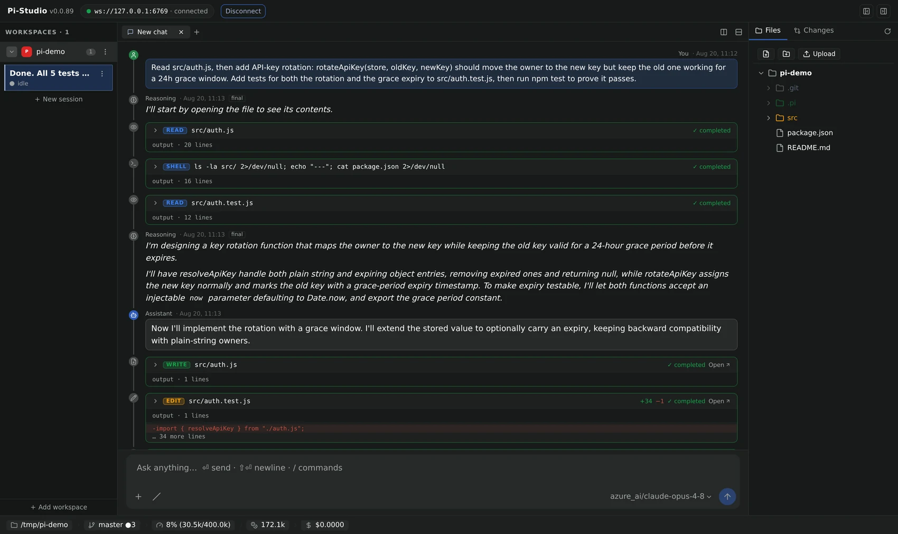
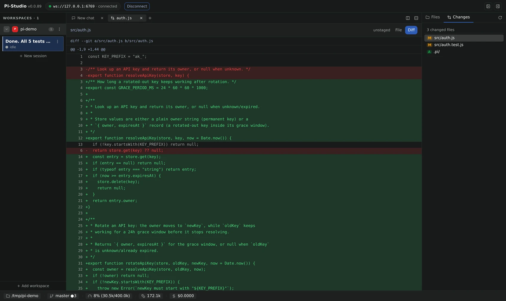
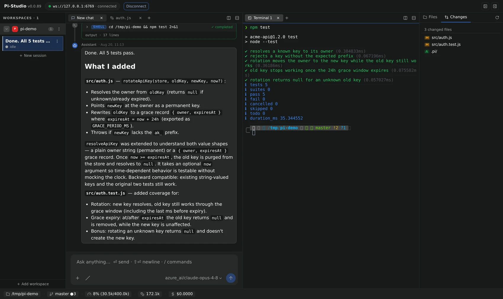
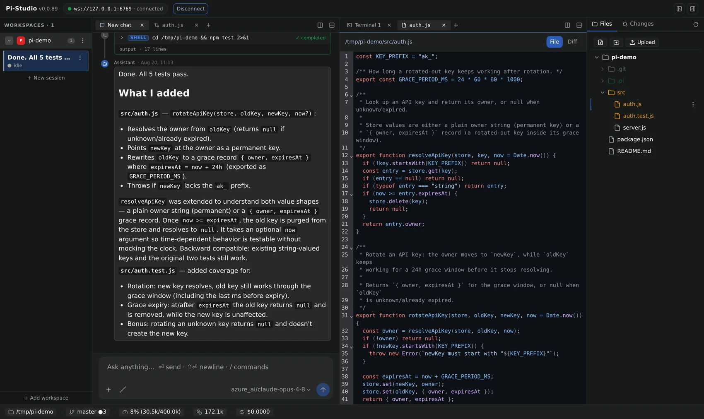

# `@av-pi-studio/cli`

Pi-Studio's job is to drive [Pi](https://pi.dev) — the terminal coding agent by Earendil — locally
or remotely, through a long-lived daemon that manages agent processes, terminals, and git
worktrees. Two clients talk to that daemon: this CLI, and a full browser UI. `pi-studio` starts
the daemon and gets you into either one:

```bash
pi-studio daemon start   # start (or find) a local daemon, print a pairing QR
pi-studio ui             # serve the browser UI, connected to that daemon
```

<p align="center">
  
</p>

---

## Install

```bash
npm install -g @av-pi-studio/cli
```

This exposes the `pi-studio` binary on your `PATH`. Without a global install, run it via:

```bash
npx @av-pi-studio/cli [options] [command] [args]
```

## Quick start

```bash
# log in to a model provider (the `pi` provider needs one before it can run a turn)
pi-studio auth login

# start a local daemon (if one isn't already running) and print a pairing QR code
pi-studio daemon start

# open the full browser UI, pointed at that daemon
pi-studio ui

# ...or stay in the terminal: run an agent, list it, attach to stream live output
pi-studio agent run --provider pi/claude-3-5-sonnet "implement user authentication"
pi-studio agent ls
pi-studio agent attach <agentId>

# target a remote daemon instead of the local one
pi-studio --host workstation.local:6767 agent ls
```

Run `pi-studio --help` (or `<command> --help`) for the full command tree.

## The web UI

`pi-studio ui` serves the production Pi-Studio browser UI — a three-column workspace (sessions on
the left, chat/terminal/code in the middle, files and git changes on the right) — as a static site,
no separate install or build step needed. Point it at any daemon, local or remote:

```bash
pi-studio ui                                    # serves on http://localhost:4173, connects to the local daemon
pi-studio ui --ui-port 8080 --daemon-host workstation.local:6767
```

The hero shot above is real: every tool call an agent makes (read/edit/write/shell) renders as its
own card, with live diff stats, right in the chat.

Review what it changed without leaving the tab — a full diff view, line by line:

<p align="center">
  
</p>

Split the workspace into multiple panes — chat next to a live terminal (backed by `node-pty`), a
file, or another session — and the layout persists across reloads:

<p align="center">
  
</p>

Every file opens with full syntax highlighting:

<p align="center">
  
</p>

See the [`ui`](#ui) command below for every flag, and
[`CONTRIBUTING.md`](../../CONTRIBUTING.md#web-ui-dev-server) for how to run the UI from source in
dev mode.

## Global options

| Flag                    | Description                                                                                                                                                                                                                       |
| ----------------------- | --------------------------------------------------------------------------------------------------------------------------------------------------------------------------------------------------------------------------------- |
| `-H, --host <host>`     | Daemon target — bare `host:port`, or a URL with a `ws://`/`wss://` or `http://`/`https://` scheme (e.g. `workstation.local:6767`, `https://box.local:6767`)                                                                       |
| `--password <password>` | Password for a password-protected daemon                                                                                                                                                                                          |
| `--home <dir>`          | Override `$PI_STUDIO_HOME` (used for the client-id store)                                                                                                                                                                         |
| `--pi-home <dir>`       | Override `$PI_STUDIO_PI_HOME` — the bundled Pi CLI's own `.pi` config dir. Selects the `auth.json` the `auth` group reads/writes, and is forwarded to a locally-spawned daemon and to `pi-studio pi`. Must precede the subcommand |
| `--json`                | Render command output as JSON instead of a table                                                                                                                                                                                  |
| `-v, --version`         | Print the installed CLI version and exit                                                                                                                                                                                          |

**Connection resolution**: `--host host:port` → `ws://host:port`; a `ws://`/`wss://` URL is used
as-is; `http://`/`https://` are accepted for familiarity and mapped to `ws://`/`wss://` (the daemon
is an HTTP server that upgrades to WebSocket on the same port); `wss://`/`https://` imply TLS. With
no `--host`, the CLI targets `ws://127.0.0.1:6767`.

**Default action** (no subcommand):

- `pi-studio <path>` — open that path as a project on the daemon.
- `pi-studio` (bare) — ensure a local daemon is running, then print a pairing QR code.

## Command tree

### `agent`

| Command                                              | Description                                    |
| ---------------------------------------------------- | ----------------------------------------------- |
| `agent run --provider pi/<model> "prompt"`           | Create an agent and run the first turn         |
| `agent ls`                                           | List all agents                                |
| `agent attach <agentId>`                             | Stream an agent's live events                  |
| `agent send <agentId> "prompt"`                      | Send a follow-up prompt                        |
| `agent steer <agentId> "message"`                    | Steer a running turn (after current tool calls) |
| `agent follow-up <agentId> "message"`                | Queue a message for after the agent stops      |
| `agent stop <agentId>`                               | Interrupt the current turn                     |
| `agent wait <agentId>`                               | Block until the agent goes idle or closes      |
| `agent logs <agentId> [-n <limit>]`                  | Print paged timeline history                   |
| `agent inspect <agentId>`                            | Print the full agent record                    |
| `agent update <agentId>`                             | Update model/mode/thinking/title               |
| `agent archive <agentId>`                            | Soft-delete                                    |
| `agent delete <agentId>`                             | Hard delete                                    |
| `agent reload <agentId>`                             | Resume a closed session                        |
| `agent import <sessionRef>`                          | Import a provider-native session by handle     |

`run`, `ls`, `attach`, `logs`, `send`, and `steer` also work without the `agent` prefix
(`pi-studio ls`, `pi-studio run …`).

Session management mirrors Pi's own slash commands — `agent session` (/session), `compact`,
`new-session`, `resume-session`, `fork`, `fork-messages`, `clone`, `name`, `export`, `model`,
`cycle-model`, `last-message`, and `commands` (list extensions/prompts/skills); run
`pi-studio agent --help` for the full set.

Provider spec parsing (`--provider`): `pi/claude-3-5-sonnet` → provider `pi`, model
`claude-3-5-sonnet`; bare `pi` → provider only; `mock` → the credential-free mock provider.

### `auth`

| Command                                                           | Description                                                                                                           |
| ----------------------------------------------------------------- | --------------------------------------------------------------------------------------------------------------------- |
| `auth login [provider] [--type api_key\|oauth] [--api-key <key>]` | Log in to a model provider. With no arguments, pick one interactively; `--api-key` is the headless path               |
| `auth status [--json]`                                            | Show which providers are configured, how (api key / oauth), and from where (stored credential vs. an ambient env var) |
| `auth logout <provider>`                                          | Remove a stored credential. Idempotent, and tells you when an ambient env var still configures the provider           |

The `pi` provider needs a model-provider credential before it can run a turn. This is the
supported way to supply one — no hand-editing Pi's `auth.json`, no hunting for `/login` inside
`pi-studio pi`'s interactive TUI:

```bash
pi-studio auth login                          # interactive: filter the provider list, pick, enter key
pi-studio auth login openai --api-key sk-...  # headless — for scripts, CI, Dockerfiles
pi-studio auth status
```

**Local and daemon-free** — unlike every other group here, `auth` never opens a WebSocket. It
writes Pi's own credential store at `<piHome>/agent/auth.json` (see `--pi-home`), which is the
exact file the daemon's spawned agents read, so a credential you add here is picked up on the next
agent spawn with no daemon restart. Interactive prompts need a TTY; use `--api-key` with an
explicit provider for non-interactive setups. Secrets are never echoed, and the store is written
`0600`.

### `daemon`

| Command                    | Description                                                                     |
| -------------------------- | -------------------------------------------------------------------------------- |
| `daemon start`             | Spawn a local daemon if one isn't already running, then print a pairing QR      |
| `daemon stop`              | Send SIGTERM to the local daemon                                                |
| `daemon restart`           | Stop then start the local daemon                                                |
| `daemon status`            | Print health + PID                                                              |
| `daemon set-password <pw>` | Bcrypt-hash a password into `$PI_STUDIO_HOME/config.json`                       |
| `daemon pair`              | Print the pairing URL/QR for an already-running daemon                          |
| `daemon rotate-key`        | Mint a fresh pairing keypair — revokes every previously issued pairing link/QR |

`pi-studio onboard` (top-level) is an alias for `daemon start`'s behavior, and bare `pi-studio`
does the same thing.

### `relay`

| Command                               | Description                                                          |
| ------------------------------------- | -------------------------------------------------------------------- |
| `relay start [--listen <host:port>]`  | Spawn a local relay server (default `0.0.0.0:7000`), wait for health |
| `relay stop`                          | Send SIGTERM to the local relay                                      |
| `relay status [--listen <host:port>]` | Print up/down for the relay at that address                          |

A self-hosted, zero-knowledge relay (`@av-pi-studio/relay`) that lets a client reach a daemon
behind a firewall/NAT — the daemon dials out to it; see that package's README for the full
picture. Runs as its own managed process, entirely decoupled from daemon lifecycle: point a
daemon at it via `daemon.relay.endpoint` in `config.json` (`PI_STUDIO_RELAY_ENDPOINT` env), not
through this command.

### `pi`

| Command        | Description                                                              |
| -------------- | ------------------------------------------------------------------------ |
| `pi [args...]` | Run the embedded Pi coding-agent CLI, forwarding every argument verbatim |

A pure pass-through proxy to the exact `pi` binary bundled inside
`@earendil-works/pi-coding-agent` (the same one the daemon spawns) — so `pi-studio pi ...` is a
drop-in replacement for a globally-installed `pi`, with none of its flags, subcommands, or
interactive TUI reimplemented. `pi-studio pi` alone launches the interactive TUI, exactly like
bare `pi`; `pi-studio pi -p "prompt"` runs non-interactively. `--pi-home` (global option, must
come before `pi` on the command line) redirects the bundled CLI's `.pi` config dir, same as it
does for a locally-spawned daemon. Falls back to a global `pi` on `$PATH` if the bundled
dependency isn't installed. Never touches the daemon or the wire protocol.

### `ui`

| Command                                                            | Description                                        |
| ------------------------------------------------------------------- | --------------------------------------------------- |
| `ui [--ui-host <host>] [--ui-port <port>] [--daemon-host <host>]` | Serve the prebuilt web-client SPA as a static site |

Serves the built `@av-pi-studio/web-client` UI (`dist/web`) via a minimal static file server with
SPA fallback — no vite/dev dependency at runtime, works from any install shape. `--daemon-host`
(falls back to the global `--host`) pre-fills the printed URL's `?host=&connect=1` so the browser
tab auto-connects; the command never itself probes or starts a daemon. Blocks until
`SIGINT`/`SIGTERM`.

See [The web UI](#the-web-ui) above for screenshots.

### `update`

| Command            | Description                                                            |
| ------------------ | ---------------------------------------------------------------------- |
| `update [--check]` | Self-update to the latest `@av-pi-studio/cli` version published on npm |

Shells out to the same `npm install -g @av-pi-studio/cli@<version>` path used to install the CLI
in the first place (see Install above), so it respects your npm config (registry mirrors, auth,
proxies) instead of reimplementing a registry client. `--check` reports whether an update is
available without installing anything.

### Feature groups

`chat`, `terminal`, `loop`, `schedule`, `permit`, `provider`, and `worktree` are sibling top-level
command groups (there is no `feature` wrapper, and no `project` group — opening a project is the
top-level `open <path>` command shown above):

| Group      | Commands                                                                                                                                                    |
| ---------- | ----------------------------------------------------------------------------------------------------------------------------------------------------------- |
| `chat`     | `create <name> [--purpose]`, `ls`, `inspect <roomId>`, `post <roomId> <message> [--from]`, `read <roomId> [-n]`, `wait <roomId>`, `delete <roomId>`         |
| `terminal` | `ls`, `create [--workspace] [--cwd]`, `capture <slot>`, `send-keys <slot> <data>`, `kill <slot>`                                                            |
| `loop`     | `run <prompt> [--max]`, `ls`, `inspect <loopId>`, `logs <loopId>`, `stop <loopId>`                                                                          |
| `schedule` | `create <cron> <prompt>`, `ls`, `inspect <id>`, `update <id> [--cron] [--prompt]`, `pause <id>`, `resume <id>`, `run-once <id>`, `logs <id>`, `delete <id>` |
| `permit`   | `ls`, `allow <permissionRequestId>`, `deny <permissionRequestId>`                                                                                           |
| `provider` | `ls`, `models <providerId>`                                                                                                                                 |
| `worktree` | `create <name> [--workspace]`, `ls`, `archive <name>`                                                                                                       |

## Using it as a library

The CLI's building blocks are also exported for programmatic use:

```ts
import { withDaemon } from "@av-pi-studio/cli";

await withDaemon(ctx, opts, async (daemonClient) => {
  // daemonClient is a connected @av-pi-studio/client DaemonClient
});
```

`withDaemon` resolves the target URL from `--host`/defaults, connects, runs your callback, then
disconnects — handling `RpcError`s and connection failures with clean stderr output and non-zero
exit codes along the way.

## How it talks to the daemon

The CLI process never runs daemon/relay code in-process — it only speaks the WebSocket API to
drive an existing daemon. It resolves `@av-pi-studio/server`'s/`@av-pi-studio/relay/server`'s
absolute module URL via `import.meta.resolve` (never `await import()`) purely to bake that URL
into a detached `node -e` subprocess it spawns for `daemon start`/`relay start` — see
`daemon-control.ts`'s `subprocessStarter` and `relay-control.ts`'s `subprocessRelayStarter`. A
stable per-machine `clientId` is generated on first use and stored at
`$PI_STUDIO_HOME/client-id`; `clientType` is always `"cli"`.

## Development

```bash
npx vitest run packages/cli
```

Tests cover command parsing, provider-spec parsing, stream-event formatting, the daemon-control
state machine, output rendering, pairing-URL construction, and the `auth` group (path resolution,
prompt/notify rendering, login/status/logout orchestration) — all against an injected `CliContext`
(stub output sink + mock `DaemonRuntime`, fake `AuthRuntime` and terminal I/O), never a real
spawned daemon and never a real credential store.
