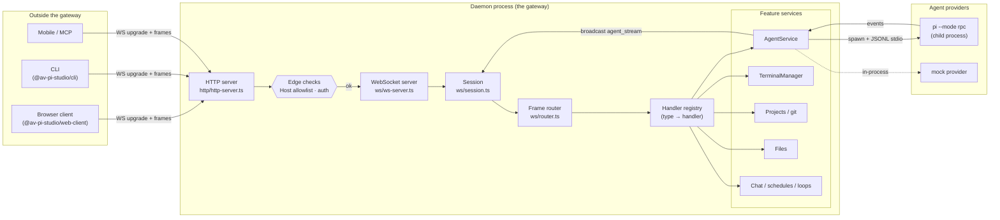
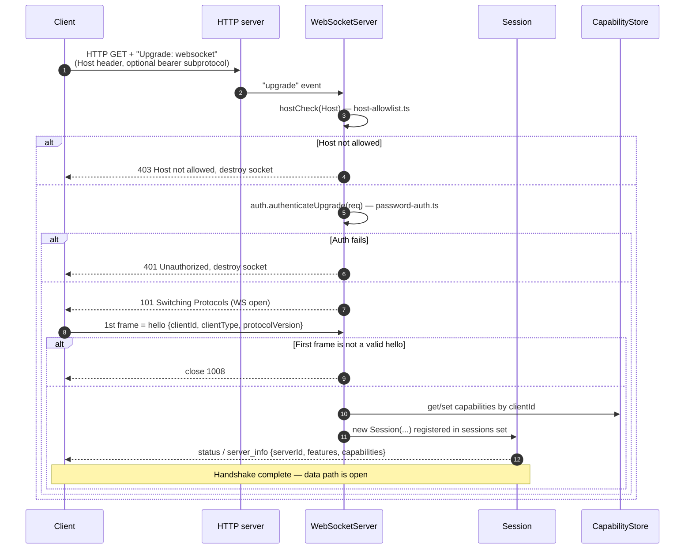
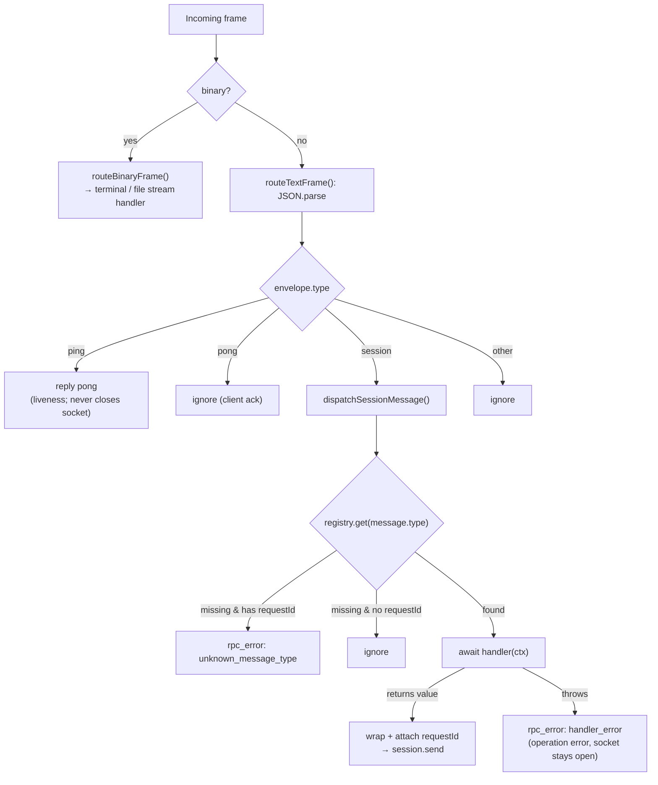
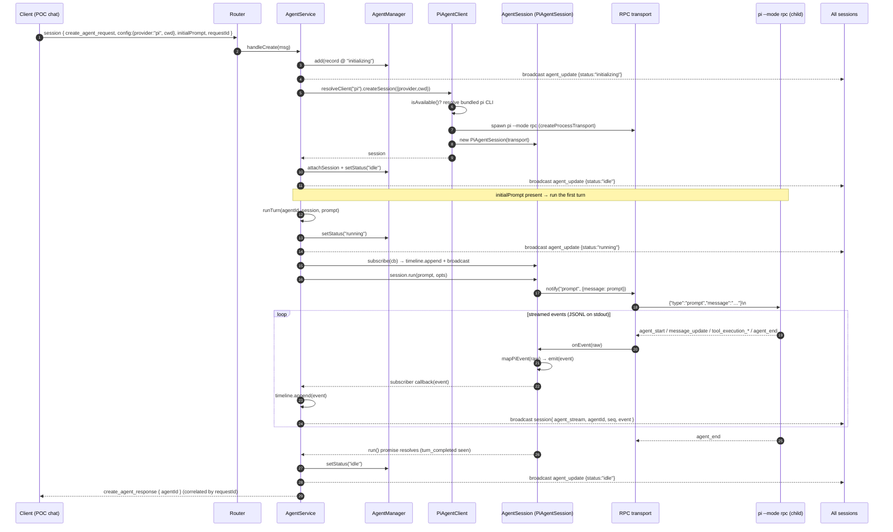
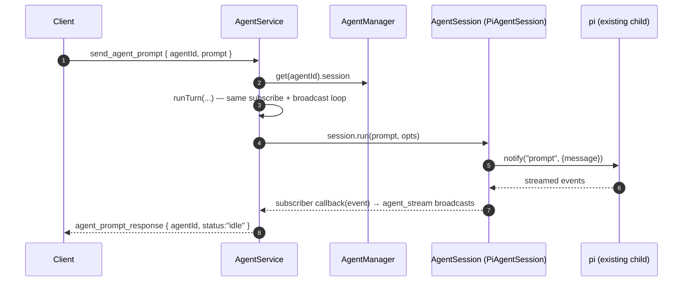
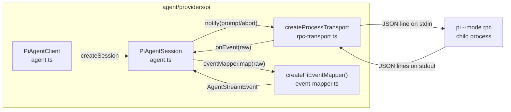
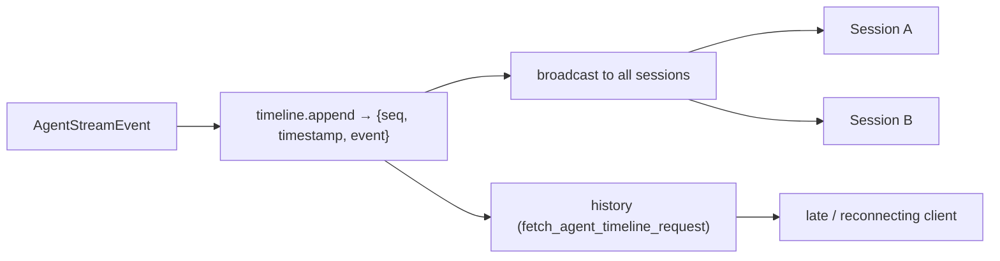
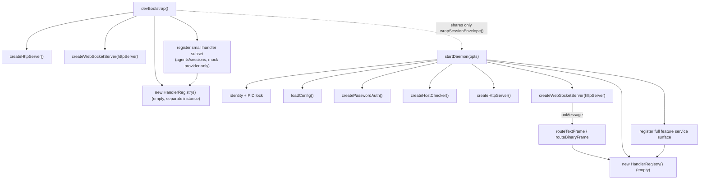
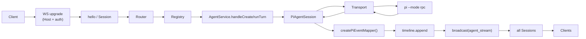

# Gateway architecture

The **daemon** is Pi-Studio's gateway: a single long-lived Node process that accepts client
connections over WebSocket (browser, CLI, mobile, MCP), authenticates and routes every frame, and
fans work out to feature services. The most important of those services is the **agent layer**,
which spawns and drives `pi` agent processes and streams their output back to every connected
client.

This document traces, end to end, **how an event enters the gateway from the outside** and **what
happens when a new user query (a chat prompt) arrives**.

> Source map: the gateway lives in `packages/server/src`. Key files are referenced inline as
> `ws/ws-server.ts`, `ws/router.ts`, `agent/agent-service.ts`, `agent/providers/pi/*`, etc.

---

## 1. The big picture

**Layers, from the edge inward:**

| Layer               | File(s)                                                        | Responsibility                                                                                                  |
| ------------------- | -------------------------------------------------------------- | --------------------------------------------------------------------------------------------------------------- |
| Transport           | `http/http-server.ts`, `ws/ws-server.ts`                       | TCP/HTTP listener; WebSocket upgrade.                                                                           |
| Edge security       | `http/host-allowlist.ts`, `auth/password-auth.ts`              | Host-header allowlist (DNS-rebinding defense) + optional password auth, both enforced **at the upgrade**.       |
| Handshake / session | `ws/ws-server.ts`, `ws/session.ts`                             | First frame must be `hello`; a `Session` object is created and capabilities are persisted.                      |
| Routing             | `ws/router.ts`                                                 | Parse envelopes, answer `ping`, dispatch `session` messages by `type`, correlate replies/errors by `requestId`. |
| Handlers            | `HandlerRegistry`                                              | Map a message `type` to a feature handler.                                                                      |
| Feature services    | `agent/`, `terminal/`, `projects/`, `files/`, `orchestration/` | The actual business logic.                                                                                      |
| Providers           | `agent/providers/pi`, `agent/providers/mock`                   | Drive the underlying agent runtime (a `pi` child process, or an in-process mock).                               |

---

## 2. How a connection is established

A client never speaks to a handler directly. It must first cross the edge and complete the handshake.

Key invariants (`ws/ws-server.ts`):

- **Host + auth are checked at the upgrade**, before any WebSocket frame is processed. A literal IP
or `localhost`/`*.localhost` Host is always allowed; configured `hostnames` extend the list.
- **The first frame must be `hello`.** A binary or non-`hello` first frame closes the socket with
code `1008`.
- The `hello.protocolVersion` is required; the server replies with a `server_info` payload that
advertises `serverId` and the enabled `features`.
- Capabilities are **persisted per `clientId`** so a reconnecting client that omits them is
rehydrated from the store.

---

## 3. How a frame is routed after the handshake

Every post-handshake frame is delivered to `onMessage` (wired in `bootstrap.ts`) and forwarded to
the router. Text frames are JSON **envelopes**; binary frames are terminal/file streams.

Routing rules (`ws/router.ts`):

- `**ping` → `pong`** on the data path. Liveness is independent of any RPC; an RPC timeout is an
*operation* failure and must **never** close the socket.
- A `session` envelope carries an inner `message` with a `type`. The router looks the type up in the
`HandlerRegistry` (canonical dotted names plus legacy flat-name aliases).
- The handler's return value is wrapped back into a `session` envelope and **correlated by
`requestId`** so the client can match the reply to its request.
- A handler that **throws** (including a timeout) yields an `rpc_error` correlated by `requestId` —
the connection survives.
- Unknown types are an `rpc_error` only if a `requestId` was supplied; otherwise they are dropped.

---

## 4. What happens when a new user query arrives

This is the central flow: a chat prompt from the POC becomes a real `pi` turn whose output streams
back to **every** connected client.

The web-client creates a **deferred draft** by calling `create_agent_request` **without** `initialPrompt`,
which persists an `AgentRecord` and spawns **no** provider process (`agent-service.ts:174-182`).
The draft materializes at tab-open time via `ensureMaterialized` (`web-client/src/stores/materialize.ts`),
so every send — first or follow-up — is `send_agent_prompt`. Both RPCs are registered by `AgentService`
(`agent/agent-service.ts`).

The eager path — `create_agent_request` **with** `initialPrompt` — still exists and is used by the CLI
`run` command, the MCP `create_agent` tool, and by `ScheduleService`/`LoopService` for automated agents.
That path spawns the provider process immediately and runs the initial turn.

### Step-by-step

1. **Frame arrives &amp; is routed.** The `create_agent_request` envelope reaches
 `dispatchSessionMessage`, which invokes `AgentService.handleCreate`.
2. **Agent record created.** `AgentManager.add` persists a record at status `initializing`, and an
 `agent_update` is broadcast to all sessions.
3. **Provider session created.** `resolveClient("pi")` returns a `PiAgentClient`. `createSession`:
  - checks `isAvailable()` (resolves the **bundled** `pi` CLI inside
   `@earendil-works/pi-coding-agent` — no global install needed; see
   `rpc-transport.ts › defaultPiCommand`);
  - spawns `node <pkg>/dist/cli.js --mode rpc` via `createProcessTransport`. A literal `~` cwd is
  expanded server-side (`expandHome`).
  - If pi can't be resolved, a clean `rpc_error` ("Pi provider unavailable…") is returned instead
  of crashing the daemon.
4. **Status → idle.** The session is attached to the manager and an `agent_update {idle}` is
 broadcast.
5. **Turn runs** (because `initialPrompt` was supplied). `runTurn`:
  - sets status `running` (+ broadcast);
  - **subscribes** to the session's event stream: each event is appended to the agent's **timeline**
  (monotonic `seq`) and broadcast to **all** sessions as an `agent_stream` frame;
  - guarantees exactly one canonical `user_message` (emitted by the provider, or synthesized if the
  provider doesn't);
  - calls `session.run(prompt, opts)`, which sends the prompt to pi via
  `transport.notify("prompt", {message})` — `AgentService` never touches the transport itself.
6. **pi streams events.** pi emits JSONL events on stdout; the transport frames each line (parses
 JSON, delivers it via the registered `onEvent` callback) and the session's callback calls
 `eventMapper.map(raw)` — a stateful `createPiEventMapper()` instance, one per session — which
 normalizes raw pi events to provider-neutral `AgentStreamEvent`s (see §5). Each becomes an
 `agent_stream` broadcast.
7. **Turn completes.** pi's session run loop emits one `agent_end` **per low-level run** — a
 retryable error, overflow-compaction, or a queued steering/follow-up continuation all loop into
 another run before the turn is truly done. The mapper treats each such `agent_end` (`willRetry`,
 or simply followed by more runs) as a non-terminal per-run boundary, latching only the
 disposition it implies. Only pi's own true-end signal, `agent_settled`, drives the turn-closer
 stream event (`turn_completed`/`turn_failed`/`turn_canceled`) — that's when the `run()` promise
 resolves, status returns to `idle` (+ broadcast), and `handleCreate` finally returns
 `create_agent_response { agentId }`, correlated by `requestId`.

> **Why the response can lag the stream.** An RPC call to `send_agent_prompt` resolves after the
> *entire* turn finishes (it `await`s `runTurn`). A long turn can exceed a client's RPC timeout — but
> the UI is driven by the `agent_stream` **broadcasts**, not by the response. Because a deferred draft's
> `agentId` is bound before any turn can start (at tab-open via `ensureMaterialized`), the live
> subscription in `use-agent-stream.ts` always attaches before streaming begins — there is no
> raw-broadcast first-turn workaround anymore.

### Follow-up prompts

`send_agent_prompt` skips agent creation: it looks up the live session and calls the same `runTurn`
on the existing agent.

---

## 5. The pi provider adapter (transport + event mapping)

The agent layer never reaches into pi internals; it talks to a small transport interface and a
per-session stateful event mapper. This is what makes the provider swappable (the `mock` provider
implements the same `AgentClient` contract).

**Wire protocol** (`rpc-transport.ts`, per pi's `docs/rpc.md`):

- **Commands** are single JSON lines on stdin: `{"type":"prompt","message":"…","id?":"…"}`.
- **Request/response** is correlated by `id`; a reply is `{"type":"response","command","success","id","data?","error?"}`.
`notify()` (fire-and-forget): `prompt`, `abort`, `steer`, `follow_up`, `respond_to_permission`,
`extension_ui_response` — starting a turn is a `notify`, not a request, so there is no response to
await. `run()` synthesizes completion by watching the event stream for a terminal event.
`request()` (correlated by `id`): `get_state`, `get_available_models`, `get_session_stats`, `compact`,
`new_session`, `switch_session`, `fork`, `get_fork_messages`, `clone`, `set_session_name`,
`export_html`, `set_model`, `cycle_model`, `get_last_assistant_text`.
- **Events** are every other JSON line on stdout.
- **Framing is strict JSONL: split on `\n` only** (strip a trailing `\r`). Node's `readline` is
deliberately avoided because it also splits on U+2028/U+2029, which are valid inside JSON strings.

**Event mapping** (`event-mapper.ts`) — raw pi events → neutral timeline events:

| pi event                                                                                           | `AgentStreamEvent`                              |
| -------------------------------------------------------------------------------------------------- | ----------------------------------------------- |
| `agent_start`                                                                                      | `turn_started` (also resets the mapper's latched disposition) |
| `agent_end` (`willRetry:true` — another run is coming)                                              | *(non-terminal)*                                |
| `agent_end` (`willRetry` false/absent)                                                              | *(non-terminal — latches disposition from the run's `stopReason` for the next `agent_settled`)* |
| `agent_settled` (latched disposition from `stopReason`: `error`)                                    | `turn_failed` (carries `errorMessage`)          |
| `agent_settled` (latched disposition: `aborted`)                                                    | `turn_canceled`                                 |
| `agent_settled` (latched disposition: other)                                                        | `turn_completed`                                |
| `message_update` (`text_delta`)                                                                    | `assistant_message` (text delta)                |
| `message_update` (`thinking_delta`)                                                                | `reasoning`                                     |
| `message_update` (`toolcall_end`)                                                                  | `tool_call` (status `started`)                  |
| `tool_execution_start`                                                                             | `tool_call` (status `running`)                  |
| `tool_execution_end`                                                                               | `tool_call` (status `completed` / `error`)      |
| `queue_update`                                                                                     | `queue_update` (steering/follow-up queue state) |
| `extension_error` / `error`                                                                        | `error`                                         |
| `turn_start`/`turn_end`, `message_start`/`message_end`, `*_update`, `compaction_*`, `auto_retry_*` | ignored                                         |

**Robustness:** a spawn failure (missing binary) emits an async `'error'` event on the child
process. The transport listens for it and converts it into a rejected request + an `error` stream
event, so a missing pi never crashes the daemon. The `pi` process tree is `treeKill`ed on `close`.

---

## 6. Broadcasting &amp; the timeline

Two properties make the system feel live and consistent:

- **Every agent event is broadcast to every session.** Recipients come from `getActiveSessions()`
(`bootstrap.ts:224`), which includes live WebSocket sessions **plus** `relaySessions`, so a relayed
client receives the same broadcasts as a direct one. Each message is wrapped through
`wrapSessionEnvelope` (`bootstrap.ts:174-180`), which wraps a bare update in `{type:"session", message}`
and passes an already-wrapped message through unchanged. This ensures every `agent_update`,
`agent_stream`, `terminals_update`, etc. reaches all connected clients.
- **Every event is appended to a per-agent timeline** with a monotonic `seq` and timestamp
(`agent/timeline-store.ts`). A late-joining or reconnecting client fetches history via
`fetch_agent_timeline_request` and then follows the live `agent_stream` broadcasts — no events are
lost across a reconnect.

---

## 7. Bootstrap &amp; wiring

The production daemon is started by `startDaemon(opts)` in `daemon/bootstrap.ts`, which assembles the
gateway: identity + PID lock, config, auth, host checker, HTTP server, WS server, and a
`HandlerRegistry`. It then registers the **full** RPC surface — the `HandlerRegistry` is handed to every
feature service (`agentService.registerHandlers`, `sessionOps.registerHandlers`,
`slashCommandOps.registerHandlers`, `registerTimelineHandler`, `permissionService`, projects/git,
files, terminals, orchestration; see `bootstrap.ts:236-256`), which populate it with handlers for agents,
terminals, projects/git/worktrees, files, chat, schedules, loops, providers.

`devBootstrap()` (`daemon/dev-bootstrap.ts`) is the **minimal** variant: it uses in-memory persistence,
the mock provider only, no auth, and registers only a small handler subset for local testing. It does
**not** call `startDaemon()` — it independently reimplements the same low-level wiring
(`createHttpServer`, `createWebSocketServer`, its own `HandlerRegistry`), sharing only the
`wrapSessionEnvelope` helper with `bootstrap.ts`.

---

## 8. End-to-end summary

A new user query travels:

- **Edge** rejects bad hosts/credentials before any frame is processed.
- **Router** correlates requests and replies by `requestId`; handler failures are operation errors,
never dead sockets.
- **AgentService** owns the turn lifecycle, the per-agent timeline, and the broadcast fan-out.
- **The pi adapter** is a thin, swappable transport + a per-session stateful event mapper over a
strict-JSONL child process, with the CLI bundled so no global install is required.

