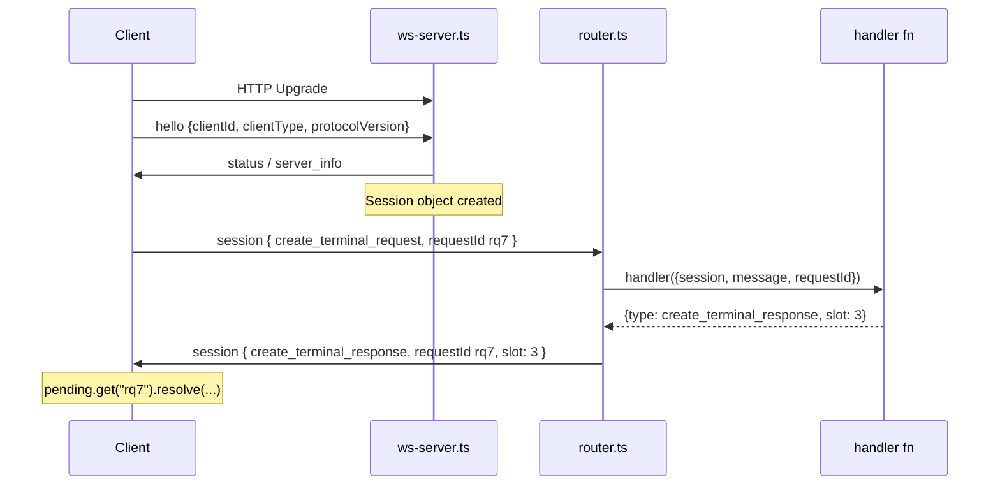

# RPC communication — request/response, correlation, and streaming

The daemon exposes its features via **Remote Procedure Calls** over a single **WebSocket per client**. This document explains what an RPC is in this codebase, how both layers of correlation work (WebSocket ↔ daemon, daemon ↔ `pi` subprocess), and how a user's prompt streams back as incremental events.

> **Source map:** The transport layer lives in `packages/server/src/ws/` and `packages/client/src`. The Pi adapter lives in `packages/server/src/agent/providers/pi/`. See `packages/server/docs/gateway-architecture.md` for the topology and the full prompt flow — this doc complements it with RPC mechanics and client-side dynamics.

---

## 1. Why RPC, and what it has to solve

**RPC = remote procedure call.** Code on machine A wants to run a function that lives on machine B. You can't call it directly, so you send a message describing the call, the other side runs the real function, and sends the result back.

In this codebase, four practical problems arise:

1. **Naming** — which function did you mean? (here: a `type` string like `"create_terminal_request"`)
2. **Correlation** — replies arrive out of order on a shared pipe; which reply belongs to which call? (here: `requestId`)
3. **Errors** — a remote failure must surface as a local failure, not a hang. (here: `rpc_error`)
4. **Server-initiated messages** — sometimes the daemon talks first (streaming agent output). Not a reply to anything. (here: *broadcasts*)

Pi-Studio does **not** use HTTP request/response. It uses **one long-lived WebSocket per client** (browser, CLI, mobile app, relayed client), and every call, reply, and stream event shares that single pipe.

---

## 2. The three nested envelopes

A text frame on the wire is JSON nested three deep:

```json
WebSocket text frame
└─ top-level envelope     { "type": "session", "message": {...} }
   └─ session message     { "type": "create_agent_request", "requestId": "rq7", ...params }
```

Why two layers instead of one? They answer different questions:

- **Top-level `type`** is *connection-level*: `hello` (handshake), `status` (server info after hello), `ping`/`pong` (liveness), `session` (…and this one carries RPC).
  The router is literally a 4-case switch over these (`ws/router.ts:129-153`).
- **The inner `session` message** is the *RPC channel*. Every actual procedure call and every stream event lives in here.

Note that `ping`/`pong` are **JSON messages**, not RFC-6455 protocol pings — browsers and React Native cannot access real protocol pings, so liveness had to be re-implemented on the data path. An RPC timeout is an operation error, never a socket death.

---

## 3. Lifecycle of one RPC call



### Client sends the call

`DaemonClient.request(type, params)` (`packages/client/src/daemon-client.ts:185-207`):

- Generate a unique `requestId` (e.g. `"rq7"`)
- Create a `Promise`, and store its `resolve`/`reject`/timer in a `pending: Map<requestId, PendingRpc>` (`line:98`)
- Send `{type:"session", message:{type, ...params, requestId}}`
- Return the promise

### Server dispatch

`routeTextFrame` sees `type: "session"` and hands the inner message to `dispatchSessionMessage` (`ws/router.ts:61-112`), which does exactly four things:

1. Look up `registry.get(message.type)` (the handler)
2. `await handler({ session, message, requestId })`
3. If the handler returned anything, wrap it and **stamp `requestId` onto it** (`router.ts:86-95`) — handlers don't have to remember to echo the id
4. If the handler threw, send `rpc_error` with code `handler_error`

Two policy details:

- Unknown `type` **with** a `requestId` gets `rpc_error` (`unknown_message_type`)
- Unknown type **without** one is silently ignored — because no-`requestId` means fire-and-forget by design (e.g. `terminal_input` from the legacy UI), and nobody is waiting

### Client resolves

`handleSession` in `daemon-client.ts:374-403`:

- `rpc_error` + matching id → `reject(new RpcError(...))`
- Otherwise if the id is in `pending` → resolve with **`msg.payload` if the response has a `payload` field, else the whole message** (`daemon-client.ts:397`)

That last detail is why some handlers return `{payload:{…}}` and others return flat fields — callers see different shapes.

---

## 4. Failure modes are three distinct things

**`rpc_error`** (`handler_error` from a throw, `unknown_message_type` from an unregistered type) — the **socket survives** (`ws/router.ts:96-110`).

**`RpcTimeoutError`** — rejects that one promise only, socket survives. `request(type, params, timeoutMs)` accepts an optional timeout; the default is 30 seconds (`daemon-client.ts:192-206`). An RPC timeout is an operation failure, never a connection failure — the next RPC can use the same socket.

**Socket close** — rejects **every** pending promise with `socket closed: <reason>` (`daemon-client.ts:285-290`). This is distinct from an RPC timeout and is the only case where the connection itself has died.

Also: an unknown type **without** a `requestId` is silently dropped, because no-`requestId` means fire-and-forget by design (so nobody is waiting for an error reply).

---

## 5. The handler contract

No IDL, no codegen. The entire framework is ~160 lines. A handler is just a function:

```ts
type RpcHandler = (ctx: { session, message, requestId? }) => unknown | Promise<unknown>
```

The `HandlerRegistry` is a `Map<string,RpcHandler>` plus an alias map (`ws/router.ts:29-55`):

- **Return a value** → it becomes the correlated response. The router stamps `requestId` onto it automatically.
- **Throw** → yields `rpc_error` with code `handler_error`.
- **Return `undefined`** → nothing is sent (fire-and-forget path).

A complete RPC endpoint is minimal (`packages/server/src/terminal/terminal-rpc.ts:33-36`):

```ts
registry.register("list_terminals_request", () => ({
  type: "list_terminals_response",
  terminals: manager.list(),
}));
```

**Registration is explicit and centralized** in `daemon/bootstrap.ts` (production) and `daemon/dev-bootstrap.ts` (development), never auto-discovered. That file *is* the daemon's API surface — ~190 registrations across agents, git, terminals, files, chat, loops, schedules.

Naming convention: flat **snake_case** is the real standard (`agent_rewind_request`, `list_providers`). Dotted names (`agent.rewind.request`) are a small minority; `registerAlias` exists for both forms to resolve to one handler.

---

## 6. Broadcasts: the other direction

A `session` message with **no matching pending `requestId`** is not a reply — it falls through to `onSessionMessage` subscribers (`daemon-client.ts:396-402`). The web-client's timeline and session store subscribe to these raw broadcasts:

```ts
// Client subscribes
client.onSessionMessage((msg) => {
  // msg.type could be: agent_stream, agent_update, terminals_update, workspace_update, agent_archived
})
```

This is how multiple browser tabs, the CLI, and a relayed mobile phone all stay in sync off one client's action — every event is pushed to **every** connected session.

---

## 7. The second RPC system: daemon ↔ `pi` subprocess

There are **two independent RPC systems nested inside each other**, and they are structurally identical.

| Aspect | WebSocket RPC | Pi JSONL RPC |
| --- | --- | --- |
| **Call id** | `requestId: "rq9"` | `id: "c7"` (`providers/pi/rpc-transport.ts:235`) |
| **Pending map** | `pending: Map<requestId, …>` (`daemon-client.ts:98`) | `pending: Map<id, …>` (`rpc-transport.ts:113`) |
| **Error reply** | `{type:"rpc_error"}` | `{type:"response", success:false}` (`rpc-transport.ts:215`) |
| **Broadcast** (no id) | `agent_stream` etc. (no `requestId`) | any stdout line where `type !== "response"` (`rpc-transport.ts:221`) |
| **Frame type** | one WS text frame | one `\n`-delimited JSON line on stdout |

The key difference: **the inner Pi RPC uses `notify` (fire-and-forget), not `request`** (`providers/pi/rpc-transport.ts:234-250`):

```ts
// Notify — no id, no promise, returns immediately
transport.notify("prompt", { message: prompt });

// Request — stamps an id, stores a promise, waits for correlated response
const data = await transport.request("get_state");
```

**Incremental JSONL framing** (`rpc-transport.ts:199-231`): the transport buffers stdout and splits on `\n` only, because a pipe chunk can land mid-JSON — you cannot `JSON.parse` a raw `data` chunk. Node's `readline` is deliberately avoided because it also splits on U+2028/U+2029, which are valid inside JSON strings.

---

## 8. Streaming a turn end to end

One `send_agent_prompt` call produces dozens-to-hundreds of events over minutes. Pure request/response can't express that — the design splits it:

- The **RPC** (`send_agent_prompt`) is a *lifecycle* call. It resolves when the whole turn is over.
- The **broadcast** (`agent_stream`, no `requestId`) carries every event as it happens.

**Five hops:**

**Hop 1 — browser → daemon.**
`Composer.tsx:181` calls `ensureMaterialized` then `client.agent(agentId).send(prompt, …)`, which is a plain `send_agent_prompt` RPC through the `pending`-map machinery. `AgentService.handleSendPrompt` (`agent-service.ts:221-241`) looks up the record, and if there's no live provider session (daemon restart, or a deferred draft's first send), calls `spawnOrResumeSession` to get one.

**Hop 2 — daemon → `pi` subprocess (the second RPC system).**
`runTurn` calls `session.run(prompt, opts)` (`agent-service.ts:326`). Inside the Pi adapter (`providers/pi/agent.ts:226-240`):

```ts
run(prompt, opts) {
  return new Promise<void>((resolve) => {
    const unsub = this.subscribe((event) => {
      if (event.kind === "turn_completed" || "turn_failed" || "turn_canceled") {
        unsub();
        resolve();  // ← Promise resolves when a terminal event arrives
      }
    });
    void this.startTurn(prompt, opts);  // ← Fire the turn via notify
  });
}
```

`startTurn` uses **`notify`** (`agent.ts:222`), not `request`:

```ts
this.transport.notify("prompt", { message: prompt, ...(images ? { images } : {}) });
return Promise.resolve({ turnId });
```

So starting a turn is fire-and-forget. The "response" is synthesized by watching the event stream for a terminal event.

**Hop 3 — normalize the vocabulary.**
Raw Pi events are Pi's own shapes. `mapPiEvent` (`event-mapper.ts`) translates them into provider-neutral `AgentStreamEvent`s:

- `agent_start` → `turn_started`
- `message_update` + `text_delta` → `assistant_message`; `thinking_delta` → `reasoning`
- `tool_execution_start/end` → `tool_call` with `status: running|completed|error`
- `agent_end` → inspects `stopReason`: `error` → `turn_failed`, `aborted` → `turn_canceled`, else `turn_completed`
- **Returns `null`** for a whole set of raw events (`turn_start`, `message_start`, `compaction_start`, …) — dropped, never reach the timeline (`agent.ts:142`)

**Hop 4 — timeline append + broadcast.**
`runTurn` (`agent-service.ts:262-301`) subscribes to the session for the duration of the turn, and every event does exactly two things:

```ts
const row = timeline.append(event);  // assign epoch, seq, timestamp
this.broadcastAll(getSessions(), {
  type: "session",
  message: { type: "agent_stream", agentId, seq: row.seq, timestamp: row.timestamp, event },
});
```

`AgentTimelineStore.append` (`timeline-store.ts:181-190`) stamps three **daemon-owned** fields: monotonic `seq`, `epoch` (bumped by `startEpoch()` at the top of each turn), and `timestamp`. The exactly-once `user_message` rule: provider-emitted and keyed by `messageId`/`clientMessageId`, else synthesized if the provider never emits one.

Recipients come from `getActiveSessions()` = WS sessions **plus** relay sessions (`bootstrap.ts:224`), so a relayed client receives every event.

When `session.run()` resolves, `runTurn` unsubscribes, derives status from the *last timeline row* (`turn_failed`/`error` → `error`, else `idle`), and broadcasts a final `agent_update`.

**Hop 5 — back into the UI.**
`PiStudioClient.agent(id).timeline.subscribe` (`client/src/pistudio-client.ts:268-272`) is a thin filter:

```ts
return this.daemon.onSessionMessage((msg) => {
  if (m.type === "agent_stream" && m.agentId === this.agentId && m.event) …
});
```

`use-agent-stream.ts` attaches that in a `useEffect`, routing each event to `applyAgentStreamEvent` (`hooks/agent-stream-events.ts:23-55`), which does two things:

1. `sessionStore.applyStreamEvent(sessionId, event)` → the pure reducer in `timeline/reducer.ts:191` folds the event into timeline state
2. A `switch` on `event.kind` for side effects: turn lifecycle → `setStatus`, and `tool_call` + `status === "completed"` + `toolMutatesFiles` → `invalidateAfterToolCompletion` (refresh file tree / diff panes without polling)

### Three consequences

**Status never comes from the RPC.** `running`/`idle`/`error` reach the UI as `agent_update` broadcasts at the start and end of `runTurn`. The RPC's own `status` field is redundant — this is deliberate, so every connected client stays in sync.

**The RPC response is a completion signal, not data.** Everything you'd want already arrived over the stream. `Composer.tsx:184`'s bare `catch` swallowing rejection is consistent with that.

**The timeline store, not the stream, is the durable source.** A reconnecting client backfills via `fetch_agent_timeline` using `seq`-based cursors (`encodeCursor` = `String(seq)`, `timeline-store.ts:123`; `page({direction, cursor, limit})` at line 232). Same rows, same ordering; live push and historical pull are two views of one append-only log.

---

## 9. Failure propagation across both systems

If the `pi` process dies mid-turn, `failAll` (`rpc-transport.ts:132-138`) does two things at once:

1. Rejects every in-flight JSONL request with the error
2. Synthesizes `{type:"error", error: message}` into the event stream

That synthetic event maps to `{kind:"error"}`, becomes a timeline row, and drives status to `error`. **Without it**, `run()`'s promise never resolves and the turn hangs forever.

Also document the `child.on("error")` listener (`rpc-transport.ts:142-150`): a missing binary raises an async `error` event that Node otherwise rethrows as unhandled, killing the whole daemon.

---

## 10. Adding a new RPC end to end

Recipe:

1. **Pick a name:** flat snake_case `<name>_request` / `<name>_response` (e.g. `create_terminal_request`).
2. **Register the handler:** in `daemon/bootstrap.ts` (always) and `daemon/dev-bootstrap.ts` only if the mock/dev path needs it.
3. **Return the response:** return the response object **without** a `requestId` — the router stamps it on. Throw for failures.
4. **Gate optional behavior:** on `session.supports(flag)` (`ws/session.ts:31-33`) for capability-guarded features.
5. **Schema:** add a Zod schema in `packages/protocol` only if the message needs typed validation. Many ad hoc RPCs deliberately validate via the `sessionMessageBaseSchema` passthrough fallback instead (`list_agents_request`, `list_provider_models`), staying untyped and unlocking future fields.

Example handler (`terminal/terminal-rpc.ts:33-36`):

```ts
registry.register("list_terminals_request", () => ({
  type: "list_terminals_response",
  terminals: manager.list(),
}));
```

Client call:

```ts
const result = await client.request("list_terminals_request");
```

---

## 11. Client-side reconnect and backfill

The client's `pending` map is keyed by `requestId`. On reconnect, the old map is flushed (every pending promise rejects with `socket closed: …`, `daemon-client.ts:285-290`), and the new connection starts fresh.

`fetch_agent_timeline_request` retrieves the timeline for an agent using `seq`-based cursor pagination. A client that reconnected mid-turn can backfill from the last known `seq` with `page({direction:"after", cursor, limit})`. This ensures no events are lost across a reconnect — the timeline is the durable, authoritative source.
