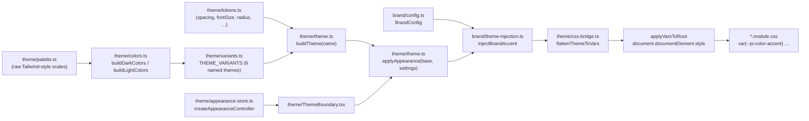

# Pi-Studio web-client — Design System

> Source of truth for the visual language and styling infrastructure of `@av-pi-studio/web-client`.
> Every number and color below is read directly from the current implementation — if this doc and
> the code ever disagree, the code wins and this doc is stale (file an issue against it).
>
> Related: `AGENTS.md` (source layout), `clean-room-scope/architecture/design-system.md` (original
> cross-platform spec this was ported from — historical reference, not always current for the
> web-only implementation described here).

## Contents

1. [Architecture](#architecture) — how a token becomes a pixel on screen
2. [Token scales](#token-scales) — spacing, type, radius, opacity, icon size, shadow
3. [Color system](#color-system) — semantic tokens, raw palette, syntax/terminal maps
4. [Theme variants](#theme-variants) — the six named themes
5. [CSS custom-property naming](#css-custom-property-naming)
6. [Appearance & runtime theming](#appearance--runtime-theming)
7. [White-label / brand injection](#white-label--brand-injection)
8. [Breakpoints & layout constants](#breakpoints--layout-constants)
9. [Primitives catalog](#primitives-catalog)
10. [Pure UI-logic modules (`ui/`)](#pure-ui-logic-modules-ui)
11. [Styling conventions](#styling-conventions)
12. [Regression guards](#regression-guards)
13. [How to extend](#how-to-extend)

---

## Architecture

- **`theme/tokens.ts`** — theme-invariant scale constants: spacing, font size, font weight, border
  radius/width, opacity, icon size, line height, default font stacks, shadow builder. No colors.
- **`theme/palette.ts`** — raw Tailwind-style numeric color scales (`zinc`, `blue`, `green`, …,
  each `50`–`950`). Fixed, theme-invariant.
- **`theme/colors.ts`** — the semantic `ThemeColors` shape plus two builders: `buildDarkColors(tint)`
  (takes a `DarkTintConfig` of ~15 colors and derives the full ~30-key semantic set + syntax +
  terminal theme) and `buildLightColors()` (the one light theme, built directly).
- **`theme/variants.ts`** — the six named `THEME_VARIANTS`, each a tint config fed through
  `buildDarkColors` (or `buildLightColors` for `light`).
- **`theme/theme.ts`** — `Theme` type (colors + every token scale + font family + swatch),
  `buildTheme(name)` assembles one from a variant, `applyAppearance(base, settings)` returns a
  **new**, non-mutated `Theme` with the font-size scale rescaled and/or custom UI/mono fonts spliced
  in.
- **`theme/css-bridge.ts`** — `flattenThemeToVars(theme)` turns a `Theme` into a flat
  `Record<"--pi-*", string>` map (colors verbatim camelCase, spacing/radius/etc. in px, font sizes
  converted to `rem`); `applyVarsToRoot`/`applyThemeToDOM` diff-apply that map onto
  `document.documentElement.style`.
- **`theme/appearance-store.ts`** — `createAppearanceController(store, brandConfig)`: owns
  `{ mode, settings, resolvedTheme }`, persists to a `KeyValueStore` (`localStorage` on web), resolves
  `"system"` mode via `prefers-color-scheme`, applies brand accent injection, and exposes
  `setMode`/`updateSettings`/`apply`/`listen`.
- **`theme/ThemeBoundary.tsx`** — wraps the app root; builds the controller and calls `apply()`
  **synchronously during render**, before first paint, so there is no flash of the wrong theme. A
  `useEffect` then starts the `prefers-color-scheme` listener for live system-theme following.
- **`*.module.css`** — every component reads tokens exclusively via `var(--pi-*)`; no CSS module
  hardcodes a color hex or a `font-size`/`padding`/`margin`/`gap`/`border-radius` px literal. Enforced
  by [regression guards](#regression-guards), not just convention.

## Token scales

All defined in `theme/tokens.ts`. Values are the same across every theme variant (color is the only
thing that varies per-theme); `fontSize` and `fontFamily` are additionally patchable at runtime by
[Appearance settings](#appearance--runtime-theming).

### Spacing

Key = the literal px value (dot-free by construction — a CSS custom-property name cannot contain a
literal `.`; an earlier `key = px / 4` scheme used fractional keys like `"1.5"`, which silently
emitted the **invalid** custom property `--pi-spacing-1.5` that no browser resolves, collapsing every
padding/margin/gap using it to nothing app-wide — see [Regression guards](#regression-guards)).
Covers every value actually used in the app, not a theoretical geometric scale.

| Key | px | Key | px | Key | px | Key | px |
|---|---|---|---|---|---|---|---|
| `0` | 0 | `6` | 6 | `14` | 14 | `30` | 30 |
| `1` | 1 | `7` | 7 | `16` | 16 | `32` | 32 |
| `2` | 2 | `8` | 8 | `20` | 20 | `48` | 48 |
| `3` | 3 | `10` | 10 | `24` | 24 | `64` | 64 |
| `4` | 4 | `12` | 12 | | | `80` | 80 |
| `5` | 5 | | | | | `96` | 96 |
| | | | | | | `128` | 128 |

Usage: `padding: var(--pi-spacing-12);` (emitted as `12px`).

### Font size

A dense, mostly-1px-step ladder covering every rung the UI renders — the **one lever** for the app's
text size. Emitted as `rem` (against the untouched 16px browser root) by `css-bridge.ts`'s `pxToRem`,
not `px`, so text still respects the user's own browser/OS zoom on top of the app's own scale.

| Rung | px | Used for |
|---|---|---|
| `4xs` | 10 | micro badges (queued, command-kind) |
| `3xs` | 11 | micro meta (author label, git status badge) |
| `2xs` | 12 | secondary meta (versions, counts, line numbers, hunk headers) |
| `xs` | 13 | dense UI text — the most common rung |
| `code` | 13 | code/diff surfaces — own base, decoupled from prose |
| `sm` | 14 | primary UI text, row titles, tab labels |
| `md` | 15 | prose and form controls |
| `base` | 17 | document base — inputs, screen titles, composer (Appearance font-size anchor) |
| `lg` | 19 | display |
| `xl` | 21 | display |
| `2xl` | 23 | display |
| `3xl` | 28 | display |
| `4xl` | 36 | display |

Usage: `font-size: var(--pi-font-size-xs);`. Never a literal `px`/`rem` in a `.module.css`.

### Other scales

| Scale | Values | CSS var prefix |
|---|---|---|
| `fontWeight` | `normal=400, medium=500, semibold=600, bold=700` | `--pi-font-weight-*` |
| `borderRadius` | `none=0, sm=2, base=4, md=6, lg=8, xl=12, 2xl=16, full=9999` | `--pi-radius-*` |
| `borderWidth` | `0, 1, 2` | `--pi-border-width-*` |
| `opacity` | `0, 50=0.5, 100=1` | `--pi-opacity-*` |
| `iconSize` | `xs=12, sm=14, md=16, lg=20` | `--pi-icon-size-*` |
| `lineHeight` | `diff=22` (code/diff; prose uses `fontSize.base * ~1.4` at render time, not a token) | `--pi-line-height-diff` |
| `shadow` | `sm/md/lg`, built per color scheme by `buildShadows()` — dark uses `rgba(0,0,0,0.55)`, light `rgba(24,24,27,0.12)`, increasing offset/radius/elevation | `--pi-shadow-*` |
| `fontFamily.ui` | `system-ui, -apple-system, "Segoe UI", Roboto, Helvetica, Arial, sans-serif` (seed; Appearance can override) | `--pi-font-ui` |
| `fontFamily.mono` | `ui-monospace, SFMono-Regular, Menlo, Monaco, Consolas, "Liberation Mono", monospace` (seed; Appearance can override) | `--pi-font-mono` |

## Color system

`ThemeColors` (`theme/colors.ts`) is a flat, layer-based semantic map. Components read these tokens
— they reach into the raw `palette` only for a **fixed signal color that must not shift per theme**
(e.g. a fixed-green success icon independent of the active accent).

| Group | Tokens | Meaning |
|---|---|---|
| Surfaces | `surface0`…`surface4` | Elevation ramp. `surface0` = app background, `surface1` subtle, `surface2` = badges/inputs/sheets, `surface3` highest, `surface4` extra emphasis (CSS currently only defines `el0`–`el3` classes in `Surface.module.css` — elevation `4` falls back to the `surface3` class) |
| Surfaces (special) | `surfaceDiffEmpty`, `surfaceSidebar`, `surfaceSidebarHover`, `surfaceWorkspace` | Empty diff side, sidebar bg + hover, workspace main bg (dark: aliases `surface1`; light: `surface0`) |
| Text | `foreground`, `foregroundMuted` | Primary + secondary text |
| Brand | `accent`, `accentBright`, `accentForeground` | Brand accent, brighter variant (used for e.g. the running-status spinner ring), text-on-accent (auto-derived via `contrastForeground` when a theme/brand doesn't specify it) |
| Semantic | `destructive`, `destructiveForeground`, `success`, `successForeground` | Danger + success fills. Dark themes alias `success` to the theme `accent` (not a separate green) |
| Borders | `border`, `borderAccent` | Default + softer low-emphasis outline |
| Status | `statusSuccess`, `statusDanger`, `statusWarning`, `statusMerged` | Signal colors a step darker than the raw palette equivalent so they read as signals, not neon; light/dark have distinct values |
| Diff | `diffAddition`, `diffDeletion` | Diff add/remove text colors |
| Controls | `scrollbarHandle` | Custom scrollbar thumb |
| Legacy aliases | `background`, `popover`, `popoverForeground`, `primary`, `secondary`, `muted`, `mutedForeground`, `input`, `ring` | Mirror the semantic tokens above 1:1 (e.g. `background` = `surface0`, `primary` = `accent`) — kept for call sites that haven't migrated; new code should prefer the semantic token |
| Nested | `colors.palette`, `colors.syntax`, `colors.terminal` | Raw scales; syntax-highlight map; xterm ANSI theme (not flattened to `--pi-*` vars — consumed directly as JS objects by the terminal/highlighter) |

### Raw palette

`theme/palette.ts` — eleven Tailwind-style 11-stop (`50`…`950`) scales (`zinc`, `gray`, `slate`,
`blue`, `green`, `red`, `teal`, `amber`, `yellow`, `purple`, `orange`) plus flat `white`/`black`.
Theme-invariant; not exposed as CSS variables — imported directly in TS/TSX where a fixed color is
needed (e.g. `ui/avatar.ts`'s 12-color deterministic avatar palette, syntax/terminal color builders).

### Syntax highlight colors

`SyntaxColors` — one color per highlight-token kind (`keyword`, `string`, `number`, `boolean`,
`comment`, `function`, `variable`, `type`, `class`, `constant`, `operator`, `punctuation`, `tag`,
`attribute`, `property`, `regexp`, `escape`, `heading`, `link`, `deleted`, `inserted`), built from the
raw palette (`darkSyntax()` / `lightSyntax()`) and emitted as `--syntax-<kebab-case>` vars (e.g.
`--syntax-function`) — consumed by `@av-pi-studio/highlight`.

### Terminal theme

`TerminalTheme` — full xterm config (`background`, `foreground`, `cursor`, `cursorAccent`,
`selectionBackground`, 8 ANSI + 8 bright-ANSI colors), built per-theme by `terminalFrom()` from the
theme's `surface0`/`foreground`/`accent`. Not flattened into individual `--pi-*` vars (xterm takes a
JS theme object directly) — only `--pi-terminal-bg`/`--pi-terminal-fg` are exposed for CSS use (the
terminal wrapper chrome).

## Theme variants

Six named themes — one light, five dark "tints" sharing `buildDarkColors()`, which takes a
`DarkTintConfig` (surfaces 0–4, sidebar surfaces, muted foreground, scrollbar, borders, accent, bright
accent, destructive — 15 fields) and derives the full ~30-key semantic set plus syntax + terminal
maps.

| Theme | Kind | Surface 0 | Accent | Bright accent | Swatch |
|---|---|---|---|---|---|
| `light` | light | `#ffffff` | `#253e6f` | `#2f4f8e` | `#ffffff` |
| `dark` *(default)* | dark, subtle teal-green | `#181B1A` | `#2e5cb8` | `#a2b4d7` | `#3b62b0` |
| `zinc` | dark, neutral gray (no tint) | `#18181b` | `#e4e4e7` | `#fafafa` | `#808080` |
| `midnight` | dark, subtle blue | `#161820` | `#3b6fcf` | `#7eaaeb` | `#4A6BA8` |
| `claude` | dark, warm orange undertone | `#1f1f1e` | `#d97757` | `#e89a7f` | `#D97757` |
| `ghostty` | dark, slate-blue | `#282c34` | `#89b4fa` | `#b4d0fc` | `#8caaee` |

`THEME_NAMES` / `THEME_VARIANTS` / `THEME_SWATCHES` (`theme/variants.ts`) are the canonical
name list, resolved-variant map, and swatch-color map (for the Appearance theme picker). Default
theme is `dark` (`DEFAULT_THEME_NAME` in `theme/theme.ts`).

`zinc`'s `accent` is a near-white gray (`#e4e4e7`) rather than a hue — its `accentForeground` resolves
dark via `contrastForeground()` instead of the white text every other variant gets.

## CSS custom-property naming

`css-bridge.ts`'s `flattenThemeToVars` is the single place variable names are minted. Emission rules,
exactly as implemented:

| Token source | CSS variable | Example |
|---|---|---|
| `theme.colors.<key>` | `--pi-color-<key>` **verbatim camelCase** (not kebab-cased — kebab-casing here silently broke every multi-word token, since call sites reference the camelCase form) | `--pi-color-surfaceSidebar`, `--pi-color-foregroundMuted`, `--pi-color-statusDanger` |
| `theme.colors.syntax.<key>` | `--syntax-<kebab-case>` | `--syntax-function`, `--syntax-punctuation` |
| `theme.spacing.<key>` | `--pi-spacing-<key>` (px) | `--pi-spacing-12` → `12px` |
| `theme.fontSize.<key>` | `--pi-font-size-<key>` (rem, via `pxToRem`) | `--pi-font-size-xs` → `0.8125rem` |
| `theme.fontFamily.ui` / `.mono` | `--pi-font-ui` / `--pi-font-mono` | |
| `theme.lineHeight.diff` | `--pi-line-height-diff` (px) | |
| `theme.iconSize.<key>` | `--pi-icon-size-<key>` (px) | |
| `theme.fontWeight.<key>` | `--pi-font-weight-<key>` | |
| `theme.borderRadius.<key>` | `--pi-radius-<key>` (px, `full` → `9999px`) | |
| `theme.borderWidth.<key>` | `--pi-border-width-<key>` (px) | |
| `theme.opacity.<key>` | `--pi-opacity-<key>` | |
| `theme.shadow.<key>` | `--pi-shadow-<key>` (`Xpx Ypx Rpx color` box-shadow string) | |
| `theme.colorScheme` | `--pi-color-scheme` (`"light"` \| `"dark"` — for a `prefers-color-scheme` media-query override) | |
| `theme.colors.terminal.background`/`.foreground` | `--pi-terminal-bg` / `--pi-terminal-fg` | |

A CSS custom-property identifier can only contain letters, digits, `-`, and `_` after the leading
`--` — never rely on a token key that isn't already known-safe; see
[Regression guards](#regression-guards) for the automated check.

## Appearance & runtime theming

`AppearanceSettings` (`theme/theme.ts`): `{ themeName?, uiFont?, monoFont?, fontSize? }`.
`applyAppearance(base, settings)` returns a **new** `Theme` (base is never mutated):

- `fontSize` (desired base px) is clamped to **10–24**, then the entire `fontSize` ladder is
  rescaled by `clamped / baseFontSize.base` (every rung moves proportionally, including `code`,
  which keeps its own base but still follows the setting). The clamp bounds and the anchor
  (`FONT_SIZE_BASE = baseFontSize.base`) are derived constants, never hardcoded copies — retuning
  `tokens.ts`'s `base` rung can't silently desync the Appearance setting's math.
- `uiFont`/`monoFont`: empty/unset resolves to the platform default stacks
  (`DEFAULT_UI_FONT`/`DEFAULT_MONO_FONT`). A custom `uiFont` only patches `fontFamily.ui` — code/mono
  surfaces keep the mono font because they reference `fontFamily.mono` independently.

`createAppearanceController(store, brandConfig)` (`theme/appearance-store.ts`) owns the live state:

- **Mode**: one of the six `ThemeName`s, or `"system"` (resolved via
  `matchMedia("(prefers-color-scheme: dark)")` → `"dark"`/`"light"`).
- **Persistence**: `{ mode, settings }` JSON-serialized to a `KeyValueStore` (interface:
  `get(key): string | null`, `set(key, value): void` — `localStorage` on web) under the key
  `pi-studio-appearance`. Corrupt/missing stored data falls back to `DEFAULT_THEME_NAME` + `{}`.
- **`apply()`**: pushes `state.resolvedTheme` to the DOM via `applyThemeToDOM`.
- **`listen()`**: subscribes to the system dark-mode media query; only re-resolves when the active
  mode is `"system"`. Returns an unsubscribe function.
- Every state change (`setMode`, `updateSettings`) rebuilds `resolvedTheme` (base theme →
  `applyAppearance` → brand accent injection if configured), persists, and calls `apply()`.

`ThemeBoundary` wraps the app root, constructs the controller once (`useRef`), and calls
`controller.apply()` **during the first render** (not inside `useEffect`) so theme vars exist before
the first paint — no flash of the wrong theme. A `useEffect` starts the system-theme listener on
mount and tears it down on unmount.

## White-label / brand injection

`brand/config.ts` — `BrandConfigSchema` (Zod): `productName` (required), `shortName`, `tagline`,
`colors: { accent (required hex), accentBright?, accentForeground?, swatch? }`,
`assets: { logoLight, logoDark, logoMark?, icon, splash? }`, `links?`, `legal?`.

- **`resolveAccentColors(colors)`** fills in any omitted optional field: `accentBright` defaults to
  `lighten(accent, 0.35)`, `accentForeground` to `contrastForeground(accent)`, `swatch` to `accent`
  itself.
- **`injectBrandAccent(theme, resolved)`** (`brand/theme-injection.ts`) replaces only
  `colors.accent`/`accentBright`/`accentForeground` (+ the `primary`/`ring` legacy aliases that mirror
  accent) and `swatch` on a `Theme` — **every other token (surfaces, status, syntax, terminal) is
  untouched**. Only the accent family is brand-overridable today, uniformly across all six variants.
- **`buildBrandedThemes(brand)`** produces all six branded `Theme`s in one call.
- **`DEFAULT_BRAND`**: Pi-Studio's own accent (`#2e5cb8`/`#a2b4d7`/`#ffffff`, swatch `#3b62b0`) and
  asset paths — the fallback when no brand config is supplied.
- **`resolveBrandLogoAsset(brand, variant, colorScheme)`** (`brand/brand-logo.ts`) resolves which
  asset path a `<BrandLogo variant>` should render: `"auto"` picks light/dark by `colorScheme`,
  `"light"`/`"dark"` are explicit, `"mark"` prefers `logoMark` and falls back to the auto wordmark.
- `getActiveBrand()`/`resolveBrandConfig(rawConfig)` — runtime resolver + frozen-after-first-call
  accessor; `_setActiveBrand`/`_resetActiveBrand` exist for tests and the build-time bootstrap.

## Breakpoints & layout constants

`platform/breakpoints.ts`:

| Breakpoint | Min width (px) |
|---|---|
| `xs` | 0 |
| `sm` | 576 |
| `md` | 768 |
| `lg` | 992 |
| `xl` | 1200 |

- `getBreakpoint(width)` → active breakpoint name. `isCompactFormFactor(width)` → `true` for `xs`/`sm`
  ("phone-class layout" — the single source of truth; never infer layout from platform/OS).
- Fixed layout constants: `HEADER_INNER_HEIGHT = 48` (desktop) / `HEADER_INNER_HEIGHT_MOBILE = 56`,
  `HEADER_TOP_PADDING_MOBILE = 8`, `WORKSPACE_SECONDARY_HEADER_HEIGHT = 36` (tab strip / panel
  toolbars), `FOOTER_HEIGHT = 75`, `MAX_CONTENT_WIDTH = 820` (chat/stream/input centered column),
  `COMPACT_FORM_FACTOR_WIDTH = 500` (per-container composer compaction threshold). These are plain JS
  numbers consumed inline by layout components, not `--pi-*` CSS variables.
- `WINDOW_CHROME`: desktop window-control reserves — macOS `{ width: 78, height: 45 }` (traffic
  lights), Windows/Linux `{ width: 140, height: 48 }`. `ui/screen-header.ts`'s `headerPadding()` uses
  these to compute left/right padding so header content never overlaps native window controls
  (macOS reserves the **left** side, Windows/Linux the **right**).

## Primitives catalog

`components/primitives/` — 21 framework-thin React components (barrel: `index.ts`). Every one wraps
a `*.module.css` reading only `--pi-*`/`--syntax-*` vars; none hardcodes a color, spacing, or
font-size literal.

| Component | Purpose | Notable props |
|---|---|---|
| `Button` | Primary pressable — 5 variants (`default`/`secondary`/`outline`/`ghost`/`destructive`) × 4 sizes (`xs`28/`sm`32/`md`36/`lg`40 min-height px) | `variant`, `size`, `loading`, `leftIcon`, `trailing`, `iconOnly` |
| `IconButton` | Compact chromeless icon affordance for row actions & menu triggers (file/session row "⋮", workspace chevron, TabStrip "+", Dialog close). Distinct from `Button iconOnly`: smaller (`xs`20px/`sm`28px) and its hover background is caller-tunable | `size`, `hoverBase` (CSS-var override for the hover-lift base color — match the ambient surface the button sits on) |
| `Icon` | `lucide-react` wrapper honoring `iconSize` tokens | `icon` (a `LucideIcon`), `size` (`xs`/`sm`/`md`/`lg` or raw number), `color` |
| `StatusDot` | 8×8 circle reflecting agent status (`ui/status-dot.ts`'s status→color mapping); `running` renders a spinning ring instead of a flat dot | `status`, `requiresAttention`, `attentionReason`, `pendingPermissionCount`, `showInactive` |
| `StatusBadge` | Small rounded pill; single semantic token drives text + translucent tint background + border (never split bg/border/text across different token families — they can diverge per theme) | `label`, `variant` (`success`/`error`/`muted`) |
| `Avatar` | Project/entity avatar — image or a deterministic colored-initial fallback (`ui/avatar.ts`) | `projectKey`, `src?`, `size` |
| `ShortcutHint` | Keyboard-shortcut chip(s), OS-aware formatting (`ui/shortcut.ts`) | `combo` or `chord`, `os` |
| `Spinner` | Thin activity-indicator ring | `size` (`xs`/`sm`/`md`/`lg` or number), `color` |
| `Divider` | 1px separator (`
`) | `orientation` |
| `Switch` | Animated toggle | `checked`, `onCheckedChange`, `disabled` |
| `Checkbox` | Accessible checkbox with custom box + checkmark | `label`, `checked` |
| `TextInput` / `TextArea` | Form input controls | standard `input`/`textarea` HTML attrs |
| `Select` / `Combobox` | Native `<select>` wrapper; searchable combobox with keyboard nav (`ui/combobox.ts`'s pure reducer) | `Select`: `options`, `placeholder`. `Combobox`: `options`, `value`, `onSelect`, `placeholder` |
| `Surface` | Elevated container reading surface tokens | `elevation` (0–4; 4 currently maps to the same CSS class as 3), `noBorder` |
| `Panel` | Full-height flex-column shell — the shared base for every tab/sidebar panel (ChatPanel, FilePanel, MoleculeViewerPanel, RightSidebar, TextViewer, SessionList) | pass-through `div` props |
| `EmptyState` | Centered, muted placeholder text (loading/error/no-results) | pass-through `div` props |
| `ScrollArea` | Themed scrollable container | `axis` (`both`/`x`/`y`) |
| `ResizeHandle` | Thin draggable strip for sidebar resize; reports pixel deltas only, owns no width state | `side` (`left`/`right` — determines delta sign), `onResize` |
| `ScreenTitle` | Canonical top-of-screen title (`<h1>`) | `children` |
| `Dialog` / `DialogClose` | Generic centered modal chrome wrapping Radix `Dialog` — every feature modal should build on this rather than hand-rolling Radix again | `open`, `onOpenChange`, `title`, `children`, `footer?`, `width?`, `bare?` (omits header, floats a circular close button — for e.g. an image lightbox) |
| `MenuCursorTrigger` / `MenuContent` / `MenuItem` / `MenuSeparator` | Shared chrome for every Radix `DropdownMenu` popup (right-click context menus, TabStrip's "+" menu, ModelMenu/CommandMenu's outer chrome). `DropdownMenu.Root`/`.Trigger` stay imported directly from Radix at call sites — only the actually-duplicated pieces are wrapped | `MenuCursorTrigger`: `x`, `y` (viewport coords to anchor at). `MenuContent`: `minWidth?`, plus Radix `Content` props. `MenuItem`: `danger?` (destructive red styling) |
| `useHover` | Pointer-enter/leave hover-tracking hook implementing the hover-to-show rule | returns `{ isHovered, hoverProps, isVisible(isCompact?) }` |

`helpers.ts` re-exports pure, DOM-free logic for the primitives above (kept out of `.tsx` files so
they're testable without a DOM): `hoverVisible`, `buttonAriaAttrs`, `buttonInlineStyle`,
`buttonIconPx`, `surfaceBgVar`, `statusDotVisible`, plus re-exports of the `ui/button.ts` constants.

## Pure UI-logic modules (`ui/`)

Framework-free TypeScript consumed by the primitives above — no React, no CSS, fully unit-testable.

| Module | Exports |
|---|---|
| `button.ts` | `ButtonVariant`/`ButtonSize` types; `BUTTON_MIN_HEIGHT`/`BUTTON_ICON_SIZE`/`BUTTON_PADDING_H`/`BUTTON_FONT_SIZE` per-size tables; `resolveButtonState` (opacity from pressed/disabled/loading); `buttonIconColorToken`/`ghostHoverIconToken` (variant → icon color token) |
| `combobox.ts` | `ComboboxOption`/`ComboboxState` types; `filterOptions` (case-insensitive label/description match); `comboboxReducer` + `ComboboxAction` (pure keyboard-nav state machine: open/close/query/arrow-up-down/select); `initialComboboxState`; `withCustomValueOption` (prepends a synthetic "Create ‹query›" option) |
| `status-dot.ts` | `AgentStatus`/`AttentionReason` types; `statusDotColor(input)` — status + attention-override → token key or `null`; `STATUS_DOT_SIZE = 8` |
| `status-badge.ts` | `statusBadgeTokens(variant)` (badge → single token); `AlertVariant`/`alertIconInfo(variant)` (icon name + accent token per alert kind); `attachmentPillRemoveVisible` (hover-to-show for attachment remove buttons) |
| `toast.ts` | `ToastVariant`/`ToastOptions`/`ToastEntry`; `DEFAULT_TOAST_DURATION_MS = 2200`; `buildToastEntry`, `copiedToast`, `errorToast` factories; `remainingMs` (hover-pause-aware countdown); `EscStack` class — shared key-stack so Esc closes the topmost modal/sheet first |
| `shortcut.ts` | `OsFamily`; `formatCombo`/`formatChord` — per-OS modifier symbol translation (⌘/⌃/⇧/⌥ on macOS, `Ctrl`/`Shift`/`Alt`/`Win` on Windows, `Ctrl`/`Shift`/`Alt`/`Super` on Linux) |
| `screen-header.ts` | `HeaderVariant`/`WindowControlSide`; `headerPadding(opts)` — desktop window-chrome-aware header padding |
| `avatar.ts` | `avatarColor(key)` — deterministic 12-color hash-based background; `avatarInitial(key)` — first alphanumeric char, uppercased |

## Styling conventions

- **CSS Modules + `clsx`.** No Tailwind, no CSS-in-JS. Every component's styles live in a sibling
  `Component.module.css`; class composition uses `clsx(styles.base, condition && styles.variant,
  className)`.
- **Tokens only.** No CSS module hardcodes a color hex, or a `font-size`/`padding`/`margin`/`gap`/
  `border-radius`/icon-size px literal — always `var(--pi-*)`. Fallback values
  (`var(--pi-x, <literal>)`) are **not used**: `ThemeBoundary` applies vars synchronously before
  first paint, so a fallback never fires in practice, and a stale/typo'd token name silently freezing
  at its fallback forever was the exact class of bug the [regression guards](#regression-guards)
  exist to catch.
- **Hover-lift recipe.** The app-wide hover-background pattern is
  `color-mix(in srgb, <ambient-surface-token> 85%, var(--pi-color-foreground) 15%)` — lightens
  (dark themes) or darkens (light theme) the row's own ambient surface by mixing in 15% foreground,
  rather than jumping to a fixed different surface step. Used across `TabStrip`, `FileExplorer`,
  `ChangesPanel`, `Menu`, `ModelMenu`, `StatusBar`, `OpenWorkspaceDialog`. `IconButton`'s `hoverBase`
  prop exists specifically so each row-action button can supply the correct ambient token for this
  recipe.
- **Tinted-token recipe.** Status/diff/command-kind badges use
  `color-mix(in srgb, <token> 18-24%, transparent)` for the background and
  `color-mix(in srgb, <token> 45-55%, transparent)` for the border, with the token itself as the
  text color — one token drives all three, so background/border/text can never diverge into a
  mismatched combination the way splitting across e.g. `success` (blue accent in dark mode) vs.
  `statusSuccess` (green) would.
- **Hover-to-show pattern.** Hover-revealed controls (row action buttons, remove-attachment,
  copy-code) compute visibility as `isHovered || isNative || isCompact`
  (`components/primitives/helpers.ts`'s `hoverVisible`) — always visible on touch/compact,
  hover-gated on desktop web. `isNative` is always `false` on this web-only client; the branch is
  kept because the logic was ported from the cross-platform (React Native) original. Tracked via
  `useHover()` or manual `onPointerEnter`/`onPointerLeave` — raw pointer events are only used inside
  web-scoped code, never as a cross-platform layout signal.
- **Overlays.** Dialogs, dropdown menus, and popovers wrap `@radix-ui/react-dialog` /
  `@radix-ui/react-dropdown-menu` (portal-based) rather than hand-rolled positioning — see `Dialog`
  and `Menu` in the [primitives catalog](#primitives-catalog).

## Regression guards

Two Vitest suites in `theme/` are the enforcement mechanism behind "tokens only" above — both fail
the build, not just lint, on drift:

- **`theme/font-scale.test.ts`** — scans every `.css` file for `font-size:` declarations and asserts:
  every `var(--pi-font-size-*)` reference resolves to a real `baseFontSize` rung, no declaration
  hardcodes an absolute `px`/`rem` literal (relative units like `em`/`%` are fine), and every
  `BUTTON_FONT_SIZE` entry maps to a real rung.
- **`theme/token-integrity.test.ts`** — generalizes the same guard to **every** `--pi-*`/`--syntax-*`
  custom property, across every `.css`/`.ts`/`.tsx` source file (not just font-size), using the exact
  runtime mechanism (`flattenThemeToVars`) rather than a hand-maintained allowlist that could itself
  drift. Three assertions: (1) sanity — finds >300 `var()` references; (2) every reference resolves
  to a key some theme variant actually emits (catches a typo'd/renamed/invented token name, which
  otherwise silently freezes at its literal fallback forever — 65 such references shipped once,
  across 14 files); (3) every emitted key is a syntactically legal CSS custom-property identifier
  (catches a token key containing `.` or other illegal punctuation, which makes the browser reject
  the whole declaration — `var()` then resolves to nothing with no console error at all; a dotted
  spacing key shipped once and collapsed spacing app-wide before being caught by inspection, not by
  the guard that now exists specifically because of it).

Both tests read actual source files on disk and the actual `theme/theme.ts` build pipeline — they
will catch a regression in either direction (new dangling reference, or a newly-illegal emitted key)
without any manual list to keep in sync.

## How to extend

- **Add a spacing/radius/opacity/icon-size value**: add a key to the relevant table in
  `theme/tokens.ts`. Spacing keys MUST be the literal px value with no `.` (see the comment at the
  top of the `spacing` export). No other file needs to change — `css-bridge.ts` iterates the object.
- **Retune the font-size scale**: edit `theme/tokens.ts`'s `baseFontSize` table only (see its
  tuning-history comment for the reasoning behind the current values before changing them again).
  `applyAppearance`'s clamp/anchor derive from this table automatically.
- **Add a semantic color token**: add the field to `ThemeColors` in `theme/colors.ts`, populate it
  in both `buildDarkColors`/its tint-config callers and `buildLightColors`. `flattenThemeToVars`
  picks up any new top-level string field automatically — no change needed in `css-bridge.ts`.
- **Add a theme variant**: add a `ThemeName` union member, a case in `variants.ts`'s
  `buildVariantColors` supplying a `DarkTintConfig` (15 fields — surfaces 0–4, diff-empty, sidebar ×2,
  muted foreground, scrollbar, border ×2, accent ×2, destructive), and a swatch color in
  `THEME_SWATCHES`.
- **Add a primitive**: put it in `components/primitives/`, give it a sibling `.module.css` reading
  only `--pi-*` vars, export it from `components/primitives/index.ts`. If it needs non-trivial pure
  logic (state machines, token-resolution rules), put that logic in a matching `ui/*.ts` module so
  it's unit-testable without a DOM — follow `button.ts`/`combobox.ts`/`status-dot.ts` as the pattern.
- Whatever you add, run the full test suite before shipping — `token-integrity.test.ts` and
  `font-scale.test.ts` will catch a dangling or illegal token immediately rather than months later.
